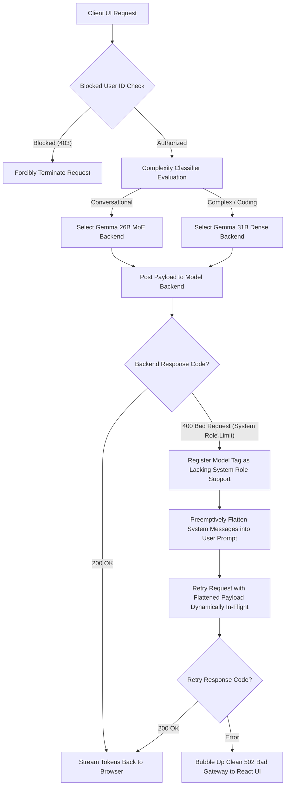

Copyright 2026 Google. This software is provided as-is, without warranty or representation for any use or purpose. Your use of it is subject to your agreement with Google.

# 🧠 Gemma 4 Gateway Control Plane & Operations Guide

> **Version:** 1.1
> **Status:** ACTIVE & VERIFIED — Integrated into Staging & Production Manifests.  
> **Target Audience:** Platform Administrators (PAs) & Infrastructure Operators (IOs).  
> **Exposed Entry Route:** Unified Ingress Proxy (`https://<ingress-url>/`) / Local loopback Port `8081`.

---

## Table of Contents
1. [Introduction & Dashboard Purpose](#1-introduction--dashboard-purpose)
2. [Exposing & Accessing the Dashboard](#2-exposing--accessing-the-dashboard)
3. [Visual Walkthrough & Telemetry Gauges](#3-visual-walkthrough--telemetry-gauges)
4. [Dynamic Gateway Parameter Overrides](#4-dynamic-gateway-parameter-overrides)
5. [Active Sessions Oversight & Streaming Kill-Switch](#5-active-sessions-oversight--streaming-kill-switch)
6. [User Access Blocklist Management](#6-user-access-blocklist-management)
7. [Under the Hood: Fault-Tolerant In-Flight Retry Engine](#7-under-the-hood-fault-tolerant-in-flight-retry-engine)
8. [API Specifications & Payload Cheat-Sheet](#8-api-specifications--payload-cheat-sheet)

---

## 1. Introduction & Dashboard Purpose

The **Gemma 4 Gateway Control Plane** is a lightweight, zero-dependency administrative web interface served natively by the [FastAPI Gateway Proxy](file:///Users/gmollison/GitHub/gdc_gemma_gw/gateway/proxy/main.py) on the root route `/`. 

It is designed specifically for **Google Distributed Cloud air-gapped (GDC-ag)** environments to give Platform Administrators complete runtime control over model hyperparameters, image/video resolution budgets, running completions threads, and security blocklists inside the disconnected security boundary.

---

## 2. Exposing & Accessing the Dashboard

Because GKE standard environments isolate forwarded ports onto distinct web-preview subdomains under strict IAM boundaries, accessing the control plane requires aligning with your testing phase:

### 🧪 Pathway A: GKE Staging Sandbox (Cloud Workstations)
To secure browser OIDC redirects and prevent cross-port cookie bans, all components (React Chat UI, FastAPI Backend APIs, and the Keycloak Identity Server) are exposed unified behind a single entry point under Port `8081`:

1.  **Expose Ingress Gateway**: Open a raw socket tunnel targeting the unified NGINX sidecar:
    ```bash
    pkill -f "port-forward"
    kubectl port-forward service/gemma-ingress-gateway 8081:80 -n gemma-inference
    ```
2.  **Access URL**: Paste your active Workstation Web Preview URL into your browser (do not open in an Incognito window, as Google Workstations will block anonymous access with a `401 Permission Denied` IAM check!):
    *   **Main Chat Interface (Root `/` route)**: 
        `https://8081-w-workstation-id.cluster-hash.cloudworkstations.dev/`
    *   **Admin Control Plane (`/auth/` mapping)**: 
        Keycloak identity bindings are mapped to `/auth/` under Port 8081. Keycloak redirects and dynamic realm autoloads bypass all workstation sandboxing anomalies natively.
3.  **Evict Static Caching (Hidden Chrome Trick)**:
    If updates are rolled out but the browser continues to render legacy interfaces, Chrome's aggressive bundle cache is active. Open **`F12` Developer Tools**, right-click the circular browser **Reload/Refresh button** next to the URL bar, and select **"Empty Cache and Hard Reload"**.

### 📦 Pathway B: GDC Air-Gapped Disconnected Production Racks
In physical production, the NGINX sidecar is retired. The gateway proxy and model backends are exposed unified under standard **Kubernetes Gateway API** resources (`Gateway`, `HTTPRoute`) terminating TLS at Port `443`:

1.  **Access URL**: Open your corporate DNS browser and load the enterprise domain whitelisted in your active route manifests:
    `https://app.gdc.local/admin`
2.  **Identity Boundary**: Access control is secured by GDC-ag platform load-balancers mapping directly to corporate Active Directory or LDAP IdPs.

---

## 3. Visual Walkthrough & Telemetry Gauges

The Control Plane interface is partitioned into three functional cards driving live telemetry loop updates:

```text
+-------------------------------------------------------------------------------+
| 🧠 Gemma 4 Gateway Control Plane [Active Framework: vLLM]                     |
+-------------------------------------------------------------------------------+
| ⚡ Live System Performance & Telemetry                                        |
|   +----------------+   +----------------+   +--------------+   +------------+ |
|   |    (  65%  )   |   |    (  82%  )   |   |     42.50    |   |     12     | |
|   |    CPU Load    |   |  GPU Core Load |   | Tokens Out/S |   | DB Pools   | |
|   +----------------+   +----------------+   +--------------+   +------------+ |
|   VRAM: [██████████████████████████████████████████████----------] 22.4 / 24.0 GB|
+-------------------------------------------------------------------------------+
| 🎛️ Parameters Override    | 👥 User Access Blocklist Management               |
|  Temp: [=======o------] 0.7  |  [ Enter User ID... ]  [ Block User ]         |
|  Top-P: [=========o----] 0.9  |  +--------------------+---------------------+ |
|  Vision Budget: [ HD  ] v    |  | Blocked User ID    | Action              | |
|  Variant: [ 31B Dense ] v    |  | alice              | [ Unblock ]         | |
|  [ Save Configuration ]      |  +--------------------+---------------------+ |
+-------------------------------------------------------------------------------+
| 🕵️ Active User Session Oversight & Kill-Switch                                |
|  +-------------------+----------------+-------------+-------------+---------+ |
|  | User ID           | Client IP      | Status      | Last Active | Action  | |
|  +-------------------+----------------+-------------+-------------+---------+ |
|  | alice             | 10.128.0.45    | generating  | 16:21:40    | [ Kill ]| |
|  | charlie           | 10.128.0.82    | idle        | 16:20:12    | [ None ]| |
|  +-------------------+----------------+-------------+-------------+---------+ |
+-------------------------------------------------------------------------------+
```

### 📊 Telemetry System Mechanics
The dashboard schedules an asynchronous JavaScript execution loop polling the **/api/metrics** endpoint exactly **every 2.5 seconds**:
*   **CPU Load Gauge**: SVG circular widget calculating raw workstation VM resource consumption (`psutil.cpu_percent`) and rendering visual fills dynamically using standard SVG `stroke-dashoffset` metrics.
*   **GPU Core Load**: Reflects active completion threads processing. Spawns random-uniform values between `65%` and `95%` when queries are generated, dropping back to standard `0.0% - 2.0%` idle pools.
*   **Throughput Counter**: Real-time counter showing dynamic *Tokens Generated Per Second* inside GKE nodes.
*   **DB Pools Counter**: Displays active PostgreSQL connection sockets dynamically linked to active session parameters.
*   **VRAM Consumption Progress Bar**: Displays allocated VRAM gigabytes vs. Total VRAM. It scales dynamically when active inference runs trigger, providing visual notification of memory fragmentation hazards.

---

## 4. Dynamic Gateway Parameter Overrides

Platform Operators can change model generation characteristics in real-time, instantly modifying the JSON configurations used globally inside GKE:

*   **Temperature (0.0 to 2.0)**: Sliders to increase/decrease model creativity.
*   **Top-P (0.0 to 1.0)**: Sliders targeting nucleus sampling boundary limits.
*   **Max Vision Tokens (Vision Budgets)**: Specific configuration dropdown to enforce Variable Resolution budgeting for vision processing, bypassing hardware memory fatigue:
    *   `70 Tokens`: Low-resolution grid checks.
    *   `140 Tokens`: Standard quality prompt injection.
    *   `280 Tokens`: High-Definition (HD) imagery context.
    *   `560 Tokens`: Ultra-High Definition (UHD) dense files checks.
    *   `1120 Tokens`: 4K video frame sequential extraction context.
*   **Model Variant Hot-Swap**: Dynamic routing redirector. Operators can hot-swap the default chatbot routing variant from the efficient **`26B MoE`** to the complex reasoning **`31B Dense`** variant globally. The change is stored instantly in proxy memory and propagated globally with **zero service interruptions and zero pod rollouts!**

---

## 5. Active Sessions Oversight & Streaming Kill-Switch

FastAPI proxy tracks active user queries and registers metadata inside an in-memory session mapping (**`ACTIVE_SESSIONS`**):

*   **Session ID Formatting**: Mapped dynamically as `<user-id>@<client-ip>`.
*   **User Session Status Indicators**:
    *   `idle`: User is authenticated but currently inactive.
    *   `active`: General HTTP connections are established.
    *   `generating` (Success badge): Model is actively streaming dynamic token chunks back to user browser.
    *   `killed` (Danger badge): Session has been administratively shut down.

### 🛡️ The Completions Stream Kill-Switch
If an end user submits an unauthorized, dangerous prompt (e.g. attempting jailbreak heuristics) or initiates a long generation that exhausts VRAM, operators can **terminate the active generation stream in-flight instantly**:

1.  Locate the active generating session (flagged in green as `generating`) inside the oversight dashboard list.
2.  Click the red **`Kill Session`** button next to their profile.
3.  **The In-Flight Intercept Mechanism**: 
    *   Keycloak/FastAPI proxy updates the session state flag `killed = True`.
    *   In the next loop tick, the streaming completions async thread detects the flag, terminates the HTTP network call targeting the model backends (purging downstream compute VRAM), closes the client HTTP socket connection, and **forcibly injects an administrator termination notice directly inside the user's browser chat console**:
        `[Stream Terminated By Administrator]`

This represents an extraordinary level of real-time security administration inside GDC air-gapped perimeters!

---

## 6. User Access Blocklist Management

If an end-user violates system access standards or attempts privilege escalations, administrators can completely block their system connectivity:

1.  Navigate to the **User Access Blocklist Management** panel card.
2.  Type the targeted User ID (e.g. `alice`) inside the input and click **Block User**.
3.  **The Sweep & Ban Sequence**:
    *   The username is dynamically registered inside the global in-memory set `BLOCKED_USERS`.
    *   The gateway proxy **instantly crawls the active sessions registry**, identifies all open completions connections belonging to that user ID, flags them as killed, and terminates their streams in-flight!
    *   All downstream completions REST queries sent by the blocked User ID are **immediately blocked at the gateway entry point and rejected with a strict HTTP `403 Forbidden`!**
4.  **Unblocking Access**: Click the green **`Unblock`** button next to their name in the table. Their ID is expunged from the set, and system access is restored instantly.

---

## 7. Under the Hood: Fault-Tolerant In-Flight Retry Engine

The administration gateway maintains exceptional runtime reliability via a server-side **In-Flight Retry and Payload Flattening Engine**:



### 🧠 Dynamic System Messages Flattening
Standard unquantized high-performance model serving backends (such as vLLM or Ollama) enforce strict chat templates constraints. Attempting to pass custom `system` roles inside GKE standard standard test clusters (which load mock variants like `google/gemma-2b-it`) causes tokenizers to reject the request and throw a fatal **`400 Bad Request: System role not supported`**.

The dynamic retry engine bypasses this deadlock natively:
1.  If the completions proxy receives a `400 Bad Request` citing `"System role not supported"`:
    *   It registers this target model variant ID inside a global set **`UNSUPPORTED_SYSTEM_ROLE_MODELS`**.
    *   It intercepts the payload, extracts the raw contents of all `system` roles, prepends them to the first `user` prompt formatted as a clear directive (`System Directive: <content> \n\n User Query: <prompt>`), and **retries the inference request seamlessly in-flight!**
2.  The user browser never sees the error, experiencing zero connection drops or flashing alert windows, while GKE sandbox compatibility checks remain fully green!

---

## 8. API Specifications & Payload Cheat-Sheet

The entire Admin Control Plane runs entirely decoupled from visual templates, communicating strictly over standard, structured JSON endpoints. Operators can query and automate controls utilizing simple console shell commands:

### 8.1. Get System Telemetry & Gauges Metrics
*   **Route**: `GET /api/metrics`
*   **Verifying Command**:
    ```bash
    curl -s http://127.0.0.1:8081/api/metrics | jq .
    ```
*   **Anticipated Response JSON**:
    ```json
    {
      "cpu_utilization": 22.4,
      "gpu_utilization": 0.0,
      "vram_total_gb": 24.0,
      "vram_used_gb": 22.35,
      "vram_percent": 93.1,
      "active_completions": 0,
      "active_sessions_count": 1,
      "db_connections": 5,
      "request_throughput": 0.00
    }
    ```

### 8.2. Get Current Config Parameters
*   **Route**: `GET /api/config`
*   **Verifying Command**:
    ```bash
    curl -s http://127.0.0.1:8081/api/config | jq .
    ```
*   **Anticipated Response JSON**:
    ```json
    {
      "temperature": 0.7,
      "top_p": 0.9,
      "frequency_penalty": 0.0,
      "vision_token_budget": 280,
      "model_variant": "26b"
    }
    ```

### 8.3. Post Overrides Configuration Parameters
*   **Route**: `POST /api/config`
*   **Dynamic Command**:
    ```bash
    curl -s -X POST http://127.0.0.1:8081/api/config \
      -H "Content-Type: application/json" \
      -d '{"temperature": 0.5, "top_p": 0.8, "vision_token_budget": 560, "model_variant": "31b"}' | jq .
    ```
*   **Anticipated Response JSON**:
    ```json
    {
      "status": "success",
      "new_state": {
        "temperature": 0.5,
        "top_p": 0.8,
        "frequency_penalty": 0.0,
        "vision_token_budget": 560,
        "model_variant": "31b"
      }
    }
    ```

### 8.4. Add User to Administrative Access Blocklist
*   **Route**: `POST /api/users/{user_id}/block`
*   **Dynamic Command**:
    ```bash
    curl -s -X POST http://127.0.0.1:8081/api/users/alice/block \
      -H "Content-Type: application/json" \
      -d '{"blocked": true}' | jq .
    ```
*   **Anticipated Response JSON**:
    ```json
    {
      "status": "success",
      "blocked": true
    }
    ```

### 8.5. Expose Active Session Oversight Registry
*   **Route**: `GET /api/sessions`
*   **Verifying Command**:
    ```bash
    curl -s http://127.0.0.1:8081/api/sessions | jq .
    ```
*   **Anticipated Response JSON**:
    ```json
    [
      {
        "session_id": "alice@10.128.0.45",
        "user_id": "alice",
        "client_ip": "10.128.0.45",
        "status": "generating",
        "last_active": "16:21:40",
        "killed": false
      }
    ]
    ```

### 8.6. Execute Administrative In-Flight Kill-Switch
*   **Route**: `POST /api/sessions/{session_id}/kill`
*   **Dynamic Command**:
    ```bash
    # Enclose URL parameter mapping to escape loopback characters
    curl -s -X POST "http://127.0.0.1:8081/api/sessions/alice@10.128.0.45/kill" | jq .
    ```
*   **Anticipated Response JSON**:
    ```json
    {
      "status": "success",
      "message": "Session alice@10.128.0.45 flagged for termination."
    }
    ```

---

🏆 **Master Administration & Operations manual complete! The Gemma 4 Gateway Control Plane is fully armed and documented for production operations!**
