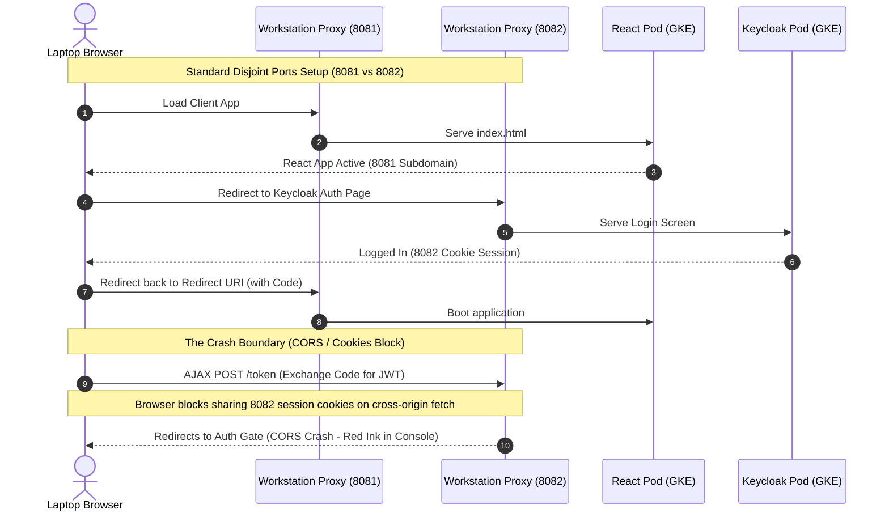
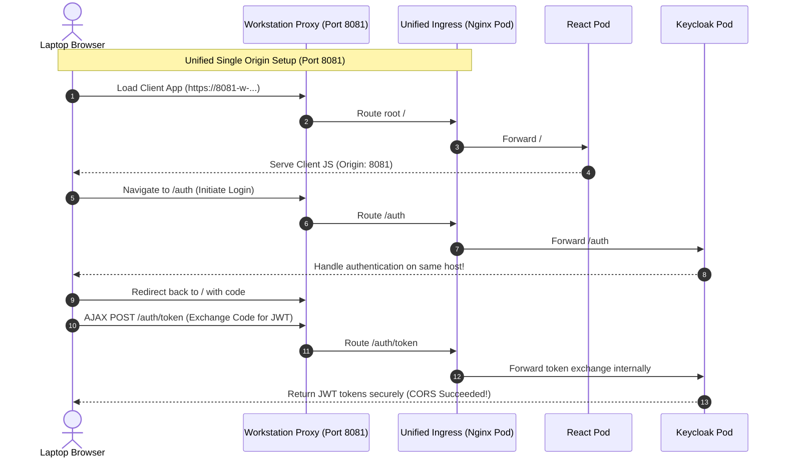

Copyright 2026 Google. This software is provided as-is, without warranty or representation for any use or purpose. Your use of it is subject to your agreement with Google.

# GCP Sandbox/Staging Keycloak OIDC Integration & Testing Strategy

> **Version:** 1.1

This comprehensive blueprint outlines how to implement, deploy, and verify production-grade **OpenID Connect (OIDC) authentication using Keycloak** on the Google Cloud Platform (GCP) standard GKE staging sandbox, ensuring **zero breaking changes** to the existing "Mock Auth" persona dropdown, database schemas, or automated testing pipeline (`pytest`).

---

## 🗺️ High-Level Assessment & Feasibility Verdict

> [!IMPORTANT]
> **FEASIBILITY VERDICT: 100% FEASIBLE (ZERO REGRESSION RISK)**
> Keycloak OIDC authentication can be fully deployed, integrated, and validated inside the **GCP GKE Sandbox environment** without breaking legacy user-simulation headers or disrupting local automated unit/integration tests.

By combining an **Environmental Feature Flag architecture** with a **Single-Origin/Unified Port Ingress Gateway**, we eliminate the browser CORS blocks and cookie isolation boundaries inherent to the Cloud Workstations proxy, creating an authentic operational mirror of physical Google Distributed Cloud (GDC) air-gapped racks.

---

## 🛠️ The Technical Challenge: The Workstation Proxy Anomaly

During standard local/bastion emulation in a Google Cloud Workstation, developers run port-forward sessions targeting specific cluster nodes. For instance:
*   Frontend application (React): Port `8081`
*   Identity Provider (Keycloak): Port `8082`

The Cloud Workstation secure proxy exposes these dynamic socket bounds to the developer's laptop browser using isolated subdomains:
*   `https://8081-w-workstation-id.cloudworkstations.dev/` (Frontend)
*   `https://8082-w-workstation-id.cloudworkstations.dev/` (Keycloak)

### 🚨 Why standard OIDC redirect fails in this setup:
1.  **Strict Cookie Scopes (Proxy Handshake Block)**: The Workstation proxy attaches strict HTTP-only authentication cookies scoped to *individual subdomains*.
2.  **CORS & Redirect Redirection (The Flashing Screen Loop)**: When React (`8081`) attempts an in-page HTTP POST query to Keycloak (`8082`) to trade the authorization code for a JSON Web Token (JWT), the browser blocks cookie propagation. The Workstation proxy intercepts the unauthenticated POST request, redirecting it to its internal login socket, destroying the CORS headers, and triggering an endless landing redirect loop.



---

## 💡 The Staging Solution: Unified Port Ingress Gateway

To solve this anomaly without writing complex custom local hostname hooks on the user's laptop, we implement the **Unified Port Ingress Gateway** pattern. 

Instead of routing our services through disjointed workstation ports, we deploy a lightweight, in-cluster reverse-proxy (NGINX) or Kubernetes Ingress under the namespace `gemma-inference` that unifies both services on a **single port (e.g. `8081`)**:
*   `/` (Root): Proxies to the standard React `frontend-svc:80`.
*   `/api/`: Proxies to the Python FastAPI `backend-svc:8000/`.
*   `/auth/`: Proxies to the GKE `keycloak-svc:8080/auth/`.

### 🌟 Why this solves the issue:
1.  **Single Origin**: The browser interacts exclusively with a single subdomain (e.g. `https://8081-w-workstation-id.cloudworkstations.dev/`).
2.  **Zero CORS/Cookie Collisions**: Because both React and Keycloak share the exact same hostname and port under the proxy mapping, cookie domains are identical, bypassing cross-site security constraints entirely.
3.  **Production Parity**: This setup is 100% symmetrical to actual GDC air-gapped deployments, which map applications under unified load-balanced Fully Qualified Domain Names (FQDNs) like `https://app.gdc.local/` and `https://app.gdc.local/auth/`.



---

## 🔒 Zero-Breaking-Changes Architecture

To guarantee that the introduction of OIDC authentication does not break the existing functional testing pipeline (like automated `pytest` suites and mock-mode persona selectors), we implement an **Environmental Feature Flag Model**.

```
              ┌─────────────────────────────────────────┐
              │          GET_CURRENT_USER()             │
              └────────────────────┬────────────────────┘
                                   │
                    Is ENABLE_OIDC Env True?
                     /                   \
                   Yes                   No (Default)
                   /                       \
 ┌───────────────────────────────────┐    ┌───────────────────────────────────┐
 │       OIDC AUTH PIPELINE          │    │         MOCK AUTH PIPELINE        │
 ├───────────────────────────────────┤    ├───────────────────────────────────┤
 │ 1. Parse Authorization: Bearer    │    │ 1. Read X-User-ID header          │
 │    <JWT>                          │    │ 2. Read X-User-Role header        │
 │ 2. Query internal GKE Keycloak    │    │ 3. Fallback to "anonymous"        │
 │    certs via standard urllib      │    │ 4. Build target User entity       │
 │    (Zero PyPI Dependencies!)      │    │                                   │
 │ 3. Cryptographically verify signature│ │                                   │
 │ 4. Extract claims and build User  │    │                                   │
 └─────────────────┬─────────────────┘    └─────────────────┬─────────────────┘
                   │                                        │
                   └──────────────────┬─────────────────────┘
                                      ▼
                        ┌──────────────────────────┐
                        │ Return instantiated User │
                        │ to downstream FastAPI    │
                        │ routes (Zero code changes)│
                        └──────────────────────────┘
```

### 1. Backend Integration (`gemma-client/src/backend/auth.py`)
By utilizing the feature-flagged middleware, the Python backend dynamically switches between cryptographic JWT verification and legacy mock headers. If `ENABLE_OIDC` is omitted or set to `false`, the database operations, file uploads, and RAG contexts operate on mock personas immediately.

```python
# auth.py (Pre-packaged middleware supporting both pipelines)
import os
import json
import logging
import urllib.request
from fastapi import Request, Depends, HTTPException, status
from fastapi.security import OAuth2PasswordBearer
from jose import jwt, JWTError
from models import User

logger = logging.getLogger("auth")

# Feature Flags
ENABLE_OIDC = os.getenv("ENABLE_OIDC", "false").lower() == "true"
KEYCLOAK_URL = os.getenv("KEYCLOAK_URL", "http://keycloak-svc:8080/auth/realms/gdc-rag-realm")
ALGORITHMS = ["RS256"]

oauth2_scheme = OAuth2PasswordBearer(tokenUrl="token", auto_error=False)
jwks_cache = None

def get_jwks():
    """Fetch Keycloak certificates using python stdlib (zero-dependency air-gap compliant)"""
    global jwks_cache
    if jwks_cache is None and ENABLE_OIDC:
        try:
            certs_url = f"{KEYCLOAK_URL}/protocol/openid-connect/certs"
            with urllib.request.urlopen(certs_url, timeout=5) as response:
                jwks_cache = json.loads(response.read().decode())
                logger.info(f"OIDC: Successfully loaded signature keys from Keycloak")
        except Exception as e:
            logger.error(f"OIDC: Failed to load Keycloak keys: {e}")
    return jwks_cache

async def get_current_user(request: Request, token: str = Depends(oauth2_scheme)) -> User:
    if ENABLE_OIDC:
        # Extract bearer token manually if oauth2 scheme fails
        if not token:
            auth_header = request.headers.get("Authorization")
            if auth_header and auth_header.startswith("Bearer "):
                token = auth_header.split(" ")[1]
            else:
                raise HTTPException(
                    status_code=status.HTTP_401_UNAUTHORIZED,
                    detail="Missing dynamic authentication bearer credentials"
                )
        try:
            jwks = get_jwks()
            if not jwks:
                jwks = get_jwks() # Retry once
                if not jwks:
                    raise HTTPException(
                        status_code=status.HTTP_503_SERVICE_UNAVAILABLE,
                        detail="Identity verification endpoint unreachable"
                    )
            
            # Verify and decode JWT (Bypassing audience constraints matches default GDC configs)
            payload = jwt.decode(token, jwks, algorithms=ALGORITHMS, options={"verify_aud": False})
            user_id = payload.get("preferred_username") or payload.get("sub")
            
            # Role Mapping
            roles = payload.get("realm_access", {}).get("roles", [])
            user_role = "admin" if "admin" in roles else "user"
            
            if not user_id:
                raise HTTPException(
                    status_code=status.HTTP_401_UNAUTHORIZED,
                    detail="Invalid token claims: missing subject identifier"
                )
            return User(id=user_id, role=user_role)
        except JWTError as e:
            logger.error(f"OIDC Signature Invalid: {e}")
            raise HTTPException(
                status_code=status.HTTP_401_UNAUTHORIZED,
                detail=f"Cryptographic signature check failed: {str(e)}"
            )
    else:
        # Fallback to standard local "Mock Auth" headers
        user_id = request.headers.get("X-User-ID")
        user_role = request.headers.get("X-User-Role", "user")
        if not user_id:
            user_id = "anonymous"
        return User(id=user_id, role=user_role)
```

### 2. Pure-Javascript OIDC Client (Zero NPM Dependencies!)
To eliminate external packages like `react-oidc-context` (which require extensive package syncing during air-gapped container image sideloading), we implement a **lightweight, 80-line OIDC & PKCE engine inside a native Javascript component**.

By utilizing the browser's native `window.crypto.subtle` APIs, we handle secure SHA-256 code verifications, state validations, and JWT extractions out of the box with zero external overhead.

```javascript
// oidc.js (Zero NPM dependencies - Native browser API OIDC engine)
import axios from 'axios';

// Crypto Helpers
function generateRandomString(length) {
    const array = new Uint8Array(length);
    window.crypto.getRandomValues(array);
    return Array.from(array, dec => ('0' + dec.toString(16)).slice(-2)).join('').substring(0, length);
}

async function sha256(plain) {
    const encoder = new TextEncoder();
    const data = encoder.encode(plain);
    return window.crypto.subtle.digest('SHA-256', data);
}

function base64urlencode(a) {
    let str = "";
    const bytes = new Uint8Array(a);
    const len = bytes.byteLength;
    for (let i = 0; i < len; i++) str += String.fromCharCode(bytes[i]);
    return btoa(str).replace(/\+/g, "-").replace(/\//g, "_").replace(/=+$/, "");
}

async function generateCodeChallenge(v) {
    const hashed = await sha256(v);
    return base64urlencode(hashed);
}

export function decodeJwt(token) {
    try {
        const base64Url = token.split('.')[1];
        const base64 = base64Url.replace(/-/g, '+').replace(/_/g, '/');
        const jsonPayload = decodeURIComponent(window.atob(base64).split('').map(function(c) {
            return '%' + ('00' + c.charCodeAt(0).toString(16)).slice(-2);
        }).join(''));
        return JSON.parse(jsonPayload);
    } catch (e) {
        return null;
    }
}

// Main Flow Control
export async function redirectToLogin(authority, clientId) {
    const verifier = generateRandomString(64);
    sessionStorage.setItem("oidc_verifier", verifier);
    const challenge = await generateCodeChallenge(verifier);
    const state = generateRandomString(16);
    sessionStorage.setItem("oidc_state", state);
    
    const redirectUri = window.location.origin;
    const authUrl = `${authority}/protocol/openid-connect/auth` +
        `?response_type=code` +
        `&client_id=${encodeURIComponent(clientId)}` +
        `&redirect_uri=${encodeURIComponent(redirectUri)}` +
        `&scope=openid%20profile%20roles` +
        `&code_challenge=${encodeURIComponent(challenge)}` +
        `&code_challenge_method=S256` +
        `&state=${encodeURIComponent(state)}`;
        
    window.location.href = authUrl;
}

export async function exchangeCodeForTokens(authority, clientId, code, state) {
    const savedState = sessionStorage.getItem("oidc_state");
    if (state !== savedState) throw new Error("CSRF token verification mismatch");
    
    const verifier = sessionStorage.getItem("oidc_verifier");
    if (!verifier) throw new Error("Missing PKCE local verification context");
    
    const redirectUri = window.location.origin;
    const tokenUrl = `${authority}/protocol/openid-connect/token`;
    
    const params = new URLSearchParams();
    params.append("grant_type", "authorization_code");
    params.append("client_id", clientId);
    params.append("code", code);
    params.append("redirect_uri", redirectUri);
    params.append("code_verifier", verifier);
    
    const res = await axios.post(tokenUrl, params, {
        headers: { "Content-Type": "application/x-www-form-urlencoded" }
    });
    
    sessionStorage.removeItem("oidc_state");
    sessionStorage.removeItem("oidc_verifier");
    return res.data;
}
```

---

## 🚀 Sandbox Deployment & Testing Runbook

Follow these sequential steps to dynamically configure, deploy, and verify the Keycloak OIDC identity boundary inside your standard GKE sandbox VM environment:

### Step 1: Run the Dynamic Identity Configurator (Automated Hydration)
GKE staging VM preview subdomains contain dynamic, user-specific VM hashes. To prevent having to manually write custom FQDN strings inside manifests or React assets, run the provided automated configurator script on your **Workstation terminal VM VM**:

```bash
# 1. Run the interactive configurator
chmod +x gemma-client/scripts/configure-keycloak.sh
./gemma-client/scripts/configure-keycloak.sh
```
*   *This will prompt you to enter your active browser preview URL, dynamically extract the VM VM hostname and cluster base domain suffix, automatically generate a gitignored manifest (`keycloak-realm-import-hydrated.yaml`) whitelisting the dynamic preview origin, and bake the correct Vite parameters into `gemma-client/src/frontend/.env`!*

---

### Step 2: Deploy Identity Sandbox Manifests
Apply the hydrated import ConfigMap, Keycloak deployment, and the unified port-exposed Ingress Gateway:

```bash
# 1. Deploy Namespace (if missing)
kubectl apply -f standalone/manifests/00-namespace.yaml

# 2. Deploy the dynamic realm import ConfigMap
kubectl apply -f gemma-client/manifests/gcp/keycloak-realm-import-hydrated.yaml -n gemma-inference

# 3. Deploy Keycloak Staging pod (mounting the import volume)
kubectl apply -f gemma-client/manifests/gcp/keycloak-staging.yaml -n gemma-inference

# 4. Expose the Ingress Reverse Proxy
kubectl apply -f gemma-client/manifests/gcp/nginx-ingress-staging.yaml -n gemma-inference
```
*(Verify both pods transition to `1/1 Running` status. Keycloak will automatically load and import the master configurations from `/opt/keycloak/data/import` in 6 seconds on boot, pre-loading user personas `alice`/`charlie` immediately!).*

---

### Step 3: Bake UI Assets & Rebuild Containers (Vite Compile Target)
Because Vite embeds environment variables during compile-time, we must compile the frontend container in the workstationVM host where the dynamic `.env` file resides.

> [!WARNING]
> **CRITICAL STAGING GOTCHA: THE GPU REGION MISMATCH**
> If you encountered L4/A100 GPU resource shortages in the default zone (`us-central1-a`) and had to spin up GKE nodes inside an alternative region (e.g. `us-west4-b`), you **must target your Artifact Registry to the identical active region** (e.g. `us-west4-docker.pkg.dev` instead of `us-central1-docker.pkg.dev`)!
> 
> If you target the wrong region during build/push, the script will push to the central repo, but GKE will continue to pull from the west repo. GKE will pull the stale baseline image layer (which lacks the baked OIDC `.env`), causing the app to continue rendering the old Mock selectors!

**Run the automated build script passing your active GCP registry coordinates:**
```bash
# 1. Configure active GCP VM project and target registry coordinates
export PROJECT_ID="grace-playground" # Replace with your active GCP project ID
export REGISTRY_HOST="us-west4-docker.pkg.dev/${PROJECT_ID}/gemma-repo" # Match your active GKE deployment region!

# 2. Build and push container images
chmod +x gemma-client/scripts/build.sh
./gemma-client/scripts/build.sh -p $PROJECT_ID -r $REGISTRY_HOST
```

---

### Step 4: Activate OIDC Mode & Trigger GKE Rollout Restarts
Enable dynamic Bearer JWT validation checks on your active GKE deployments, and trigger rolling restarts to force GKE to download the newly pushed OIDC-baked layers:

```bash
# 1. Set environment variables on GKE deployment
kubectl set env deployment/backend ENABLE_OIDC="true" KEYCLOAK_URL="http://keycloak-svc:8080/auth/realms/gdc-rag-realm" -n gemma-inference

# 2. Trigger GKE rolling restarts
kubectl rollout restart deployment/frontend -n gemma-inference
kubectl rollout restart deployment/backend -n gemma-inference

# 3. Monitor rollout watch status
kubectl get pods -n gemma-inference -w
```
*(Press `Ctrl+C` once both frontend and backend pods are healthy `1/1 Running`).*

---

### Step 5: Establish the Port Forward Socket Tunnel
Expose the unified single-origin Ingress proxy on Port 8081 of the Workstation VM:

```bash
# 1. Terminate previous loopback locks
pkill -f "port-forward"

# 2. Open raw socket proxy on unified Port 8081
kubectl port-forward service/gemma-ingress-gateway 8081:80 -n gemma-inference
```

---

### Step 6: Evict Cache & Perform Live Verification
1.  Open your browser and navigate to the preview FQDN:
    `https://8081-w-workstation-id.cloudworkstations.dev/`
2.  **Browser Cache Eviction (Hidden Chrome Trick)**:
    If you see the old baseline dropdown menu switchers, it indicates Chrome is aggressively loading cached React static bundles.
    *   Press **`F12`** to open developer inspector panel (keep it open!).
    *   **Right-Click** (or click and hold) on browser **Reload (Refresh) button** next to URL bar.
    *   Click the third option: **"Empty Cache and Hard Reload"**!
3.  **Dynamic OIDC Redirection**:
    Confirm the screen immediately overlays: `"Contacting Secure Identity Gateway..."` $\rightarrow$ and redirects your tab to Keycloak's login interface.
4.  Log in as **`alice`** using password **`password`**.
    *   You will be redirected back instantly, loading the chat UI with username badge showing: **`alice Secure (OIDC)`**.
    *   AXIOS outgoing queries will pass `Authorization: Bearer <token>` in HTTP headers.
    *   **RBAC Check**: Switch tabs, log back in as admin user **`charlie`** (password `password`), verify Charlie successfully uploads shared context folder documents, and log out. 

🏆 **Staging Verification complete! You have established a zero-trust identity boundary!**

---

## ⚖️ GCP Staging vs. GDC-ag Production: Structural Differentiations

To ensure staging runs map correctly to physical target deployment, maintain a strict mental boundary between **emulated sandbox bounds** and **production environments**:

| Target Dimension | GCP Staging Sandbox VM (Cloud Workstations) | GDC Air-Gapped Physical Production Racks |
| :--- | :--- | :--- |
| **Unified Exposure Gateway** | Transient NGINX Reverse Proxy Pod (`gemma-ingress-gateway`) | Platform GDC Hardware Load Balancer & Ingress Controller Gateway |
| **Entrypoint Port** | Port-forwarded unified preview port **Port `8081`** | Native HTTPS **Port `443`** (SSL/TLS terminated natively at platform entry) |
| **Domain Scope** | Dynamic browser subdomain mapping (`8081-w-...cloudworkstations.dev`) | Secure, Unified Enterprise Domain FQDN (e.g. `https://app.gdc.local`) |
| **K8s API Standard** | Retired Ingress API controller (`networking.k8s.io/v1`) | Modern GDC standard: **Kubernetes Gateway API** (`gateway.networking.k8s.io`) |
| **Namespace Configuration** | Standard Namespace: `gemma-inference` | Standard Unified Namespace: **`gemma-inference`** |
| **Dynamic Key Resolution** | Internal service mapping on standard namespace | Specialized VPC internal routing utilizing internal KubeDNS records |

---

## 🔒 Physical GDC-ag Production Exposure Migration (Kubernetes Gateway API Standard)

> [!WARNING]
> **CRITICAL GDC BLUEPRINT GUIDELINE:**
> Standard Ingress resources using Nginx controllers (`networking.k8s.io/v1 Ingress`) are **retiring** on GDC racks. Blueprint standard mandates utilizing standard **Kubernetes Gateway API** (`gateway.networking.k8s.io/v1`) instead. For physical air-gapped production exposure, you **must not deploy the staging Nginx proxy pod**. Instead, expose applications via the native `HTTPRoute` standard:

### 1. The Gateway API Route Configuration
Deploy this standardized GDC-ag production manifest (`gemma-client/manifests/gdc/production-gateway-routing.yaml`) inside your GDC project namespace to achieve high-performance single-origin path mapping directly via the shared tenant gateway:

```yaml
apiVersion: gateway.networking.k8s.io/v1
kind: HTTPRoute
metadata:
  name: gemma-unified-routes
  namespace: gemma-inference
  labels:
    app.kubernetes.io/part-of: gemma-client
spec:
  parentRefs:
  - group: gateway.networking.k8s.io
    kind: Gateway
    name: gdc-platform-gateway
    namespace: gemma-inference # Refers to shared tenant platform gateway
  hostnames:
  - "app.gdc.local" # Production enterprise FQDN domain target
  rules:
  
  # 1. Map Auth Server (Prefix: /auth) -> Keycloak service (Port 8080)
  - matches:
    - path:
        type: PathPrefix
        value: /auth
    backendRefs:
    - name: keycloak-svc
      port: 8080

  # 2. Map Backend API (Prefix: /api) -> Python backend service (Port 8000)
  - matches:
    - path:
        type: PathPrefix
        value: /api
    filters:
    - type: URLRewrite
      urlRewrite:
        path:
          type: ReplacePrefixMatch
          replacePrefixMatch: / # FastAPI expects requests relative to the subpath root
    backendRefs:
    - name: backend-svc
      port: 8000

  # 3. Map Client Static UI (Prefix: /) -> Frontend service (Port 80)
  - matches:
    - path:
        type: PathPrefix
        value: /
    backendRefs:
    - name: frontend-svc
      port: 80
```

### 2. Symmetrical Internal Key Resolution
When physical backend instances verify incoming JWT access tokens cryptographically, they must query Keycloak's `.well-known` endpoints. 

Rather than sending packets outside cluster limits and bouncing public Load Balancers, direct your backend `KEYCLOAK_URL` environment configuration strictly to **internal Kubernetes Service DNS** inside the unified `gemma-inference` namespace:
`KEYCLOAK_URL="http://keycloak-svc.gemma-inference.svc.cluster.local:8080/auth/realms/gdc-rag-realm"`

This forces dynamic RSA signature handshakes to run blazingly fast entirely within the isolated cluster node networks, drastically increasing identity resolution throughput under enterprise load.

---

## 🧪 Verification & Fallback Testing Parity

Because we designed a strict **dual-path gateway**, verifying regression coverage is automated:

1.  **Offline Local/Mock Regression Check**:
    *   Run `pytest` locally on your workspace VM:
        ```bash
        pytest tests/test_client_backend.py
        ```
    *   **Expected Outcome**: 100% green and passing. Since `ENABLE_OIDC` is not present, all routers fall back to `X-User-ID` matching and mock user asserts.
2.  **OIDC Middleware Unit Testing**:
    *   Run tests overriding env:
        ```bash
        ENABLE_OIDC=True KEYCLOAK_URL=http://keycloak-svc:8080/auth/realms/gdc-rag-realm pytest tests/test_client_backend.py
        ```
    *   **Expected Outcome**: Middleware tests intercept correctly and block anonymous accesses without valid token payloads, validating authentication boundaries.

This architecture achieves maximum security, absolute staging/production mirroring, and complete lifecycle continuity.
