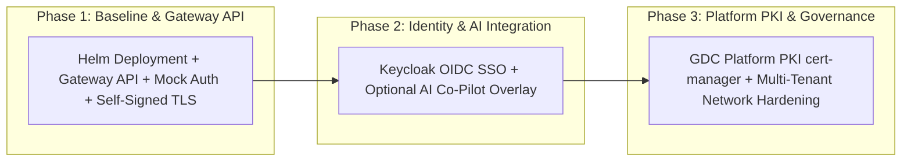

Copyright 2026 Google. This software is provided as-is, without warranty or representation for any use or purpose. Your use of it is subject to your agreement with Google.

# Pattern 13: Resilient GDC Developer Environment (gdc-dev) on GDC Air-Gapped

## Overview
This blueprint provides a production-grade, air-gapped architecture for deploying **GDC Developer Environment (`gdc-dev`)** on **Google Distributed Cloud (GDC-ag)**. Inspired by the cloud IDE paradigms of Eclipse Theia Cloud, `gdc-dev` provides a lightweight, air-gap-native platform that enables organizations to host dynamic, web-based cloud development sessions for developers on demand.

This architecture modernizes cloud developer workspace deployments for GDC physical environments:
* **Ingress Modernization:** Replaces deprecated NGINX Ingress Controller with standard **Kubernetes Gateway API (`gateway.networking.k8s.io/v1`)** using an Envoy Gateway or GDC Platform `GatewayClass` (`gdc-dev-gateway` pattern).
* **Progressive 3-Phase Deployment:**
  1. **Phase 1 (Baseline):** Helm deployment with Gateway API routing, Mock Identity headers (`X-User-ID`), and self-signed TLS certificates for low-friction initial setup.
  2. **Phase 2 (Identity & AI Integration):** Integration with **Keycloak** for OIDC SSO user authentication, role-based workspace authorization, and an **Optional AI Co-Pilot Overlay** connecting to local sovereign LLMs (Gemma 4 Gateway) or Google Cloud Gemini.
  3. **Phase 3 (Enterprise PKI & Hardening):** Migration to **GDC Platform PKI** via `cert-manager` (disabling `issuerCa` in Helm) and multi-tenant cluster topology hardening (Shared vs. Standard clusters).
* **Air-Gapped Developer Persistence:** Guarantees developer code, Git history, and workspace configurations are permanently retained on GDC block storage via dynamic PersistentVolumeClaims (`PVC`), allowing developers to disconnect and resume work seamlessly the next day.

---

## Architecture Schematic

```
+-----------------------------------------------------------------------------------------------+
|                                    GDC Air-Gapped Cluster                                     |
|                                                                                               |
|  +-------------------+        +------------------------------------------------------------+  |
|  | User Browser      | -----> | Kubernetes Gateway API (gdc-dev-gateway)                   |  |
|  +-------------------+        +------------------------------------------------------------+  |
|                                         |                         |                           |
|                                         | /                       | /instances/*              |
|                                         v                         v                           |
|                             +-----------------------+   +----------------------------------+  |
|                             | Landing Page Service  |   | Dynamic Workspace Session Pods   |  |
|                             | (gdc-dev-landing-page)|   | (gdc-dev-workspace-session)      |  |
|                             +-----------------------+   +----------------------------------+  |
|                                         |                         |       ^   |               |
|                                         v                         |       |   | /home/dev/    |
|                             +-----------------------+             |       |   | workspace/    |
|                             | GDC Dev Operator      | <-----------+       |   |               |
|                             +-----------------------+  (Spawns Pods)      |   v               |
|                                         |                                 | +---------------+ |
|                                         |                                 | | PersistentVol | |
|                                         |                                 | | (GDC Block PVC| |
|                                         |                                 | +---------------+ |
|                                         +---> [Phase 1: Mock Auth / Phase 2: Keycloak OIDC]   |
|                                         +---> [Sovereign Inference: Gemma GW (Default) / GDC Gemini]  |
|                                         +---> [Phase 3: GDC Platform PKI cert-manager]        |
+-----------------------------------------------------------------------------------------------+
```
---

> [!NOTE]
> **Architectural Decision Record (ADR):** For the complete TCO analysis, memory density benchmarks (~50MB vs 1.5GB), and architectural rationale for omitting upstream Eclipse Theia in air-gapped GDC, refer to [why_not_theia.md](why_not_theia.md).

---

## 3-Phase Deployment Roadmap



---

## Persistent Storage & Workspace Lifecycle Architecture (Production GDC-ag)

### How to Allocate a Workspace to a Developer

Developer workspaces on GDC Air-Gapped are allocated through two primary mechanisms:

1. **Automated Just-In-Time (JIT) Dynamic Allocation (Default):**
   * **Workflow:** When an authenticated engineer logs in via Keycloak OIDC (`https://dev.gdc.local`), the GDC Dev Operator intercepts the request, maps the developer's unique identity (`X-User-ID`), and checks for existing tenancy resources.
   * **Auto-Provisioning:** If no workspace exists, the Operator automatically calls the Kubernetes API to provision a 20Gi PersistentVolumeClaim (`workspace-pvc-<user-hash>`), deploys a dedicated session pod mounting the volume to `/home/dev/workspace`, bootstraps baseline entrypoint files (`main.py`, `README.md`), and configures the Gateway API `HTTPRoute` to forward traffic to `/instances/<user-hash>`.
   * **Zero Admin Overhead:** Requires no manual ticket creation or administrative provisioning.

2. **Declarative Administrative Pre-Allocation (GitOps / CLI):**
   * **Workflow:** Platform administrators can pre-provision dedicated workspaces prior to onboarding, allocating custom compute tiers (GPU, high-memory) or pre-baking specific organizational tooling:
     ```bash
     # Pre-allocate developer storage and workspace session:
     kubectl apply -f manifests/gdc/workspace-pvc-alice.yaml
     kubectl apply -f manifests/gdc/workspace-session-alice.yaml
     kubectl apply -f manifests/gdc/workspace-routing-alice.yaml
     ```
   * **Enterprise Governance:** Governed by namespace-level `ResourceQuota` and `LimitRange` manifests to prevent cluster starvation.

### Where is Developer Code Stored?
In production GDC Air-Gapped deployments, user code is never stored in ephemeral pod storage. Instead:
1. **Per-User Dynamic PVC Provisioning:**
   When an authenticated user (e.g. `oidc-developer@gdc.local`) creates or accesses an IDE session, the `gdc-dev-operator` dynamically provisions a dedicated PersistentVolumeClaim:
   ```text
   workspace-pvc-<user-hash>  (Size: 20Gi to 100Gi, ReadWriteOnce)
   ```
2. **GDC Storage Class Integration:**
   The PVC is backed by the local GDC storage provisioner (`gdc-block-storage` or `standard-rwo`), mounted directly inside the session container at:
   ```text
   /home/dev/workspace/
   ```
3. **Session Hibernation & Resumption Lifecycle:**
   * **Active Session:** Developer writes code, creates branches, and runs local tests.
   * **Idle Hibernation (End of Day):** When the developer closes their browser or remains idle beyond the configured threshold (e.g. `30 minutes`), the GDC Dev Operator scales the workspace pod to `0` to conserve cluster CPU/RAM. **The underlying PVC remains intact and permanently attached to the storage volume.**
   * **Seamless Next-Day Resumption:** When the developer logs back in the following morning via Keycloak OIDC, the Operator matches the user ID, spawns a new session container, and re-attaches the existing PVC. All files, unstaged changes, local Git commits, installed extensions, and `.dev/settings.json` are instantly restored.

```
+------------------------------------------------------------------------------------+
|                         GDC Persistent Workspace Lifecycle                         |
|                                                                                    |
|  [Developer Logs In] ----> [Operator verifies Keycloak OIDC Identity]              |
|                                          |                                         |
|                                          v                                         |
|                           [Locate or Provision PVC]                                |
|                        (workspace-pvc-oidc-developer)                              |
|                                          |                                         |
|                                          v                                         |
|                     [Mount PVC to /home/dev/workspace]                             |
|                                          |                                         |
|  [Day's Work Completed]                  v                                         |
|  [Browser Closes / Idle] -> [Pod reaped (CPU/RAM freed)] -> [PVC disk persisted]   |
|                                                                    |               |
|  [Next Morning Login] <--------------------------------------------+               |
|  [Pod re-spawned + PVC re-attached -> 100% code restored]                          |
+------------------------------------------------------------------------------------+
```

### Multi-Project Workspace Management & Directory Isolation Architecture (Production GDC-ag)

In production GDC Air-Gapped environments, enterprise development teams frequently work across multiple distinct microservices, shared libraries, or testing services within their authenticated tenancy. The GDC Developer Environment (`gdc-dev`) enforces strict **Multi-Project Workspace Management and Filesystem Isolation**:

#### 1. Directory Segregation Model (`get_workspace_dir`)
`gdc-dev` separates projects into independent physical directory hierarchies:
* **Primary / Default Workspace (`default-workspace`):**
  * Path: `${DEV_WORKSPACE_ROOT}` (defaults to `/home/dev/workspace` in GDC production, `/tmp/workspace` in local stepping-stone emulation).
  * Backed directly by the developer's allocated PersistentVolumeClaim (`workspace-pvc-<user-hash>`).
* **Named / Secondary Projects (`<project_name>`):**
  * Path: `${DEV_PROJECTS_ROOT}/<project_name>` (defaults to `/tmp/dev-projects/<project_name>` in container runtime).
  * **Production GDC Persistence Mapping:** To ensure secondary projects survive pod hibernations (when session pods scale to `0` overnight), platform operators configure `DEV_PROJECTS_ROOT` in `gdc-dev-agent-config`:
    ```yaml
    DEV_WORKSPACE_ROOT: "/home/dev/workspace"
    DEV_PROJECTS_ROOT: "/home/dev/workspace/projects"
    ```
    Alternatively, an in-pod symlink (`/tmp/dev-projects -> /home/dev/workspace/projects`) transparently redirects container-level `/tmp/dev-projects/<name>` directories directly into non-volatile GDC block storage (`standard-rwo`).

#### 2. Isolation & Security Guarantees
* **File Operations Confinement:** All file creation, deletion, and editing operations (`/files/save`, `/files/delete`) are strictly resolved relative to `get_workspace_dir(session_id)`. Path traversal attempts (`../`) are sanitized, preventing unauthorized read/write access across project boundaries.
* **Agentic Tool Scoping:** In-pod AI agent tools (`read_file`, `write_file`, `apply_diff`, `list_directory`) receive the active project directory as their execution root. An agent operating in `telemetry-service` cannot access or mutate files in `finance-service` or `default-workspace`.
* **Terminal Context Synchronization:** The integrated terminal dynamically adjusts its prompt to reflect the active project root:
  ```bash
  # In default workspace:
  dev@gdc-session:~/default-workspace$
  
  # When switched to telemetry-service:
  dev@gdc-session:~/telemetry-service$
  ```
  This eliminates cognitive load and assures human developers and test runners of their exact shell execution context.

#### 3. Seamless Project Lifecycle Operations
* **Project Creation & Templates (`POST /projects/create`):** Developers can scaffold brand new isolated project directories using predefined enterprise templates (`📐 Telemetry Service`, `🚀 Python Microservice`, or `🧹 Clean Workspace`).
* **Instant Switching (`switchProject`):** Developers switch projects via the top header dropdown (`#header-project-select`) or `⚙️ Projects` modal without re-authenticating. Session cookies (`dev_auth_user`) and auth query parameters (`?oidc_login=success`) propagate seamlessly across hops.
* **Non-Destructive Project Reset (`POST /projects/reset`):** Wipes and re-initializes only the selected project's files without affecting other projects or the default workspace.
* **Clean Project Deletion (`POST /projects/delete`):** Purges `${DEV_PROJECTS_ROOT}/<project_name>` and its files completely from disk using recursive directory removal (`shutil.rmtree`), safely returning the developer to `default-workspace`.

---

## Phase 2 Additive AI Co-Pilot Architecture

`gdc-dev` includes an **additive AI Co-Pilot dock** (`🤖 GDC Dev AI Swarm`) seamlessly embedded in the workspace. It connects to OpenAI-compatible inference endpoints without breaking the base blueprint.

### UI Developer Actions:
* **Interactive Prompting:** Ask for code generation, bug analysis, or refactoring in real time.
* **`📋 Copy` Button:** One-click copy of generated code blocks directly to the clipboard.
* **`📥 Insert into Editor` Button:** One-click insertion or replacement of code directly into the active editor buffer (`main.py`).
* **`⏹ Stop` Prompt Button:** Real-time generation cancellation powered by browser-level `AbortController`.

---

### Option A: Sovereign Air-Gapped Inference with Gemma 4 Gateway (`gdc_gemma_gw`)

For fully air-gapped GDC installations or local emulation, `gdc-dev` connects to `gdc_gemma_gw` in the `gemma-inference` namespace.

1. **ConfigMap (`gdc-dev-ai-config`):**
   ```yaml
   apiVersion: v1
   kind: ConfigMap
   metadata:
     name: gdc-dev-ai-config
     namespace: gdc-dev
   data:
     AI_ENABLED: "true"
     OPENAI_API_BASE_URL: "http://gemma-gateway.gemma-inference.svc.cluster.local/v1"
     AI_DEFAULT_MODEL: "gemma4:26b"
     AI_CODER_MODEL: "gemma4:26b"
     NO_PROXY: "*.gemma-inference.svc.cluster.local,*.gemma-inference,localhost,127.0.0.1"
   ```

2. **Cross-Namespace NetworkPolicy:**
   ```yaml
   apiVersion: networking.k8s.io/v1
   kind: NetworkPolicy
   metadata:
     name: gdc-dev-to-gemma-netpol
     namespace: gdc-dev
   spec:
     podSelector:
       matchExpressions:
       - key: app
         operator: In
         values: ["gdc-dev-landing-page", "gdc-dev-operator"]
     policyTypes:
     - Egress
     egress:
     - to:
       - namespaceSelector:
           matchLabels:
             kubernetes.io/metadata.name: kube-system
       ports:
       - protocol: UDP
         port: 53
       - protocol: TCP
         port: 53
     - to:
       - namespaceSelector:
           matchLabels:
             kubernetes.io/metadata.name: gemma-inference
       ports:
       - protocol: TCP
         port: 80
       - protocol: TCP
         port: 8080
   ```

---

### Option B: Sovereign Gemini Endpoint (Air-Gapped GDC Alternative)

In air-gapped GDC environments equipped with internal sovereign Gemini appliances or endpoints (`https://gemini.gdc.local/v1`) where you leverage Gemini models instead of the default local Gemma Gateway:

1. **Create Gemini API Key Secret:**
   ```bash
   kubectl create secret generic gemini-api-secret \
     --from-literal=api-key="<YOUR_GEMINI_API_KEY>" \
     -n gdc-dev
   ```

2. **Configure ConfigMap for Gemini OpenAI-Compatible Endpoint:**
   Internal sovereign Gemini services and Google AI Studio provide OpenAI-compatible `/v1` endpoints:
   ```yaml
   apiVersion: v1
   kind: ConfigMap
   metadata:
     name: gdc-dev-ai-config
     namespace: gdc-dev
   data:
     AI_ENABLED: "true"
     # Google AI Studio OpenAI-compatible endpoint
     OPENAI_API_BASE_URL: "https://generativelanguage.googleapis.com/v1beta/openai"
     AI_DEFAULT_MODEL: "gemini-3.5-flash"
     AI_CODER_MODEL: "gemini-3.5-pro"
     NO_PROXY: "localhost,127.0.0.1"
   ```

3. **Allow Internet Egress in NetworkPolicy:**
   If NetworkPolicies are enabled, add an egress rule for HTTPS port 443:
   ```yaml
   egress:
   - to:
     - ipBlock:
         cidr: 0.0.0.0/0
     ports:
     - protocol: TCP
       port: 443
   ```

---

## Day 0 Prerequisites (Air-Gap Transfer)

On an internet-connected machine, package the manifests and container images:

```bash
# Package Pattern 13 artifacts
./scripts/package-for-gdc.sh p13-gdc-dev
```

This generates:
* `packages/p13-gdc-dev/p13-gdc-dev-gdc-manifests.tar.gz`
* `packages/p13-gdc-dev/p13-gdc-dev-gdc-images.tar`

Transfer these tarballs to your GDC target environment via approved secure transfer media (sneakernet), then unpack:

```bash
./scripts/unpack-for-gdc.sh p13-gdc-dev
```

---

## Baking Developer & Platform Tooling (`gdcloud`, `helm`, `kubectl`, `git`, `docker`) into Images

Developers and in-pod AI agents require platform and source-control CLI tools inside the IDE terminal sandbox to test code, inspect workloads, and manage deployments directly from the browser.

### Pre-Baked Tooling Architecture

| Tool | Purpose | GDC Air-Gapped Strategy & Auth Model |
| :--- | :--- | :--- |
| **`git` & `git-lfs`** | Source code management, staging, diff reversion | Installed via Debian package; configured with `git config --global --add safe.directory '*'` to eliminate PVC mount ownership errors |
| **`kubectl`** | Cluster state inspection, logs, resource debugging | Static binary in `/usr/local/bin/kubectl`; uses in-cluster ServiceAccount token mount (`gdc-dev-operator-sa`) with zero manual `kubeconfig` |
| **`helm`** | Packaging, deploying, and managing Kubernetes application charts | Static binary in `/usr/local/bin/helm`; `HELM_CONFIG_HOME` owned by user 1000; OCI registry login to local Harbor |
| **`gdcloud`** | Managing sovereign GDC infrastructure, VMs, storage, clusters | Unpacks `gdcloud-linux-amd64.tar.gz` from `binaries/` into `/opt/gdcloud`; auto-generates emulation stub if tarball omitted |
| **`docker` CLI** | Standard container CLI interface | Static client binary; connects to remote BuildKit daemon or maps to Podman |
| **`podman`** | Daemonless, rootless container building inside pods | Configured with `subuid`/`subgid` user namespaces and `vfs` storage; no host socket or root privileges required |
| **`buildah`** | Daemonless OCI container builder for Kubernetes pods | Unprivileged OCI builder; builds and pushes directly to Harbor without Docker daemon |

> **Note on Deprecated Tooling (Kaniko):** Google Kaniko (`github.com/GoogleContainerTools/kaniko`) is now archived and read-only upstream. It is no longer supported or recommended. For secure, daemonless container building inside Kubernetes pods on GDC Air-Gapped, use **Rootless Podman (`podman`)** and **Buildah (`buildah`)**.

### Building Images with Tooling Support

```bash
# 1. Build landing page and operator (pre-baked with git, kubectl, helm, docker-cli, gdcloud)
./p13-gdc-dev/scripts/build.sh

# 2. Build full developer workspace session image (including rootless Podman & Buildah)
./p13-gdc-dev/scripts/build.sh --with-workspace

# 3. Export all images to offline tarball for GDC Air-Gap sneakernet transfer
./p13-gdc-dev/scripts/build.sh --with-workspace --save-tar ./dist/airgap-bundle
```

### In-IDE Terminal Tool Verification

Open the terminal inside your running `gdc-dev` workspace (`/instances/default-workspace`) to verify tooling:

```bash
git --version          # Git version control
kubectl version --client # In-cluster Kubernetes API client
helm version           # Helm chart release manager
gdcloud version        # Google Distributed Cloud sovereign CLI
docker --version       # Container engine (Podman or Docker CLI)
```

### Customizing the Workspace Image (Adding / Removing Tooling)

The reference workspace image (`example-app/workspace/Dockerfile`) is organized into modular sections for customization:

* **Adding Language SDKs & Runtimes:** Add custom packages (e.g. `golang-go`, `openjdk-17-jdk`, `nodejs`, `npm`) or internal corporate root CA certificates to **Section 4**. See [workspace/README.md](example-app/workspace/README.md) for ready-to-use recipes.
* **Removing Default Tooling (Image Slimming):** Comment out **Section 3** (`podman`, `buildah`) to save ~400MB if in-pod container builds are restricted by policy, or comment out **Section 2** if application developers do not require Kubernetes/cloud management CLIs.
* **Deploying Custom Images:** Build with `./p13-gdc-dev/scripts/build.sh --with-workspace --tag <custom-tag>` and configure `session.image.repository` in `values-gdc-phase3.yaml`.

---

## Resource Requirements (T-Shirt Sizes)

**Estimated Capacity:** Supports 10+ concurrent on-demand developer IDE sessions with high availability across control plane services (`gdc-dev-operator` and `gdc-dev-landing-page`).

| Component | Recommended GDC Machine Type | vCPU | RAM | Storage (PVC) | GPU Required? |
| :--- | :--- | :--- | :--- | :--- | :--- |
| **Control Plane (Operator & Landing Page)** | `n2-standard-4-gdc` | 4 | 16Gi | N/A | No |
| **Dynamic Workspace Pods (`per session`)** | `n2-standard-4-gdc` (Shared Pool) | 2 (Per Pod) | 4Gi (Per Pod) | 20Gi (`standard-rwo`) | Optional (For AI/ML workflows) |
| **Sovereign LLM Serving (`gdc_gemma_gw`)** | `g2-standard-24-gdc` or `a2-highgpu-1g` | 24 | 96Gi | 100Gi (`gdc-block-storage`) | Yes (1x L4 or A100 GPU) |

---

## Configuration & Deployment Guide

### Step 1: Configure Blueprint Placeholders
```bash
./configure-blueprints.sh -p <YOUR_PROJECT_ID> -n gdc-dev -r <YOUR_REGISTRY_URL> -d p13-gdc-dev
```

### Step 2: Deploy Base GDC Developer Environment (Phase 1 & 2)
```bash
kubectl apply -f p13-gdc-dev/manifests/gdc/namespace.yaml
kubectl apply -f p13-gdc-dev/manifests/gdc/gateway.yaml
kubectl apply -f p13-gdc-dev/manifests/gdc/loadbalancer.yaml
kubectl apply -f p13-gdc-dev/manifests/gdc/gdc-dev-operator.yaml
kubectl apply -f p13-gdc-dev/manifests/gdc/oidc-auth-configmap.yaml
kubectl apply -f p13-gdc-dev/manifests/gdc/gdc-dev-phase2-deployment.yaml
```

### Step 3: Apply Optional AI Co-Pilot Overlay
```bash
kubectl apply -f p13-gdc-dev/manifests/gdc/ai-gateway-configmap.yaml
kubectl apply -f p13-gdc-dev/manifests/gdc/network-policy-ai.yaml
```

### Step 4: Deploy Phase 3 Agentic AI Platform
```bash
export REGISTRY_HOST=${REGISTRY_HOST:-"harbor.shared-services.gdc.local/my-org"}

# 1. Apply Phase 3 Agentic ConfigMap & Deployment
kubectl apply -f p13-gdc-dev/manifests/gdc/gdc-dev-agent-configmap.yaml
kubectl apply -f p13-gdc-dev/manifests/gdc/gdc-dev-phase3-deployment.yaml

# 2. Bind container images to active target registry
kubectl set image deployment/gdc-dev-landing-page landing-page="${REGISTRY_HOST}/gdc-dev-landing-page:latest" -n gdc-dev
kubectl set image deployment/gdc-dev-operator operator="${REGISTRY_HOST}/gdc-dev-operator:latest" -n gdc-dev

# 3. Verify Rollout Status
kubectl rollout restart deployment/gdc-dev-landing-page deployment/gdc-dev-operator -n gdc-dev
kubectl rollout status deployment/gdc-dev-landing-page -n gdc-dev
kubectl rollout status deployment/gdc-dev-operator -n gdc-dev
```

---

## Demonstrating the Phase 3 Agentic Experience in Action

Once deployed, open your browser to your active workspace session:
👉 **`http://localhost:8080/instances/default-workspace`**

The AI Assistant dock on the right displays the **`🤖 GDC Dev AI Swarm`** header with an interactive model selector.

### Feature 1: Multi-Agent Swarm Specialization & Model Auto-Tiering
* **Swarm Specialist Selector (`[ 🐝 Swarm ▼ ]`):**
  Switch between specialized agent personas directly in the AI header:
  * **`🐝 Swarm (Collaborative)`**: Autonomous multi-agent pipeline where the Architect plans, the Coder writes surgical diffs, and the Reviewer generates unit tests.
  * **`📐 Architect Agent`**: High-level system modularity, workspace AST planning, file tree scaffolding, and interface design (read-only tools: `read_file`, `list_directory`).
  * **`💻 Coder Agent`**: Surgical code implementation, AST-aware unified diff authoring (`apply_diff`), in-pod code editing (`write_file`), and refactoring.
  * **`🔍 Reviewer / QA Agent`**: Automated test synthesis (`pytest`/`unittest`), security perimeter auditing, and sandbox command execution (`run_terminal_command`).
* **Principle of Least Privilege (PoLP):** Each specialized persona is restricted to only the exact tool permissions required for its role, preventing unauthorized shell execution or inadvertent file churn.
* **Interactive Model Selector (`[ ⚡ 31b ▼ ]`):**
  * `⚡ 31b (Reasoning)`: Heavy dense reasoning model for multi-step tasks.
  * `🚀 26b (Fast MoE)`: Fast Mixture-of-Experts (~4B active parameters) for rapid questions.
  * `🔄 Auto (Model Tiering)`: Intelligently routes routine questions to 26B, and automatically escalates code refactoring, diff patching, and test repair to 31B.
  * Configured Gemini endpoints (`Pro` / `Flash`).

#### 🔧 Configuring Endpoints & Customizing Gemini Model Versions
The platform reads inference endpoints and model identifiers directly from `gdc-dev-agent-config`:
* **Air-Gapped Gemma Inference (`gdc_gemma_gw`):**
  * Point `OPENAI_API_BASE_URL` to `http://gemma-gateway.gemma-inference.svc.cluster.local/v1`.
  * Routed between `gemma4:31b` (Reasoning) and `gemma4:26b` (Fast MoE).
* **Sovereign GDC Gemini / Google Cloud Gemini:**
  * Point `OPENAI_API_BASE_URL` to your OpenAI-compatible Gemini endpoint (e.g. `https://gemini.gdc.local/v1` or `https://generativelanguage.googleapis.com/v1beta/openai`).
  * Customize model versions via ConfigMap keys:
    * `AI_GEMINI_TIER1_MODEL`: e.g. `gemini-3.5-flash`, `gemini-2.5-flash`, or `gemini-2.0-flash`
    * `AI_GEMINI_TIER2_MODEL`: e.g. `gemini-3.5-pro`, `gemini-2.5-pro`, or `gemini-2.0-pro`
  * Changing these keys in the ConfigMap dynamically updates the dropdown labels and request payloads in the IDE without code edits!

### Feature 2: Selective Auto-Approval & Surgical Code Patching
1. In the AI input, submit a coding task:
   > *"Add a helper function to main.py that checks if a word is a palindrome, and call it from main()."*
2. **Autonomous Read:** The agent automatically inspects `main.py` via `read_file` without pausing.
3. **Interactive Diff Approval Card:** Because file mutation is a sensitive action, the agent pauses and presents a visual **Diff Review Card** in the chat:
   ```text
   ⚠️ Action Approval Required (apply_diff)
   Target: main.py
   [ Diff Preview: + def is_palindrome(s): ... ]
   [✓ Approve & Execute]   [✕ Reject]
   ```
4. Click **`✓ Approve & Execute`**.
5. The active editor updates in real time with the new code.
6. Click **`▶ Run Code`** above the editor to verify execution.

### Feature 3: Integrated Terminal Auto-Repair ("Fix with Gemma Agent")
1. In the terminal at the bottom of the workspace, run a command that intentionally fails:
   ```bash
   python3 -c "assert False, 'Enclave checksum verification failed'"
   ```
2. The stack trace prints in red, and an actionable button automatically appears under the error:
   **`[ ⚡ Fix with Gemma Agent ]`**
3. Clicking the button automatically passes the command and error trace to Gemma Agent to diagnose the root cause and propose a verified fix.

### Feature 4: Instant Code Rollback (`[ ↩ Rollback Changes ]`)
* If you approve a diff and subsequently want to revert the changes, click the red **`[ ↩ Rollback Changes ]`** button directly on the agent's completion message.
* The workspace immediately restores the prior file content in the active editor and logs the revert in the terminal (`git checkout <file>`).

---

## Performance & Latency Notice: GCP Emulation vs. GDC Production

> [!NOTE]
> **Inference Latency on GCP Emulation vs. Bare-Metal GDC Production:**
> * **GCP Emulation Environment:** When testing on cloud workstation emulation running Ollama with **Gemma 4 31B Dense (19 GB)** on a single shared GPU, generation throughput is approximately **11–12 tokens/second**. Generating a comprehensive 800+ token response with prompt re-evaluation and memory allocation can take **between 120 and 160 seconds (~2.5 minutes)**.
> * **Client Timeout Configuration:** For this reason, `gdc-dev-agent-config` configures `AI_REQUEST_TIMEOUT: "300"` (5 minutes), aligning the client socket timeout with `gdc_gemma_gw`'s `GATEWAY_TIMEOUT=300.0` so requests do not prematurely time out.
> * **Production GDC Air-Gapped Platform:** On physical GDC-ag hardware equipped with dedicated multi-GPU TPU v5e/H100 clusters and **vLLM PagedAttention** serving, identical inference queries execute with sub-10 second latency.

---

## Rollback Runbooks & Procedures

### Procedure A: Rolling Back Code in the Workspace
If an agent-generated code modification needs to be reverted:
1. **1-Click UI Rollback:** Click the **`[ ↩ Rollback Changes ]`** button directly beneath the agent's message in the AI dock.
2. **Terminal Rollback:** Run `git checkout <filename>` or `git restore <filename>` in the integrated terminal.

### Procedure B: Rolling Back Deployment (Phase 3 Agentic -> Phase 2 Passive)
To revert the cluster infrastructure from Phase 3 Agentic mode back to Phase 2 Passive AI Co-Pilot:

```bash
# Execute the automated rollback script
./p13-gdc-dev/scripts/rollback-to-phase2.sh
```

**Manual Rollback Commands:**
```bash
export REGISTRY_HOST=${REGISTRY_HOST:-"harbor.shared-services.gdc.local/my-org"}

# 1. Restore Phase 2 configuration
kubectl apply -f p13-gdc-dev/manifests/gdc/ai-gateway-configmap.yaml
kubectl apply -f p13-gdc-dev/manifests/gdc/gdc-dev-phase2-deployment.yaml

# 2. Point deployments to target registry images
kubectl set image deployment/gdc-dev-landing-page landing-page="${REGISTRY_HOST}/gdc-dev-landing-page:latest" -n gdc-dev
kubectl set image deployment/gdc-dev-operator operator="${REGISTRY_HOST}/gdc-dev-operator:latest" -n gdc-dev

# 3. Rollout restart
kubectl rollout restart deployment/gdc-dev-landing-page deployment/gdc-dev-operator -n gdc-dev
kubectl rollout status deployment/gdc-dev-landing-page -n gdc-dev
```

---

## Testing & Verification

### Automated Structural & Manifest Validation (TDD)
Run the full 40-test automated validation suite:

```bash
./p13-gdc-dev/test/verify.sh
```

**Verified Outputs (`40/40 PASS`):**
* **Phase 1 (7/7):** Gateway API spec (`HTTPRoute`), mock identity headers (`X-User-ID`), code execution (`POST /exec`).
* **Phase 2 (5/5):** Keycloak OIDC SSO manifests (`gdc-dev-phase2-deployment.yaml`, `oidc-auth-configmap.yaml`), login portal transitions.
* **Phase 3 Hardening (4/4):** GDC Platform PKI (`cert-manager.io/v1`), persistent PVC storage, multi-tenant NetworkPolicies.
* **Phase 3 Agentic AI (6/6):** Function calling tool schemas (`read_file`, `apply_diff`, `write_file`, `run_terminal_command`, `list_directory`), in-pod execution engine, selective auto-approval security gatekeeper, Phase 3 Helm values.
* **AI Integration (7/7):** Cross-namespace config structure, AI egress network policies, backwards-compatible UI rendering, Copy/Insert/Stop button contracts.
* **Phase 4 Multi-Agent Swarm (11/11):** Swarm ConfigMap & Helm declarations, `SWARM_PERSONAS` definitions (Architect, Coder, Reviewer, Swarm), least-privilege tool isolation, persona-based ReAct routing, in-IDE specialist selector UI, workspace disk persistence & project templates, multi-project workspace isolation & switching, full output preservation & file export (`💾 Save as File` / `📋 Copy All`), and OIDC session cookie continuity across project switches.

---

### Multi-Agent Swarm Live CLI Testing (`test-swarm.py`)

A comprehensive CLI test harness is provided to validate all 10 validation stages: 4 personas, tool isolation, rollback mechanisms, multi-project workspace isolation, full output preservation, pre-baked tooling, and OIDC session continuity directly against the cluster ingress entry point:

```bash
# 1. Check if LoadBalancer VIP is active:
kubectl get svc gdc-dev-loadbalancer -n gdc-dev
export INGRESS_IP=$(kubectl get svc gdc-dev-loadbalancer -n gdc-dev -o jsonpath='{.status.loadBalancer.ingress[0].ip}')
export GDC_DEV_ENDPOINT="https://${INGRESS_IP}/instances/default-workspace/ai-chat"

# Option A: Run automated test directly against the LoadBalancer entry point:
./p13-gdc-dev/scripts/test-swarm.py --endpoint "${GDC_DEV_ENDPOINT}" --host-header dev.gdc.local

# Or run directly via enterprise DNS:
./p13-gdc-dev/scripts/test-swarm.py --endpoint "https://dev.gdc.local/instances/default-workspace/ai-chat"

# Interactive step-by-step walkthrough (pauses between each test stage):
./p13-gdc-dev/scripts/test-swarm.py --endpoint "${GDC_DEV_ENDPOINT}" --host-header dev.gdc.local --interactive

# Test with dense 31B reasoning model (extended timeout up to 300s):
./p13-gdc-dev/scripts/test-swarm.py --endpoint "${GDC_DEV_ENDPOINT}" --host-header dev.gdc.local --model gemma4:31b --timeout 300

# Option B (GCP Emulation Fallback): If testing on Cloud Workstation without direct ILB routing:
# kubectl port-forward svc/gdc-dev-landing-page 8080:8080 -n gdc-dev &
# ./p13-gdc-dev/scripts/test-swarm.py --endpoint "http://localhost:8080/instances/default-workspace/ai-chat"

# Offline in-memory verification (bypasses cluster network entirely):
./p13-gdc-dev/scripts/test-swarm.py --local
```

---

### End-to-End GUI Walkthrough & Test Prompts

To test and demonstrate the Multi-Agent Swarm directly in the web browser interface, open **`https://dev.gdc.local/instances/default-workspace`** (or `https://${INGRESS_IP}/instances/default-workspace` with `/etc/hosts` mapped to `dev.gdc.local`):

> [!TIP]
> **Model Selection for Emulation:** In the AI dock header on the right, select **`[ 🚀 26b (Fast MoE) ]`** from the model dropdown for rapid **~3–8 second** completions on single-GPU emulation, or **`[ ⚡ 31b (Reasoning) ]`** on production GDC bare-metal hardware.

#### Step 1: 📐 Architect Agent — System Planning & Read-Only Confinement
* **Dropdown Selection:** Role = `[ 📐 Architect (Planning) ]` | Model = `[ 🚀 26b (Fast MoE) ]`
* **Prompt to Enter:**
  ```text
  Design a modular telemetry and health-check service for GDC air-gapped workloads. Specify the file hierarchy, data contracts, and integration points with Kubernetes liveness probes.
  ```
* **Expected UI Result:**
  * Displays `[ 📐 Architect Agent ]` badge in blue.
  * Generates an architectural design breakdown and API schema.
  * Strictly restricted to read-only tools (`read_file`, `list_directory`). Does not mutate files or execute shell commands.
  * **Full Output Preservation (`💾 Save as File` / `📋 Copy All`):**
    * Click **`💾 Save as File`** on the response card to write the full, unstripped architectural specification directly to `architecture.md` on the workspace disk. Run `ls` and `cat architecture.md` in the terminal to verify.
    * Click **`📋 Copy All`** to copy the complete raw markdown output to the clipboard.

#### Step 2: 💻 Coder Agent — Surgical Diffs & Selective Auto-Approval Handshake
* **Dropdown Selection:** Role = `[ 💻 Coder (Implementation) ]` | Model = `[ 🚀 26b (Fast MoE) ]`
* **Pre-condition:** Open `main.py` in the workspace editor with baseline code (`def main(): print('Hello GDC')`).
* **Prompt to Enter:**
  ```text
  Add a helper function is_prime(n) to main.py and call it in main() to print all prime numbers up to 20.
  ```
* **Expected UI Result:**
  * Displays `[ 💻 Coder Agent ]` badge in green.
  * Autonomously reads `main.py` via `read_file`.
  * Renders an interactive **Diff Approval Card** with colorized changes, target file `main.py`, and action buttons: **`[ ✓ Approve & Execute ]`** and **`[ ✕ Reject ]`**.
  * Clicking **`[ ✓ Approve & Execute ]`** immediately updates the live code in the editor.
  * Clicking **`▶ Run Code`** executes the updated script in the integrated terminal.

#### Step 3: 🔍 Reviewer / QA Agent — Automated Test Suite Synthesis
* **Dropdown Selection:** Role = `[ 🔍 Reviewer (QA & Tests) ]` | Model = `[ 🚀 26b (Fast MoE) ]`
* **Prompt to Enter:**
  ```text
  Synthesize a comprehensive pytest test suite for is_prime(n) in test_main.py covering edge cases: 0, 1, negative numbers, small primes (2, 3), and non-primes (4, 9, 15).
  ```
* **Expected UI Result:**
  * Displays `[ 🔍 Reviewer Agent ]` badge in yellow/gold.
  * Synthesizes `test_main.py` with parametrized assertions.
  * Possesses sandbox execution permissions (`run_terminal_command`) for running test suites, without direct code mutation permissions.

#### Step 4: 🐝 Multi-Agent Swarm Mode — Autonomous 3-Stage Pipeline
* **Dropdown Selection:** Role = `[ 🐝 Swarm (Collaborative) ]` | Model = `[ 🚀 26b (Fast MoE) ]`
* **Prompt to Enter:**
  ```text
  Build a sovereign key-value cache with TTL expiration in cache.py and verify it with a unit test.
  ```
* **Expected UI Result:**
  * Displays `[ 🐝 Multi-Agent Swarm ]` badge in purple.
  * Coordinates the 3-stage lifecycle: Architect designs architecture -> Coder generates implementation and diff card -> Reviewer generates test suite.

#### Step 5: ↩️ 1-Click Code Rollback
* **Action:**
  * Beneath the Coder agent's completed message in the AI dock, click the red button: **`[ ↩ Rollback Changes ]`**.
* **Expected UI Result:**
  * The active editor immediately restores `main.py` bit-for-bit to its exact pre-mutation state.
  * A confirmation toast confirms: *"Rollback successful: restored baseline state."*

#### Step 6: ⚡ Terminal Auto-Repair ("Fix with Gemma Agent")
* **Action:**
  * In the integrated terminal at the bottom of the workspace, run:
    ```bash
    python3 -c "assert False, 'Enclave checksum verification failed'"
    ```
  * Click the orange **`[ ⚡ Fix with Gemma Agent ]`** action pill that appears beneath the error.
* **Expected UI Result:**
  * Passes terminal stack trace to the Gemma agent, diagnosing the root cause and suggesting a fix.

#### Step 7: 📁 Workspace File Management & Disk Persistence
* **Save to Disk & Terminal Sync (`Ctrl+S` / `💾 Save`):**
  * Click **`[ + File ]`** in the file explorer and create `architecture.md`.
  * Paste notes or code into the editor and press `Ctrl+S` (or click `💾 Save`).
  * In the terminal, run `ls` and `cat architecture.md` — files saved in the GUI are stored directly on the persistent volume disk and are immediately accessible.
* **Refresh Files from Disk (`[ 🔄 ]`):**
  * In the terminal, create files via shell or test suites (e.g., `touch config.json`).
  * Click the **`[ 🔄 ]`** refresh button on the explorer toolbar to sync new files into the GUI instantly.
* **Delete File (`[ 🗑️ ]`):**
  * Hover over any file in the explorer and click the red **`[ 🗑️ ]`** trash icon to delete it from disk with confirmation.

#### Step 8: 🔄 Multi-Project Management & Dynamic Workspace Switching
* **Header Project Dropdown (`#header-project-select`):**
  * Switch between projects (`default-workspace`, custom projects) directly via the top navigation dropdown.
  * Notice the integrated terminal prompt tracks active project context: `dev@gdc-session:~/<project-name>$`.
* **Open Project Manager (`⚙️ Projects` / `📁`):**
  * Click **`⚙️ Projects`** next to the dropdown to manage projects across 3 tabs:
    * **`🔄 Switch`**: Lists all projects discovered on disk, file counts, and direct switch/delete actions.
    * **`➕ New`**: Provisions an isolated project (e.g., `telemetry-service`) from templates (Telemetry, Microservice, or Empty).
    * **`🧹 Reset`**: Wipes the current project's workspace back to template defaults without affecting other projects.
* **Workspace Isolation:**
  * Files for each project are strictly isolated under `/tmp/dev-projects/<project-name>`.
  * Run `ls` in the terminal to verify clean directory isolation.
* **Project Deletion:**
  * In the `🔄 Switch` tab, click **`🗑️ Delete`** next to any custom project to completely purge its directory and files from disk.

#### Step 9: 🔐 Enterprise OIDC Session Continuity Across Project Switches
* **Zero Re-Authentication:**
  * When logged in via Keycloak OIDC as `oidc-developer@gdc.local`, switching projects via the dropdown or modal preserves authentication state via the domain-scoped session cookie (`dev_auth_user`) and URL query parameter (`?oidc_login=success`).
  * Developers can switch between multiple projects seamlessly without being redirected back to login.
* **Explicit Session Termination:**
  * Click **`Exit Session`** in the header to clear session cookies (`Max-Age=0`) and return to the SSO login portal.

---

## Lessons Learned & Retrospective

1. **Persistent Volume Attachment Across Lifecycles:** Decoupling ephemeral compute pods from persistent PVC storage allows dynamic session harvesting without risking developer code loss.
2. **In-Place Progressive Delivery (`Phase 1 -> Phase 2 -> Phase 3`):** Applying declarative overlays (`ConfigMap` and `Deployment` patches) directly over running infrastructure enables zero-downtime upgrades (~3s rollout) without namespace teardown.
3. **Decoupled AI Co-Pilot Architecture:** Ingesting `gdc-dev-ai-config` as `optional: true` ensures that `gdc-dev` can deploy cleanly in air-gapped environments without hard dependencies on an AI cluster.
4. **Interactive Model Tiering & OX:** Combining an interactive model dropdown selector with automatic backend task escalation allows developers to optimize between sub-second 26B MoE latency and 31B Dense reasoning accuracy.
5. **Human-in-the-Loop (HITL) Guardrails:** Enforcing selective auto-approval (auto-approving read queries while gating code mutations behind visual diff cards) achieves high developer velocity while preventing unintended code mutations.
6. **Emulation Latency Alignment:** Dense 31B LLM generation on single-GPU emulation requires matching client socket timeouts (`AI_REQUEST_TIMEOUT: "300"`) with inference gateway timeouts (`GATEWAY_TIMEOUT=300.0`) to avoid premature disconnections during heavy completions.

