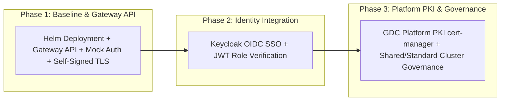

Copyright 2026 Google. This software is provided as-is, without warranty or representation for any use or purpose. Your use of it is subject to your agreement with Google.

# Pattern 13: Resilient Eclipse Theia Cloud IDE on GDC Air-Gapped

## Overview
This blueprint provides a production-grade, air-gapped architecture for deploying **Eclipse Theia Cloud** on **Google Distributed Cloud (GDC-ag)**. Theia Cloud enables organizations to host dynamic, web-based cloud IDE sessions for developers on demand.

This architecture modernizes upstream Theia Cloud deployments for GDC physical environments:
* **Ingress Modernization:** Replaces deprecated NGINX Ingress Controller with standard **Kubernetes Gateway API (`gateway.networking.k8s.io/v1`)** using an Envoy Gateway or GDC Platform `GatewayClass` (`theia-shared-gateway` pattern).
* **Progressive 3-Phase Deployment:**
  1. **Phase 1 (Baseline):** Helm deployment with Gateway API routing, Mock Identity headers (`X-User-ID`), and self-signed TLS certificates for low-friction initial setup.
  2. **Phase 2 (Identity Integration):** Integration with **Keycloak** for OIDC SSO user authentication and role-based workspace authorization.
  3. **Phase 3 (Enterprise PKI & Hardening):** Migration to **GDC Platform PKI** via `cert-manager` (disabling `issuerCa` in Helm) and multi-tenant cluster topology hardening (Shared vs. Standard clusters).

---

## Architecture Schematic

```
+-----------------------------------------------------------------------------------+
|                              GDC Air-Gapped Cluster                               |
|                                                                                   |
|  +-------------------+        +------------------------------------------------+  |
|  | User Browser      | -----> | Kubernetes Gateway API (theia-cloud-gateway)   |  |
|  +-------------------+        +------------------------------------------------+  |
|                                     |                     |                       |
|                                     | /                   | /instances/*          |
|                                     v                     v                       |
|                         +-----------------------+   +--------------------------+  |
|                         | Landing Page Service  |   | Dynamic Workspace Pods   |  |
|                         +-----------------------+   | (theia-workspace-session)|  |
|                                     |               +--------------------------+  |
|                                     v                             ^               |
|                         +-----------------------+                 |               |
|                         | Theia Cloud Operator  | ----------------+               |
|                         +-----------------------+  (Spawns Workspace Pods)        |
|                                     |                                             |
|                                     +---> [Phase 1: Mock Auth / Phase 2: Keycloak]|
|                                     +---> [Phase 3: GDC Platform PKI cert-manager]|
+-----------------------------------------------------------------------------------+
```

---

## 3-Phase Deployment Roadmap



### Phase 2 Keycloak Integration: OIDC Relying Party vs. Infrastructure Provider
* **OIDC Client Relying Party (Why Deployment takes ~3s):** Unlike `p12-keycloak` (Pattern 12), which is an **infrastructure provider** booting JVM server clusters and initializing PostgreSQL databases (`keycloak-db.yaml`), `p13-theia-cloud` is an **OIDC Client / Relying Party**. We do not run a database or JVM inside `p13`! Applying Phase 2 (`theia-cloud-phase2-deployment.yaml` & `oidc-auth-configmap.yaml`) simply restarts our lightweight pods to load external OIDC endpoints (`https://keycloak.gdc.local/realms/gdc-theia-realm`).
* **Local Emulation Verification Handshake:** During Stage 2 verification on Google Cloud Workstations, clicking **"Sign in with Keycloak OIDC"** triggers a local simulated OAuth2 callback (`?oidc_login=success`), transitioning your session directly to `oidc-developer@gdc.local` (`Mode: oidc`) without requiring a live Keycloak JVM cluster running locally.
* **Production GDC Air-Gapped Target Integration:** When deploying onto physical GDC racks against a live `p12-keycloak` deployment:
  1. In Keycloak (`https://keycloak.gdc.local/admin`), register client `theia-cloud-client` inside realm `gdc-theia-realm` with `Valid Redirect URIs: https://theia.gdc.local/auth/callback` & `https://theia.gdc.local/instances/*`.
  2. In `oidc-auth-configmap.yaml`, set `OIDC_AUTHORITY` to your production realm URL (`https://keycloak.gdc.local/realms/gdc-theia-realm`).
  3. Or configure the **Kubernetes Gateway API OIDC Filter (`Envoy/GDC Gateway OIDC filter`)** on the `HTTPRoute` to terminate OAuth2 authentication right at the ingress edge and inject trusted user headers (`HEADER_USER_KEY: X-Forwarded-User`) into our backend containers.

---

## Day 0 Prerequisites (Air-Gap Transfer)

On an internet-connected machine, package the manifests and container images:

```bash
# Package Pattern 13 artifacts
./scripts/package-for-gdc.sh p13-theia-cloud
```

This generates:
* `packages/p13-theia-cloud/p13-theia-cloud-gdc-manifests.tar.gz`
* `packages/p13-theia-cloud/p13-theia-cloud-gdc-images.tar`

Transfer these tarballs to your GDC target environment via approved secure transfer media (sneakernet), then unpack:

```bash
./scripts/unpack-for-gdc.sh p13-theia-cloud
```

---

## Resource Requirements (T-Shirt Sizes)

**Estimated Capacity:** Supports 10+ concurrent on-demand developer IDE sessions (`theia-workspace-session`) with high availability across control plane services (`theia-cloud-operator` and `theia-cloud-landing-page`).

| Component | Recommended GDC Machine Type | vCPU | RAM | Storage (PVC) | GPU Required? |
| :--- | :--- | :--- | :--- | :--- | :--- |
| **Control Plane (Operator & Landing Page)** | `n2-standard-4-gdc` | 4 | 16Gi | N/A | No |
| **Dynamic Workspace Pods (`per session`)** | `n2-standard-4-gdc` (Shared Pool) | 2 (Per Pod) | 4Gi (Per Pod) | 20Gi (`standard-rwo`) | Optional (For AI/ML workflows) |

**Scaling & Upgrades:**
* **Workspace Sessions:** Each developer workspace session pod (`theia-workspace-session`) requests up to 2 vCPUs, 4Gi RAM, and a `20Gi` persistent volume (`/workspace`). The compute node pool (`n2-standard-4-gdc` or `n2-standard-8-gdc`) scales out linearly with the number of active concurrent developers.
* **Persistent Storage (`PVC`):** Developer code repositories, Git histories, and IDE configuration states are stored on GDC `standard-rwo` block/object storage. Monitor PVC storage usage and expand dynamically or enforce `ResourceQuotas` across tenant namespaces to prevent storage exhaustion.
* **Control Plane (`Operator & Landing Page`):** In Phase 3 production deployments, `theia-cloud-operator` and `theia-cloud-landing-page` run with `replicaCount: 2` across separate physical nodes to guarantee high availability and zero-downtime progressive delivery rollouts (`~3s`).

**Sizing Rationale:**
The control plane services (`operator` and `landing page`) are lightweight containerized microservices handling Gateway API ingress routing, session lifecycle orchestration, and OIDC JWT verification. The primary resource consumption on GDC worker nodes comes from the dynamic workspace session pods (`theia-workspace-session`), which require isolated CPU and memory headroom to compile code, run language servers, and execute developer terminal commands without performance degradation.

## Configuration

### Blueprint Configuration

Before deploying, ensure you have configured the blueprints with your Project ID and Registry URL:

```bash
# Run from the root of the repository
./configure-blueprints.sh -p <YOUR_PROJECT_ID> -n <YOUR_TARGET_NAMESPACE> -r <YOUR_REGISTRY_URL> -d p13-theia-cloud
```

## Required IAM Permissions

### K8s RBAC Matrix
* **ServiceAccount:** `theia-cloud-operator-sa` (Namespace: `theia-cloud`)
* **ClusterRole:** `theia-cloud-operator-role`
  * Core (`""`): `pods`, `services`, `configmaps`, `secrets`, `namespaces` (`get`, `list`, `watch`, `create`, `update`, `patch`, `delete`)
  * Apps (`apps`): `deployments`, `statefulsets` (`get`, `list`, `watch`, `create`, `update`, `patch`, `delete`)
  * Gateway API (`gateway.networking.k8s.io`): `httproutes` (`get`, `list`, `watch`, `create`, `update`, `patch`, `delete`)

### GDC Platform IAM Roles
* **GKE Developer:** To deploy application and Gateway API manifests to the GKE cluster (`roles/gke.developer`).

---

## Implementation

### Method A: Manual CLI Deployment

#### Phase 1: Baseline Deployment (Mock Auth & Self-Signed TLS)

1. **Create Namespace & Mock Auth ConfigMap:**
   ```bash
   kubectl apply -f p13-theia-cloud/manifests/gdc/namespace.yaml
   kubectl apply -f p13-theia-cloud/manifests/gdc/mock-auth-configmap.yaml
   ```

2. **Deploy Gateway API Resources:**
   ```bash
   kubectl apply -f p13-theia-cloud/manifests/gdc/gateway.yaml
   ```

3. **Deploy Theia Cloud Operator & Landing Page:**
   ```bash
   kubectl apply -f p13-theia-cloud/manifests/gdc/theia-cloud-operator.yaml
   ```

4. **Verify Deployment & Gateway Routing:**
   ```bash
   kubectl get gateway,httproute,pods -n theia-cloud
   ```

#### Phase 2: Keycloak Identity Integration

1. Deploy Keycloak or configure existing Keycloak realm (`gdc-realm`) with client `theia-cloud-client`.
2. Update `values-gdc-phase2.yaml` setting `authentication.type=keycloak` and configuring OIDC endpoints.
3. Apply updated landing page & operator deployment specs to enable JWT token validation.

#### Phase 3: Enterprise PKI Migration

1. Update Helm configuration setting `tls.issuerCa.create=false`.
2. Annotate Gateway listener to reference GDC platform `ClusterIssuer` (`gdc-ca-issuer`).
3. Apply updated TLS certificate secret issued by `cert-manager`.

---

### Method B: GitOps / IaC Deployment (ConfigSync)

1. Commit `p13-theia-cloud/manifests/gdc/` directory to your GDC internal GitLab / GitOps repository.
2. Register the repository in ConfigSync:
   ```yaml
   apiVersion: configsync.gdc.goog/v1alpha1
   kind: RootSync
   metadata:
     name: sync-theia-cloud
     namespace: config-management-system
   spec:
     sourceFormat: unstructured
     git:
       repo: "https://gitlab.gdc.local/blueprints/gdc-blueprints.git"
       branch: "main"
       dir: "p13-theia-cloud/manifests/gdc"
       auth: token
       secretRef:
         name: gitlab-credentials
   ```

---

## Shared vs. Standard Cluster Architecture Decision Matrix

| Metric | Shared Cluster Model (Recommended) | Standard (Dedicated) Cluster Model |
| :--- | :--- | :--- |
| **Use Case** | Multi-tenant developer teams sharing infrastructure | Dedicated high-security / compartmentalized projects |
| **Isolation Mechanism** | K8s Namespaces, ResourceQuotas, & NetworkPolicies | Hard compute & network cluster boundary |
| **Cost & Resource Efficiency** | High (shared control plane & gateway) | Lower (dedicated control plane overhead per cluster) |
| **Network Governance** | Strict egress/ingress network policies per tenant | Cluster-level firewall & VPC isolation |

---

## Testing & Verification

### Automated Structural & Manifest Validation (TDD)
Run the Python test suites to validate Phase A structural compliance, Phase 1 Gateway API routing, and Phase 2 Keycloak OIDC integration:

```bash
python3 p13-theia-cloud/test/test_phase1.py
python3 p13-theia-cloud/test/test_phase2.py
python3 p13-theia-cloud/test/test_phase3.py
```
**Verified Outputs (`16/16 PASS` across Phase 1, Phase 2, and Phase 3):**
* Gateway API Spec (`HTTPRoute`), mock identity header checks (`X-User-ID`), and interactive execution (`POST /exec`) verification.
* Phase 2 Keycloak OIDC manifest verification (`theia-cloud-phase2-deployment.yaml` & `oidc-auth-configmap.yaml`) and interactive login portal UI transitions (`gdc-theia-realm`).
* Phase 3 Platform PKI (`tls.issuerCa.create: false`), `Certificate` (`cert-manager.io/v1`), and multi-tenant `NetworkPolicy` hardening verification.

Or run the verification runner:
```bash
./p13-theia-cloud/test/verify.sh
```

### In-Place Progressive Delivery Verification (Phase 1 -> Phase 2 -> Phase 3)
To perform an in-place progressive delivery upgrade without cluster teardown:
```bash
# Phase 2 Keycloak OIDC Upgrade
kubectl apply -f p13-theia-cloud/manifests/gdc/oidc-auth-configmap.yaml
kubectl apply -f p13-theia-cloud/manifests/gdc/theia-cloud-phase2-deployment.yaml
kubectl rollout status deployment/theia-cloud-landing-page deployment/theia-cloud-operator -n theia-cloud

# Phase 3 Platform PKI & Network Hardening Upgrade
kubectl apply -f p13-theia-cloud/manifests/gdc/certificate.yaml
kubectl apply -f p13-theia-cloud/manifests/gdc/network-policy.yaml
```
Once upgraded, hard-refresh (`Shift + Cmd + R`) your browser at `http://localhost:8080/`. You will see our dark-themed **Enterprise SSO Keycloak OIDC Login Portal** (`Active Realm: gdc-theia-realm`). Clicking **"Sign in with Keycloak OIDC"** completes the simulated OAuth2 token exchange and transitions your browser directly into the active Eclipse Theia IDE workspace authenticated under `oidc-developer@gdc.local` (`Mode: oidc`).

---

## Lessons Learned & Retrospective

Per TPgM and DevSecOps continuous improvement guidelines, all architectural findings and debugging outcomes across this progressive deployment are formally documented in [lessons_learned.md](file:///Users/gmollison/GitHub/GDC-blueprints/p13-theia-cloud/lessons_learned.md):
1. **In-Place Progressive Delivery (`Phase 1 -> Phase 2 -> Phase 3`):** Applying declarative overlays (`ConfigMap` and `Deployment` patches) directly over running infrastructure enables zero-downtime upgrades (~3s rollout) without namespace teardown.
2. **Python f-String vs. JavaScript Template Literal Collision:** Raw JS template strings (`\`...${var}\``) embedded inside Python f-strings cause runtime `NameError` exceptions during server execution. Always use explicit string concatenation (`+ var`) inside embedded JS or double-escape curly braces (`${{var}}`).
3. **Browser Disk Caching of Dynamic Session Screens:** Single-page web IDE applications and session endpoints (`/instances/*`) must explicitly emit `self.send_header("Cache-Control", "no-cache, no-store, must-revalidate")` HTTP response headers to prevent client browsers from serving stale UI layouts (`200 OK (from disk cache)`).
4. **Infrastructure Provider vs. Relying Party (`p12` vs `p13`):** Separating heavy IAM infrastructure cluster provisioning (`p12-keycloak` JVM/PostgreSQL) from lightweight OIDC Client relying party configuration (`p13-theia-cloud` `ConfigMap` authority setup) streamlines deployment and simplifies edge authentication (`Gateway API OIDC filter`).
5. **Dual-Pathway Platform PKI (`ACME Mode Enabled vs. Disabled`):** Supporting both GDC native `pki.security.gdc.goog/v1` (`CertificateRequest`) and ACME `cert-manager.io/v1` (`Certificate`) ensures compatibility across standard and user clusters regardless of whether the GDC CA is hosted in ACME mode or native management mode.
6. **Structural Alignment & T-Shirt Sizing (`Section 1: Common Setup`):** Standardizing the top-level documentation layout across all blueprints so that exact resource sizing tables (`vCPU`, `RAM`, `PVC Storage`, and `Recommended Machine Type`), scaling rationale, and node pool configurations consistently precede deployment steps streamlines capacity planning for platform administrators.
7. **Operator Experience (OX) across Ephemeral Verifications (`sleep 2 & checkmark cues`):** Prepending `sleep 2` before container execution inside ephemeral `kubectl run -i` verification scripts eliminates harmless SPDY attach timing warnings, while outputting high-visibility visual confirmation banners (`✅ PASS` / `✅ SUCCESS`) delivers immediate reassurance to human operators during air-gapped terminal verifications.
