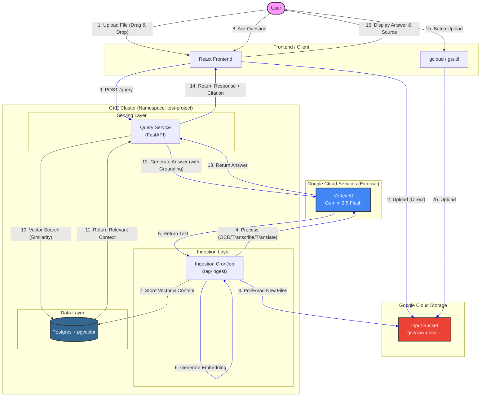

Copyright 2026 Google. This software is provided as-is, without warranty or representation for any use or purpose. Your use of it is subject to your agreement with Google.

# P6 Resilient RAG Agent - Data Flow Schematic

This document illustrates the end-to-end data flow for the Resilient RAG Agent, from file ingestion to user query.

## Workflow Description

### 1. Data Ingestion (Async)
1.  **Upload**: Users upload files (PDF, Images, Audio) via the React GUI or batch upload tools (`gsutil`) directly to the **GCS Input Bucket**.
2.  **Processing**: The **Ingestion CronJob** runs periodically (every 15 mins) or can be triggered manually.
3.  **Multimodal Transformation**: The Ingest Job reads files from GCS and sends them to **Gemini 2.5 Flash**.
    *   **Audio**: Transcribed to text.
    *   **Images**: OCR / Described as text.
    *   **PDF**: Text extracted.
    *   **Translation**: Non-English text is translated to English.
4.  **Storage**: The extracted text is embedded (vectorized) and stored in **Postgres (pgvector)** along with the original filename.

### 2. Query & Retrieval (Real-time)
1.  **Search**: The user asks a question via the **React Frontend**.
2.  **Retrieval**: The **Query Service** embeds the question and performs a similarity search in **Postgres** to find the most relevant document chunks.
3.  **Generation**: The retrieved context + user question is sent to **Gemini 2.5 Flash** with a strict system prompt ("Answer using ONLY the provided context").
4.  **Response**: The answer and the source document filename are returned to the user.
