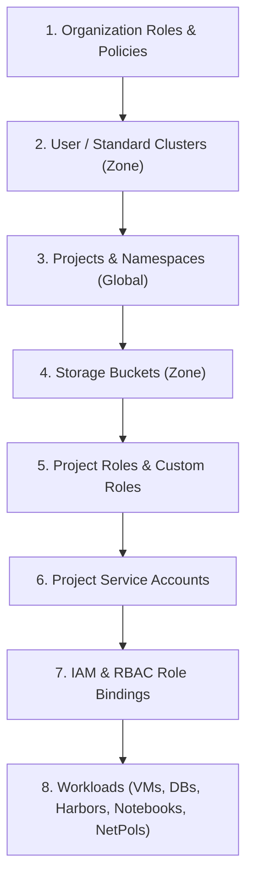

# Google Distributed Cloud Infrastructure Automation

This repository provides an end-to-end Infrastructure as Code (IaC) and GitOps automation framework for **Google Distributed Cloud air-gapped (GDCag)**. It brings together modular Helm charts, enterprise landing zone foundations, multi-engine deployment tooling, and production-ready reference architecture blueprints.

## Terminology
- **GDCag**: Google Distributed Cloud air-gapped (formerly known as **GDCH**)
- **Global API Cluster**: Central administrative context managing Projects, IAM, and global service accounts
- **Org Admin / Zone Cluster**: Zonal management context managing VMs, storage Buckets, databases, and network policies
- **Standard / User Clusters**: Dedicated tenant Kubernetes clusters hosting containerized application workloads

---

## Repository Structure

```text
.
├── foundations/               # Multi-stage enterprise landing zone automation via Helmfile
│   ├── bases/environments/    # Environment configurations (dev, stg, prd)
│   └── releases/              # Phased deployment stages (0-bootstrap to 4-notebooks)
├── blueprints/                # Production-ready, 100% self-contained workload reference architectures
│   ├── patterns/              # Enterprise patterns (P0-P13: 3-tier web, Kafka, RAG, Vault, Keycloak, etc.)
│   ├── gdc_gemma_gw/          # Self-contained Gemma LLM Gateway (vLLM & Ollama serving)
│   ├── common-scripts/        # Packaging, building, parameter configuration, and image mirroring scripts
│   └── docs/                  # In-depth architectural implementation guides
├── charts/                    # 27 modular Helm charts templating GDCag Custom Resources
├── tools/                     # Deployment tooling and GitOps orchestration engines
│   ├── bootstrap/             # Initial root project, service account, and credentials bootstrap
│   ├── helmfile/              # Declarative, data-driven orchestration using helmfile
│   ├── helm_cli/              # Custom Python CLI wrapper script for imperative templating and deployments
│   ├── config-sync/           # In-cluster continuous GitOps synchronization with Google Config Sync
│   └── argocd/                # Continuous deployment and GitOps synchronization using ArgoCD
├── policy/                    # OPA/Rego policies for security and configuration validation
└── scripts/                   # CI/CD validation, testing, schema generation, and documentation utilities
```

---

## Core Pillars

### 1. Landing Zone Foundations (`foundations/`)
The `foundations/` directory automates the setup of an enterprise GDCag landing zone using Helmfile. It structures environment resources into phased execution layers:
- **`0-bootstrap/`**: Root administrative namespace, base operations, and landing zone operator setup.
- **`0-org-setup/`**: Platform operations, organizational policy boundaries, and billing linkages.
- **`1-project-factory/`**: Dynamic tenant project creation, IAM role bindings, and project service accounts.
- **`2-resources/`**: Zonal resources (observability dashboards, Harbor registries, backup repositories, VMs, databases, and buckets).
- **`3-clusters/`**: Standard Kubernetes cluster provisioning and RBAC baseline setup.
- **`4-notebooks/`**: AI/ML Jupyter notebooks and supporting infrastructure.

Environment-specific definitions are maintained under `foundations/bases/environments/` (`dev/`, `stg/`, `prd/`) with modular configuration files (`globals.yaml`, `iac.yaml`, `tenants-org-*.yaml`, and `overrides.yaml`).

👉 **[View Foundations Documentation & Deployment Manual](foundations/README.md)**

### 2. Production Workload Blueprints (`blueprints/`)
The `blueprints/` directory contains **100% self-contained**, production-ready deployment assets for air-gapped environments. These packages require zero external internet dependencies and can be transferred as standalone bundles into air-gapped registries:
- **Enterprise Patterns (`blueprints/patterns/`)**:
  - `p0-dga-factory`: Factory automation for tenant workloads
  - `p1-resilient-3-tier-webapp`: High-availability 3-tier web application
  - `p3-legacy-vm-modern-db`: Mixed-mode legacy VM workloads connecting to managed PostgreSQL
  - `p4-event-driven-kafka`: Scalable, event-driven messaging with Kafka
  - `p5-hybrid-llm-gateway`: Hybrid LLM inference gateway supporting Ollama and vLLM
  - `p6-resilient-rag-agent`: Resilient Retrieval-Augmented Generation (RAG) agent
  - `p7-agentic-data-analyst`: AI-powered data analysis platform
  - `p8-closed-loop-mlops`: Air-gapped MLOps model training and serving pipeline
  - `p10-gemini-gui`: Conversational web interface for internal AI models
  - `p11-vault`: Enterprise secret management with HashiCorp Vault
  - `p12-keycloak`: Centralized Identity and Access Management with Keycloak
  - `p13-gdc-dev`: Developer workstation and sandbox environment
- **Gemma LLM Gateway (`blueprints/gdc_gemma_gw/`)**: Production inference serving for Google Gemma models.
- **Air-Gapped Tooling (`blueprints/common-scripts/`)**: Scripts for offline image mirroring (`bulk_mirror_images.sh`), parameter substitution (`configure-blueprints.sh`), and packaging (`package-for-gdc.sh`).

👉 **[View Blueprints Documentation & Workflow Guide](blueprints/README.md)**

### 3. Modular Helm Charts (`charts/`)
The repository includes purpose-built Helm charts that declare GDCag Custom Resources across organizational hierarchy, networking, IAM, storage, databases, and workloads. Each chart is equipped with strongly typed `values.schema.json` validation and local unit tests.

---

## Architecture & Resource Orchestration

GDCag heavily relies on custom resources, which are typically created in alphabetical order by Helm (as described in [helm/helm#1228](https://github.com/helm/helm/issues/1228)). For example, an `IAMRole` resource must exist before a `Project` resource can bind it.

To overcome this constraint, this framework enforces a **strict, layered deployment order**:



### Separating Infrastructure Provisioning from Access Management
When provisioning standard clusters, it is highly recommended to separate cluster lifecycle operations from access management:
- **Infrastructure Provisioning (`charts/gdc-standard-clusters`)**: Creates and manages the lifecycle of the standard cluster itself. Requires elevated platform privileges.
- **Access Management (`charts/gdc-standard-clusters-rbac`)**: Configures Kubernetes RBAC (`RoleBindings`, `ClusterRoleBindings`) inside the target cluster. Allows developers to be onboarded or offboarded securely without altering underlying cluster infrastructure.

---

## Deployment Strategies

This toolkit accommodates various operational models depending on your infrastructure automation maturity and air-gapped tooling preferences:

| Method | Best For | Description | Documentation |
| :--- | :--- | :--- | :--- |
| **Foundations (Helmfile)** | Enterprise Landing Zones | Phased multi-stage orchestration across Global and Zonal endpoints using Helmfile. | [Foundations Guide](foundations/README.md) |
| **Helmfile (Tools)** | Data-Driven Tenancy | Dynamic release generation sequenced directly from `tenants.yaml`. | [Helmfile Guide](tools/helmfile/README.md) |
| **Custom Helm CLI** | Local / CI/CD Pipelines | Python CLI (`helm_cli.py`) imperatively managing contexts and deployments. | [Helm CLI Guide](tools/helm_cli/README.md) |
| **Config Sync** | In-Cluster GitOps | Continuous reconciliation using Google's Config Sync operator. | [Config Sync Guide](tools/config-sync/README.md) |
| **ArgoCD** | GitOps Continuous Delivery | Enterprise continuous delivery and state synchronization using ArgoCD. | [ArgoCD Guide](tools/argocd/README.md) |

---

## Prerequisites

To use this framework, ensure you have the following tools installed and authenticated with your GDCag environment:

- `gdcloud` CLI configured with an active context
- `kubectl` and `helm` (v3.10+)
- `helmfile` (v1.2.1+) and the `helm-diff` plugin (for Helmfile workflows)
- Access to the target GDCag organization and projects

### Initial Bootstrap
Before deploying tenant workloads, you must bootstrap the initial root project and service account permissions. Follow the setup guide in [tools/bootstrap/README.md](tools/bootstrap/README.md):

```bash
cd tools/bootstrap
cp config.sh.sample config.sh
# Edit config.sh with your environment details
./bootstrap.sh
./authenticate.sh
```

---

## Quick Start Guide

### Option 1: Deploy Landing Zone via Foundations
1. Navigate to the foundations directory:
   ```bash
   cd foundations
   ```
2. Configure your environment variables in `bases/environments/dev/` (`globals.yaml`, `iac.yaml`, `tenants-org-1.yaml`).
3. Execute the release pipeline sequentially:
   ```bash
   helmfile -e dev -f releases/0-bootstrap/helmfile.yaml.gotmpl sync
   helmfile -e dev -f releases/0-org-setup/helmfile.yaml.gotmpl sync
   helmfile -e dev -f releases/1-project-factory/helmfile.yaml.gotmpl sync
   helmfile -e dev -f releases/2-resources/helmfile.yaml.gotmpl sync
   helmfile -e dev -f releases/3-clusters/helmfile.yaml.gotmpl sync
   ```

### Option 2: Deploy Production Workload Blueprints
1. Navigate to the blueprints directory:
   ```bash
   cd blueprints
   ```
2. Configure target environment parameters across all manifests:
   ```bash
   ./common-scripts/configure-blueprints.sh -p <target-project-id> -r <registry-url> -n <target-namespace>
   ```
3. Deploy GDC managed service custom resources and application workloads:
   ```bash
   kubectl apply -f patterns/p1-resilient-3-tier-webapp/manifests/gdc/db/
   kubectl apply -f patterns/p1-resilient-3-tier-webapp/manifests/apps/
   ```

---

## Code Validation & Testing

This repository enforces a strict, 4-layer offline validation pipeline to guarantee chart correctness, schema integrity, and security compliance before deployment:

1. **Input / Schema Validation (`helm lint` & `values.schema.json`):** Asserts that required values are provided and strongly typed.
2. **Logic Validation (`helm-unittest`):** Verifies Go templating logic via unit tests without requiring a running cluster.
3. **Structural Validation (`kubeconform`):** Verifies rendered YAML against Kubernetes OpenAPI specifications.
4. **Security Policy Compliance (`conftest` / OPA):** Asserts that manifests conform to security policies (e.g. `policy/security.rego`).

Run the entire offline test suite across all charts:

```bash
./scripts/test-charts.sh
```

Run chart linting (matching GitHub Actions CI):

```bash
ct lint --debug --config ./.github/configs/ct-lint.yaml --lint-conf ./.github/configs/lintconf.yaml
```

---

## Contributing

We welcome contributions! Please review [CONTRIBUTING.md](CONTRIBUTING.md) for details on:
- Contributor License Agreement (CLA) requirements
- Community guidelines & Code of Conduct
- Chart versioning and documentation standards
- Pull request submission checklist

---

## Reference

<details>
<summary><b>GDCag Resource Creation Sequences</b></summary>
<br>

**Zonal resource creation sequence:**
- `clusters.cluster.gdc.goog`: [only zonal mgmt]
- `OrganizationNetworkPolicy`: [only zonal mgmt]

**Global Resource creation sequence:**
- `projects` namespace: platform
- `customroles.iam.global.gdc.goog` namespace: platform
- `projectserviceaccounts.resourcemanager.global.gdc.goog` namespace: project
- `iamrolebindings.iam.global.gdc.goog` namespace: platform/project-name (both regular and custom)
- `projectnetworkpolicies.networking.global.gdc.goog` namespace: project
</details>

<details>
<summary><b>Global Resources API Endpoints</b></summary>
<br>

- `backendservicepolicies.networking.global.gdc.goog`
- `backendservices.networking.global.gdc.goog`
- `billingaccountbindings.billing.global.gdc.goog`
- `billingaccounts.billing.global.gdc.goog`
- `blockinvalidgdchrestrictedservice.constraints.global.gatekeeper.sh`
- `bucketinfos.object.global.private.gdc.goog`
- `bucketlocationconfigs.object.global.gdc.goog`
- `bucketlocations.object.global.gdc.goog`
- `buckets.object.global.gdc.goog`
- `clustermeshes.network.global.private.gdc.goog`
- `customroles.iam.global.gdc.goog`
- `datasources.monitoring.global.private.gdc.goog`
- `dnsregistrations.network.global.private.gdc.goog`
- `dnszones.network.global.private.gdc.goog`
- `etcdcarotations.etcd.mz.global.private.gdc.goog`
- `etcdclusterconfigoverrides.etcd.mz.global.private.gdc.goog`
- `etcdclusters.etcd.mz.global.private.gdc.goog`
- `etcdzones.etcd.mz.global.private.gdc.goog`
- `forwardingruleexternals.networking.global.gdc.goog`
- `forwardingruleinternals.networking.global.gdc.goog`
- `gdchallowedchars.constraints.global.gatekeeper.sh`
- `gdchallowedlength.constraints.global.gatekeeper.sh`
- `gdchallowednamespaces.constraints.global.gatekeeper.sh`
- `gdchreadonly.constraints.global.gatekeeper.sh`
- `gdchreservednames.constraints.global.gatekeeper.sh`
- `gdchreservedprefix.constraints.global.gatekeeper.sh`
- `gdchreservedsuffix.constraints.global.gatekeeper.sh`
- `gdchrestrictattribute.constraints.global.gatekeeper.sh`
- `gdchrestrictattributerange.constraints.global.gatekeeper.sh`
- `gdchrestrictbyattributes.constraints.global.gatekeeper.sh`
- `gdchrestrictedservice.constraints.global.gatekeeper.sh`
- `gdchrestrictfinalizerremoval.constraints.global.gatekeeper.sh`
- `gdchrestrictobjectstorageattributevalue.constraints.global.gatekeeper.sh`
- `gdchrestrictresource.constraints.global.gatekeeper.sh`
- `gdchsuffixednamespace.constraints.global.gatekeeper.sh`
- `gdchsystemclusterresource.constraints.global.gatekeeper.sh`
- `globaladdresspoolclaims.ipam.global.private.gdc.goog`
- `globaladdresspools.ipam.global.private.gdc.goog`
- `globalapizones.location.mz.global.private.gdc.goog`
- `globalresourceregistrations.apiregistry.global.private.gdc.goog`
- `globalrootkeys.kms.global.private.gdc.goog`
- `globalsecrets.core.global.private.gdc.goog`
- `healthchecks.networking.global.gdc.goog`
- `iamrolebindings.iam.global.gdc.goog`
- `iamroles.iam.global.gdc.goog`
- `identityproviderconfigs.iam.global.gdc.goog`
- `ioauthmethods.iam.global.private.gdc.goog`
- `kubeapiservers.lcm.global.private.gdc.goog`
- `manageddnszones.networking.global.gdc.goog`
- `mzaeadkeys.kms.global.gdc.goog`
- `orgbootstraps.bootstrap.mz.global.private.gdc.goog`
- `orgzones.bootstrap.mz.global.private.gdc.goog`
- `projectnetworkpolicies.networking.global.gdc.goog`
- `projects.resourcemanager.global.gdc.goog`
- `projectserviceaccounts.resourcemanager.global.gdc.goog`
- `releases.release.mz.global.private.gdc.goog`
- `resourcerecordsets.network.global.private.gdc.goog`
- `resourcerecordsets.networking.global.gdc.goog`
- `subnets.ipam.global.gdc.goog`
- `tokenrequests.bootstrap.mz.global.private.gdc.goog`
- `virtualmachineimages.virtualmachine.global.gdc.goog`
- `volumereplicationrelationships.storage.global.gdc.goog`
- `zonalrolebindings.iam.global.gdc.goog`
- `zonednsservers.network.global.private.gdc.goog`
- `zoneexclusions.location.mz.global.private.gdc.goog`
- `zones.location.mz.global.private.gdc.goog`
- `zoneselectionresults.location.mz.global.private.gdc.goog`
- `zoneselections.location.mz.global.private.gdc.goog`
</details>
