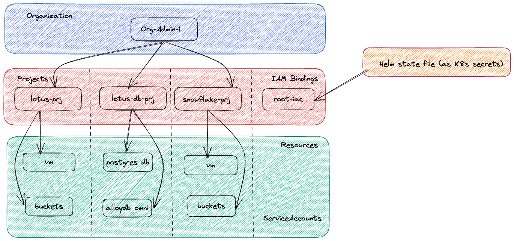

# Introduction

This framework is using [Helm](https://helm.sh/) as the resource config generator and can use either Helm or [Config-Sync](https://github.com/GoogleContainerTools/config-sync) as the resource state synchronization agent.

Helm creates resources in a predefined way as described in [issue/1228](https://github.com/helm/helm/issues/1228). GDCag is heavily relying on custom resources, and these are created in alphabetical order. This means that for example IAMRole resource comes before Project resource. This blocks possibility of creating single Helm Chart to manage all the resources.

Using sub-charts does not change the order as all resources are first merged into a single manifest, sorted and only uploaded afterwards. 

Using hooks solves resource creation order, however hook resources' life cycle is not managed with the release. 

Due to above, this framework is using layered approach, where single `org.yaml` configuration file is shared across multiple charts, a chart per layer. The layers are installed and updated in predefined order:
- Organization wide roles
- User Clusters [scope: zone]
- Projects
- Buckets [scope: zone]
- Project roles
- Project Service Accounts
- Role Bindings

# Setup

Helm is using the default kubeconfig path. To use different one:
export KUBECONFIG=~/workspaces/amg1/adhoc-tools/kubeconfigs/global-api-iac-kubeconfig

# Bootstrap IaC
0. Export environment variables (example):
   ```
   export ORG_NAME="org-15357"
   export IAC_PROJECT="iac-root"
   export IAC_USER="gdch-infra-operator-fop-iac001@opscenter.local"
   export IAC_SA="iac001-sa"
   export GDCH_CONSOLE="console.org-19364.lux-central1-b.lux.clr"
   export ZONE="lux-central1-b"
   export ROOT_ZONE="lux.clr"
   export CA_CERT_PATH="/mnt/Share/CTIE/dga/iac/"
   export CLUSTER_NAME="clstr-20260224"
   export shared_infra_project_name=data-ets-shared-infra
   ```
1. Grant IaC Bootstrap User required Org roles:
   ```
   for role in \
   organization-iam-admin \
   project-creator \
   project-editor \
   user-cluster-admin \
   ; do \
      gdcloud organizations add-iam-policy-binding "$ORG_NAME" \
      --member="user:${IAC_USER:?}" \
      --role="$role";\
   done
   ```
2. Create a project to host IaC resources

   ```
   gdcloud auth login (as $IAC_USER)
   gdcloud projects create $IAC_PROJECT
   gdcloud projects create $shared_infra_project_name
   ```

3. Grant IaC Bootstrap User required `$IAC_PROJECT` roles:
   ```
   for role in \
   secret-admin \
   project-iam-admin \
   ; do \
   gdcloud projects add-iam-policy-binding $IAC_PROJECT \
   --member=user:$IAC_USER \
   --role=$role;\
   done
   ```

4. Follow [documentation](https://docs.cloud.google.com/distributed-cloud/hosted/docs/latest/gdch/application/ao-user/iam/service-identities#gdcloud) to create service account:
   ```
   gdcloud iam service-accounts create "$IAC_SA" --project "$IAC_PROJECT"
   ```

5. Assign the permissions required by the service account:
- organization:
   ```
   for role in \
   organization-iam-admin \
   project-creator \
   project-editor \
   user-cluster-admin \
   ; do \
      gdcloud organizations add-iam-policy-binding "$ORG_NAME" \
      --member="serviceAccount:${IAC_PROJECT:?}:${IAC_SA:?}" \
      --role="$role";\
   done
   ```
- project:
   ```
   for role in \
   secret-admin \
   ; do \
   gdcloud projects add-iam-policy-binding $IAC_PROJECT \
   --member="serviceAccount:${IAC_PROJECT:?}:${IAC_SA:?}" \
   --role=$role;\
   done
   ```
6. Obtain the Service Account [credentials](https://docs.cloud.google.com/distributed-cloud/hosted/docs/latest/gdch/application/ao-user/iam/service-identities#create-and-add-key-pairs):
   ```
   gdcloud iam service-accounts keys create "${CA_CERT_PATH}${IAC_SA:?}.json" \
    --project="$IAC_PROJECT" \
    --iam-account="$IAC_SA"
   ```

7. [Generate kubeconfig](https://docs.cloud.google.com/distributed-cloud/hosted/docs/latest/gdch/application/ao-user/iam/service-identities#generate-kubeconfig) file:
   ```
   gdcloud auth activate-service-account --key-file=${CA_CERT_PATH:?}${IAC_SA:?}.json
   gdcloud auth print-identity-token --audiences=https://global-api.${ORG_NAME:?}.${ZONE:?}.${ROOT_ZONE:?}
   ERROR: no access token could be obtained from the current credentials: unable to obtain STS token using service account JWT: unable to reach server: Post "https://service-accounts.org-15357.lux.clr/authenticate": dial tcp: lookup service-accounts.org-15357.lux.clr on 10.255.255.254:53: no such host
   gdcloud auth print-identity-token --audiences=https://management-kube.apiserver.${ORG_NAME:?}.${ZONE:?}.${ROOT_ZONE:?} --zone=${ZONE:?}
   ERROR: no access token could be obtained from the current credentials: unable to obtain STS token using service account JWT: unable to reach server: Post "https://service-accounts.org-15357.lux.clr/authenticate": dial tcp: lookup service-accounts.org-15357.lux.clr on 10.255.255.254:53: no such host
   export KUBECONFIG=${CA_CERT_PATH:?}${IAC_PROJECT:?}_${IAC_SA:?}-global-api.kubeconfig
   gdcloud config set core/zone ""
   gdcloud clusters get-credentials global-api
   export KUBECONFIG=${CA_CERT_PATH:?}${IAC_PROJECT:?}_${IAC_SA:?}-${ZONE:?}.kubeconfig
   gdcloud config set core/zone ${ZONE:?}
   gdcloud clusters get-credentials ${ORG_NAME:?}-admin --zone ${ZONE:?}
   export KUBECONFIG=${CA_CERT_PATH:?}${IAC_PROJECT:?}_${IAC_SA:?}-${ZONE:?}-${CLUSTER_NAME:?}.kubeconfig
   gdcloud config set core/zone ${ZONE:?}
   gdcloud clusters get-credentials ${CLUSTER_NAME:?} --zone ${ZONE:?}
   ```

# Deploy Organization Resources using HELM CLI
1. Configure HELM environment
   ```
   export HELM_BURST_LIMIT=1 #required in adhoc env but not for real GDCag
   export HELM_NAMESPACE=$IAC_PROJECT
   ````
1. Configure HELM to use service account:
   ```
   gdcloud auth activate-service-account --key-file=${CA_CERT_PATH}${IAC_SA}.json
   export KUBECONFIG=${IAC_PROJECT}_${IAC_SA}-global-api.kubeconfig
   gdcloud clusters get-credentials global-api
   ```

2. Validate configuration
```
export config=dga
for resource in \
 projects\
 iac-role-bindings\
 clusters\
 buckets\
 iam-roles\
 iam-role-bindings\
 ; do \
    helm template --debug ${config}-$resource ./gdc-$resource -f ${config}.yaml;\
done
```

3. Create global resources
```
export config=dga
gdcloud config set core/zone ""
gdcloud clusters get-credentials global-api

for resource in \
 projects\
 iac-role-bindings\
 iam-roles\
 iam-role-bindings\
 ; do \
    helm install --debug ${config}-$resource ./gdc-$resource -f ${config}.yaml;\
done
```
4. Create zonal resources 

Note: The singlezone bucket resources and clusters are created using the zonal management API endpoint.
```
export config=dga
export zone=zone1
gdcloud clusters get-credentials ${ORG_NAME}-admin --zone ${zone}

for resource in \
 clusters\
 buckets\
 ; do \
    helm install --debug ${config}-$resource ./gdc-$resource --set zone=${zone} -f ${config}.yaml;\
done

```

# Mutate Organization
Mutating organization includes operations like:
- adding projects
- removing (actually tombstoning) projects
- adding and removing users and accounts
- adding and removing roles
- adding and removing role bindings
- creating and deleting clusters
- etc

1. Configure HELM to impersonate configured user:
```
gdcloud auth login (as $IAC_USER)
gdcloud clusters get-credentials global-api
export HELM_NAMESPACE=$IAC_PROJECT
```
2. Check if authentication works:
```
helm list
```

3. Validate configuration
```
for resource in \
 projects\
 clusters\
 organization-roles\
 organization-role-bindings\
 organization-network-policies\
 project-service-accounts\
 iam-role-bindings\
 ; do \
    helm template --debug org-$resource ./gdc-$resource -f org.yaml;\
done
```
4. Update configuration
```
for resource in \
 projects\
 projectserviceaccounts\
 iamrolebindings\
 ; do \
    helm upgrade --debug org-$resource ./gdc-$resource -f org.yaml;\
done
```

# Notes
- https://github.com/helm/helm/issues/1228

# GDCag Resource Creation
## Zonal resource creation sequence
- clusters.cluster.gdc.goog: [only zonal mgmt]
- OrganizationNetworkPolicy: [only zonal mgmt]
## Global Resource creation sequence:
- projects namespace: platform
- customroles.iam.global.gdc.goog namespace: platform
- projectserviceaccounts.resourcemanager.global.gdc.goog namespace: project
- iamrolebindings.iam.global.gdc.goog namespace: platform/project-name (both regular and custom)
- projectnetworkpolicies.networking.global.gdc.goog namespace: project

# Global resources
- backendservicepolicies.networking.global.gdc.goog                                  
- backendservices.networking.global.gdc.goog                                         
- billingaccountbindings.billing.global.gdc.goog                                     
- billingaccounts.billing.global.gdc.goog                                            
- blockinvalidgdchrestrictedservice.constraints.global.gatekeeper.sh                 
- bucketinfos.object.global.private.gdc.goog                                         
- bucketlocationconfigs.object.global.gdc.goog                                       
- bucketlocations.object.global.gdc.goog                                             
- buckets.object.global.gdc.goog                                                     
- clustermeshes.network.global.private.gdc.goog                                      
- customroles.iam.global.gdc.goog                                                    
- datasources.monitoring.global.private.gdc.goog                                     
- dnsregistrations.network.global.private.gdc.goog                                   
- dnszones.network.global.private.gdc.goog                                           
- etcdcarotations.etcd.mz.global.private.gdc.goog                                    
- etcdclusterconfigoverrides.etcd.mz.global.private.gdc.goog                         
- etcdclusters.etcd.mz.global.private.gdc.goog                                       
- etcdzones.etcd.mz.global.private.gdc.goog                                          
- forwardingruleexternals.networking.global.gdc.goog                                 
- forwardingruleinternals.networking.global.gdc.goog                                 
- gdchallowedchars.constraints.global.gatekeeper.sh                                  
- gdchallowedlength.constraints.global.gatekeeper.sh                                 
- gdchallowednamespaces.constraints.global.gatekeeper.sh                             
- gdchreadonly.constraints.global.gatekeeper.sh                                      
- gdchreservednames.constraints.global.gatekeeper.sh                                 
- gdchreservedprefix.constraints.global.gatekeeper.sh                                
- gdchreservedsuffix.constraints.global.gatekeeper.sh                                
- gdchrestrictattribute.constraints.global.gatekeeper.sh                             
- gdchrestrictattributerange.constraints.global.gatekeeper.sh                        
- gdchrestrictbyattributes.constraints.global.gatekeeper.sh                          
- gdchrestrictedservice.constraints.global.gatekeeper.sh                             
- gdchrestrictfinalizerremoval.constraints.global.gatekeeper.sh                      
- gdchrestrictobjectstorageattributevalue.constraints.global.gatekeeper.sh           
- gdchrestrictresource.constraints.global.gatekeeper.sh                              
- gdchsuffixednamespace.constraints.global.gatekeeper.sh                             
- gdchsystemclusterresource.constraints.global.gatekeeper.sh                         
- globaladdresspoolclaims.ipam.global.private.gdc.goog                               
- globaladdresspools.ipam.global.private.gdc.goog                                    
- globalapizones.location.mz.global.private.gdc.goog                                 
- globalresourceregistrations.apiregistry.global.private.gdc.goog                    
- globalrootkeys.kms.global.private.gdc.goog                                         
- globalsecrets.core.global.private.gdc.goog                                         
- healthchecks.networking.global.gdc.goog                                            
- iamrolebindings.iam.global.gdc.goog                                                
- iamroles.iam.global.gdc.goog                                                       
- identityproviderconfigs.iam.global.gdc.goog                                        
- ioauthmethods.iam.global.private.gdc.goog                                          
- kubeapiservers.lcm.global.private.gdc.goog                                         
- manageddnszones.networking.global.gdc.goog                                         
- mzaeadkeys.kms.global.gdc.goog                                                     
- orgbootstraps.bootstrap.mz.global.private.gdc.goog                                 
- orgzones.bootstrap.mz.global.private.gdc.goog                                      
- projectnetworkpolicies.networking.global.gdc.goog                                  
- projects.resourcemanager.global.gdc.goog                                           
- projectserviceaccounts.resourcemanager.global.gdc.goog                             
- releases.release.mz.global.private.gdc.goog                                        
- resourcerecordsets.network.global.private.gdc.goog                                 
- resourcerecordsets.networking.global.gdc.goog                                      
- subnets.ipam.global.gdc.goog                                                       
- tokenrequests.bootstrap.mz.global.private.gdc.goog                                 
- virtualmachineimages.virtualmachine.global.gdc.goog                                
- volumereplicationrelationships.storage.global.gdc.goog                             
- zonalrolebindings.iam.global.gdc.goog                                              
- zonednsservers.network.global.private.gdc.goog                                     
- zoneexclusions.location.mz.global.private.gdc.goog                                 
- zones.location.mz.global.private.gdc.goog                                          
- zoneselectionresults.location.mz.global.private.gdc.goog                           
- zoneselections.location.mz.global.private.gdc.goog                                 
# GDCH Infrastructure Automation (Helmfile)

This repository manages the deployment of **Google Distributed Cloud Hosted (GDCH)** resources using [Helmfile](https://github.com/helmfile/helmfile). 

It utilizes a **data-driven approach**:
1.  **`tenants.yaml`**: Defines the desired state (Tenants, Projects, IAM, VMs, Buckets, Databases).
2.  **`helmfile.yaml`**: The logic engine that dynamically generates Helm releases based on the data.
3.  **`charts/`**: Local Helm charts that template the GDCH Custom Resources.

---

## 🏗 Architecture

This setup orchestrates resources across two distinct Kubernetes contexts required by GDCH:

| Kubernetes Context | Resources Managed |
| :--- | :--- |
| **Global API Cluster** | `Project`, `IAMRoleBinding`, `ProjectServiceAccount` |
| **Org Admin Cluster** | `VirtualMachine`, `Bucket`, `DBCluster` (Postgres/Oracle/AlloyDB) |



### State Management Strategy
* **Helm State (Secrets):** All Helm release secrets are stored in a centralized namespace called **`iac-root`**.
* **Resource Destination:** The actual resources are deployed into their respective Project Namespaces (e.g., `lotus-prj`, `snowflake-prj`).

### Dependency Chain
Helmfile enforces the following strict execution order to satisfy GDCH API requirements:
1.  **Project** (Creates the Namespace)
2.  **IAM Role Bindings** (Grants permissions to the IaC user & Tenant users)
3.  **Service Accounts** (Requires IAM permissions to be visible)
4.  **Workloads** (VMs, Buckets, DBs - deployed in parallel after the Project environment is ready)

---

## ✅ Prerequisites

### 0. Required Tools
* [Helm](https://helm.sh/docs/intro/install/) (v3.17.1+)
* [Helm diff](https://github.com/databus23/helm-diff) (v3.12.5+)
* [Helmfile](https://github.com/helmfile/helmfile) (v1.2.1+)
* `kubectl`

```bash
# install helm-diff
helm plugin install https://github.com/databus23/helm-diff --version v3.12.5

helm plugin list

# install helmfile
wget https://github.com/helmfile/helmfile/releases/download/v1.2.1/helmfile_1.2.1_linux_amd64.tar.gz
tar -zxvf helmfile_1.2.1_linux_amd64.tar.gz
mv helmfile /usr/local/bin/

echo 'source <(helmfile completion bash)' >> ~/.bashrc
source ~/.bashrc

helmfile version
```

### 2. Kubeconfig Contexts
The `helmfile.yaml.gotmpl` expects these specific context names:
* `global-api-gdch_console-org-1-zone1-google-gdch-test_global-api` - use for global resources deployment like projects, projectserviceaccounts.
* `org-1-admin-zone1-gdch_console-org-1-zone1-google-gdch-test_org-1-admin` - use for project specific or zonal resource deployment like VMs, buckets and DBs.

> **Tip:** To see your available cluster contexts:  `kubectl config get-contexts`

### 3. RBAC Bootstrapping (First Run Only)
The user running Helmfile (e.g., `fop-iac`) requires **Secret-Admin** and **Project-IAM-Admin** privileges on **iac-root** project to manage Helm state file.

Run these commands once to bootstrap permissions:

Firstly, make sure `fop-platform-admin@example.com` user has the roles `IAM Org Admin`, `Organization Grafana Viewer`, `Project Creatori` assigned.

```bash
# Export environment variables 
export ORG_NAME="org-1"
export IAC_PROJECT="iac-root"
export IAC_USER="fop-iac@example.com"


### Create a project to host IaC resources
gdcloud auth login (as platform-admin)
gdcloud projects create $IAC_PROJECT

### Grant IAC_USER required Org roles:
for role in \
  organization-iam-admin \
  project-creator \
  project-editor \
  user-cluster-admin \
; do \
   gdcloud organizations add-iam-policy-binding "$ORG_NAME" \
   --member="user:$IAC_USER" \
   --role="$role";\
done

### Grant IAC_USER required IAM permissions on `IAC_PROJECT` :
for role in \
  secret-admin \
; do \
  gdcloud projects add-iam-policy-binding $IAC_PROJECT \
  --member=user:$IAC_USER \
  --role=$role;\
done
```

### 4. Deploying GDCH Resources `VirtualMachine`, `Bucket`, `DBCluster`

0. gdcloud auth login (as fop-iac@example.com)

`gdcloud auth login --login-config-cert=/tmp/org-1-web-tls-ca.cert`

1. Prechecks Helm Chart
```bash
cd helm-iac
helmfile lint
helmfile list
helmfile show-dag
```


2. Helmfile diff to show resources to deploy

```bash
helmfile diff
```

Note: this is like to fail because of a "Chicken and Egg" problem.  `helmfile diff` or even `helmfile apply` attempts to calculate diffs for all groups before it applies anything.
However, this is a fresh install and  the namespaces (e.g lotus-prj, snowflake-prj) does not exist yet.

2. Use `helmfile sync` for ``first run``.

Note: `helmfile sync` does not try to read the state first. It will simply execute the DAG in order ensuring the resources are deployed base on the order and dependency defined using the `needs` keyword.

4. Use `helmfile apply` for subsequent resources deployment once project and rolebindings exists.

```bash
helmfile apply
```
