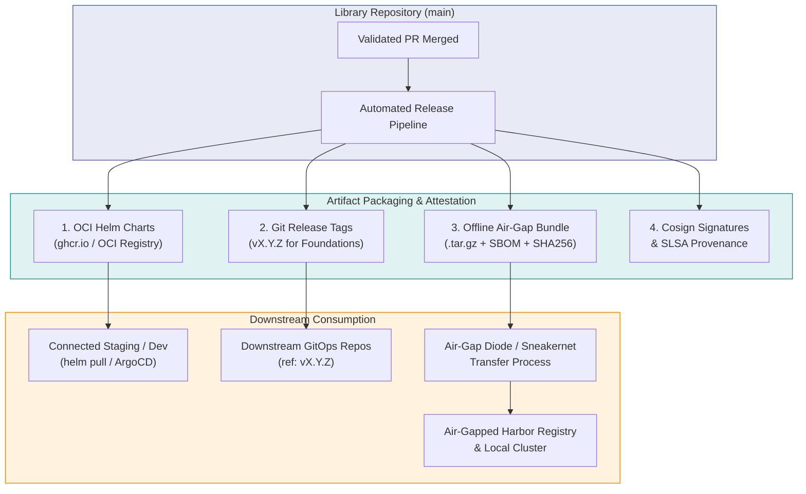
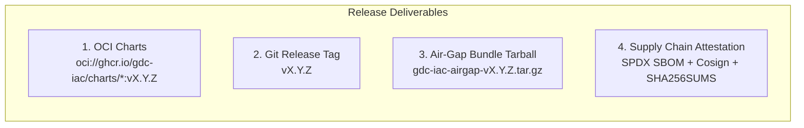
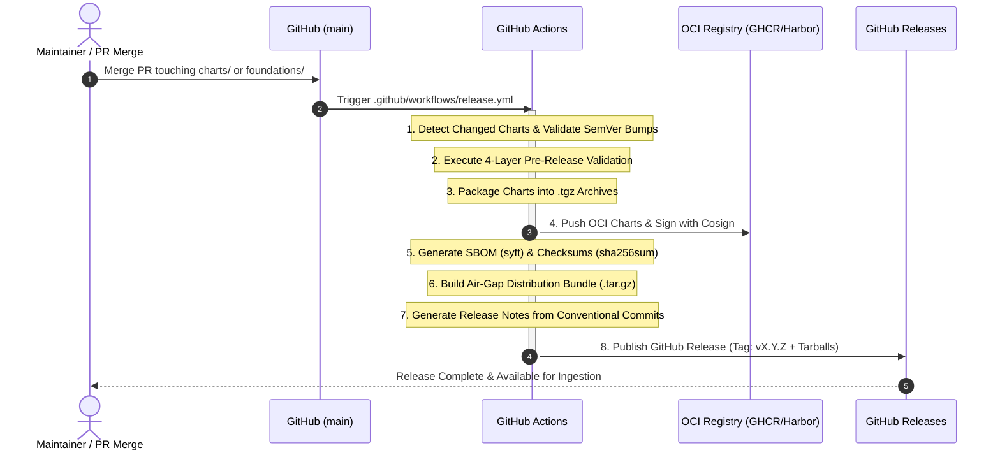
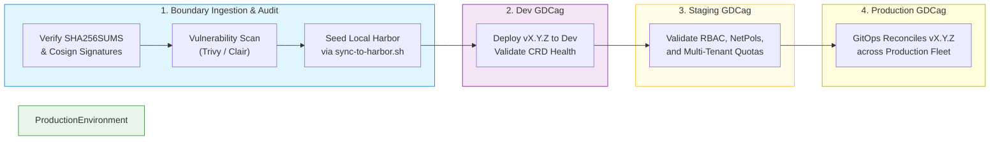

<!--
Copyright 2026 Google. This software is provided as-is, without warranty or representation for any use or purpose. Your use of it is subject to your agreement with Google.
-->

# Google Distributed Cloud Infrastructure Automation — Release Strategy

**Repository:** `gdc-iac-org`  
**Operational Paradigm:** Reusable Module and Template Library (Zero In-Tree Environment State)  
**Target Environments:** Google Distributed Cloud air-gapped (GDCag) & Connected Staging

---

## 1. Executive Summary & Paradigm Context

This repository operates strictly as a **Reusable Module, Chart, and Blueprint Library**. Under this paradigm:
- The repository contains **zero environment-specific secrets, live cluster credentials, or deployed release state**.
- The repository does **not** directly execute deployments to physical environments.
- Its sole purpose is to produce, certify, package, and distribute **versioned, immutable, production-ready infrastructure artifacts**.

Because Google Distributed Cloud air-gapped (GDCag) environments operate in classified, disconnected, or isolated networks without internet connectivity, this release strategy establishes two synchronized delivery modalities:
1. **Connected Delivery**: Continuous publishing of versioned OCI Helm charts and Git-tagged macro-releases for connected staging, testbeds, and GitOps engines (Config Sync, ArgoCD).
2. **Air-Gapped Delivery**: Self-contained, cryptographically signed offline transfer bundles (`.tar.gz`) containing packaged charts, digest-pinned image manifests, Software Bill of Materials (SBOM), and local registry seeding scripts for high-side diode / sneakernet transfer.



---

## 2. Dual-Track Release Cadence & Semantic Versioning

To decouple fast-moving micro-charts from macro landing zone foundations, releases operate on two coordinated tracks adhering strictly to [Semantic Versioning 2.0.0](https://semver.org/):

| Track | Target Components | Versioning Schema | Release Cadence | Release Trigger |
|---|---|---|---|---|
| **Track 1: Component (Micro)** | Individual Helm Charts (`charts/*`) | Independent SemVer per chart (`0.X.Y`) declared in `Chart.yaml` | Continuous on PR merge | Automated when `Chart.yaml` version is incremented in a merged PR |
| **Track 2: Distribution (Macro)** | Landing Zone Foundations (`foundations/`) & Workload Blueprints (`blueprints/`) | Unified Repository SemVer (`vMAJOR.MINOR.PATCH`) | Milestone / Bi-weekly | Tagging `vX.Y.Z` or merging an automated Release PR |

### Semantic Versioning Rules

- **PATCH (`0.0.X` / `v1.0.X`)**:
  - Backward-compatible bug fixes in Go templates or helper scripts.
  - Schema documentation clarifications that do not change validation rules.
  - Non-functional changes, comments, and documentation updates.
- **MINOR (`0.X.0` / `v1.X.0`)**:
  - New charts added to `charts/`.
  - Backward-compatible parameter additions to `values.yaml` with safe defaults.
  - New reference architecture blueprints (e.g. `blueprints/patterns/p14-*`).
  - New operational stages in `foundations/releases/`.
- **MAJOR (`X.0.0` / `v2.0.0`)**:
  - Incompatible value renames, removals, or type changes in `values.yaml`.
  - Schema validation breaking changes in `values.schema.json`.
  - Architectural overhauls to Helmfile execution pipelines.
  - Dropping compatibility support for an older GDC Hosted platform version.

---

## 3. Published Release Deliverables

Every official release produces four distinct, versioned deliverables:



### Deliverable 1: OCI Helm Charts (`Track 1`)
- Built using Helm 3 native OCI packaging:
  ```bash
  helm package charts/gdc-projects --version 0.2.0
  helm push gdc-projects-0.2.0.tgz oci://ghcr.io/gdc-iac/charts
  ```
- **Registry Targets**:
  - **Air-Gapped**: Re-hosted inside tenant on-prem registries (`oci://[harbor]/library/charts/<chart-name>`).

### Deliverable 2: Git Release Tags (`Track 2`)
- Annotated Git tags on `main`: `v<Major>.<Minor>.<Patch>` (e.g. `v1.2.0`).
- Downstream consumer repositories pin the exact version tag:
  ```yaml
  # In downstream tenant environment helmfile.yaml
  helmfiles:
    - path: "git::https://github.com/gdc-iac/gdc-iac-org.git//foundations/releases/1-project-factory/helmfile.yaml.gotmpl?ref=v1.2.0"
  ```

### Deliverable 3: Standalone Air-Gap Transfer Bundle
For facilities with zero internet access, each GitHub Release generates an all-inclusive archive:
- **`gdc-iac-airgap-vX.Y.Z.tar.gz`** containing:
  - `charts/`: All packaged `.tgz` Helm charts.
  - `foundations/`: Modular Helmfile landing zone configurations.
  - `blueprints/`: Declarative Kustomize manifests and application architectures.
  - `images/bulk_external_images.txt`: Manifest of all third-party container images pinned by **immutable SHA256 digest**.
  - `scripts/sync-to-harbor.sh`: Offline synchronization script using `skopeo` or `crane` to hydrate the air-gapped Harbor registry.

### Deliverable 4: Supply Chain Security & Provenance
- **Signatures**: OCI artifacts signed using **Cosign** (Sigstore / OIDC keyless or organization private key).
- **SBOM**: Software Bill of Materials in SPDX 2.3 JSON format (`gdc-iac-sbom-vX.Y.Z.json`).
- **Integrity**: Cryptographic `SHA256SUMS` file signed with GPG.

---

## 4. End-to-End Release Automation Pipeline



### Automation Details

1. **Change Detection**:
   The workflow compares `git diff` against the previous tag. If files under `charts/<chart>/` changed, `Chart.yaml` version bump is mandatory; otherwise the build fails.
2. **Packaging & OCI Upload**:
   ```bash
   for chart_dir in charts/*; do
     if [ -f "$chart_dir/Chart.yaml" ]; then
       helm package "$chart_dir" -d dist/charts/
     fi
   done

   for pkg in dist/charts/*.tgz; do
     helm push "$pkg" "oci://ghcr.io/${GITHUB_REPOSITORY}/charts"
     cosign sign --yes "ghcr.io/${GITHUB_REPOSITORY}/charts/$(basename "$pkg" .tgz)"
   done
   ```
3. **Air-Gap Bundle Compilation**:
   ```bash
   tar -czvf "dist/gdc-iac-airgap-${VERSION}.tar.gz" \
     charts/ \
     foundations/ \
     blueprints/ \
     policy/ \
     scripts/sync-to-harbor.sh

   cd dist && sha256sum * > SHA256SUMS
   ```

---

## 5. Air-Gapped Ingestion & Downstream Promotion Lifecycle

Downstream platform operators consume release bundles and promote them across physical GDC environments through an isolated, unidirectional pipeline:



### Downstream Environment Promotion Protocol

1. **Development Environment**:
   - Downstream tenant repository updates its `bases/environments/dev/globals.yaml` to point to the new tag:
     ```yaml
     library_version: "v1.2.0"
     ```
   - Executes `helmfile -e dev apply` to validate new CRD behaviors.
2. **Staging Environment**:
   - Following automated testing and security sign-off, a pull request is submitted in the downstream repository promoting `stg/` to `v1.2.0`.
3. **Production Environment**:
   - Change Advisory Board (CAB) review approves the promotion PR in the downstream repository, updating `prd/` to `v1.2.0`.
   - Continuous reconciliation via Config Sync or ArgoCD synchronizes the desired state to the production clusters.
4. **Emergency Rollback**:
   - If an unexpected regression occurs, the downstream PR reverts `library_version: "v1.2.0"` back to `v1.1.4`.
   - Zero branch rollbacks or code alterations are required in this library repository.

---

## 6. Implementation Roadmap & Execution Status

The release strategy is deployed incrementally across three progressive phases:

### Phase 1: CI Release Pipeline Stabilization (Completed in PR #67)
- [x] **Helm Setup Pinning**: Integrated `azure/setup-helm` pinned to Helm `v3.18.0` via immutable commit SHA (`dda3372f752e03dde6b3237bc9431cdc2f7a02a2`) in `.github/workflows/release.yml`.
- [x] **Global Git Attribution**: Added `git config --global user.name` and `user.email` to ensure clean attribution for release commits.
- [x] **Security Token Hardening**: Removed insecure `x-access-token` injection into repository remote URLs.
- [x] **Concurrency Serialization**: Added `concurrency: group: release-${{ github.ref }}` to serialize releases and prevent race conditions.
- [x] **Dual-Mode Chart Distribution**: Enabled native OCI packaging and publishing to GitHub Container Registry (`ghcr.io/gdc-iac/gdc-iac-org/charts`) alongside GitHub Releases.

### Phase 2: Foundations & Chart Version Parameterization (Follow-Up PR)
- [ ] **Helmfile Version Attribute Support**: Update Helmfile release templates under `foundations/releases/*/*.yaml.gotmpl` to accept both local paths and remote OCI registry references with explicit `version:` attributes:
  ```yaml
  chart: {{ $vals | get "gdc_clusters_chart" "../../../charts/gdc-clusters" }}
  {{- if hasKey $vals "gdc_clusters_version" }}
  version: {{ $vals.gdc_clusters_version | quote }}
  {{- end }}
  ```
- [ ] **Dual-Mode Environment Definitions**: Update `foundations/bases/environments/*/charts.yaml` to provide dual-mode examples (local relative filesystem paths for development vs `oci://harbor.infra.gdc.example.com/charts` with pinned versions for production).
- [ ] **Unified Distribution Tagging**: Automate Git macro-tagging (`vMAJOR.MINOR.PATCH`) on `main` when `foundations/` or `blueprints/` change to support remote Helmfile references (`git::https://github.com/gdc-iac/gdc-iac-org.git//foundations/releases/1-project-factory?ref=v1.3.0`).

### Phase 3: Air-Gap Bundling & Supply Chain Attestation (Follow-Up PR)
- [ ] **Automated Air-Gap Tarball Compilation**: Extend `.github/workflows/release.yml` to package `gdc-iac-airgap-vX.Y.Z.tar.gz` containing all `.tgz` chart packages, foundations templates, blueprints, and `SHA256SUMS`.
- [ ] **Cosign OCI Signatures**: Sign published OCI charts in GHCR using Cosign keyless or KMS-backed signatures.
- [ ] **SBOM Generation**: Generate SPDX 2.3 Software Bill of Materials (`gdc-iac-sbom-vX.Y.Z.json`) using Syft/Anchore during the release workflow.
- [ ] **Air-Gap Ingestion Utility**: Author `foundations/scripts/ingest-airgap-bundle.sh` to provide customers with a turnkey script to verify checksums and seed charts and images into their local air-gapped Harbor registry.

---