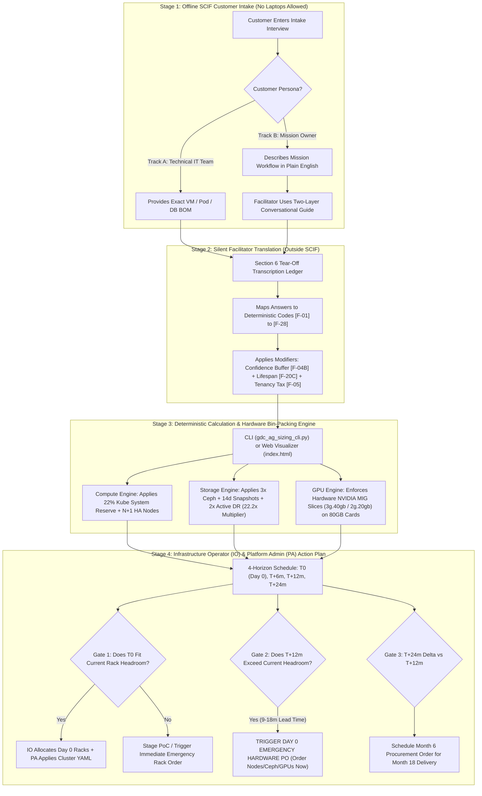
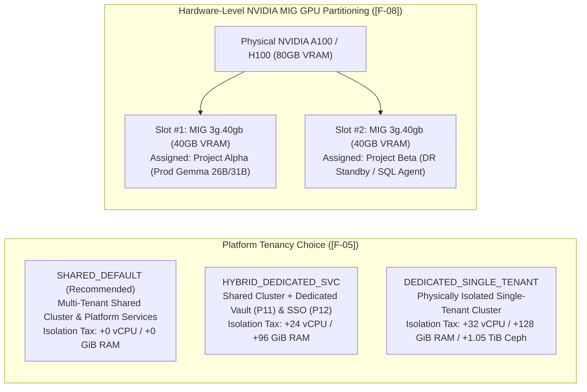
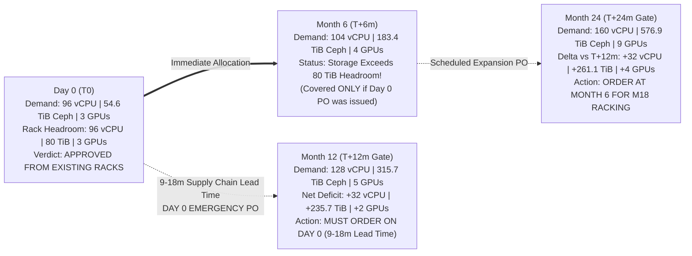

# GDC Air-Gapped (GDC-ag) Workload Sizing & IO Procurement Framework
## Executive & Technical Presentation Deck

````carousel
# Slide 1: Executive Summary — The Air-Gapped Sizing Paradox
### Why Traditional Cloud Sizing Fails in Disconnected SCIF Enclaves

* **The Cloud Illusion vs. Air-Gapped Reality:**
  * In public cloud, capacity is elastic and procurement takes seconds via API.
  * In **Google Distributed Cloud Air-Gapped (GDC-ag)**, hardware is physically fixed inside accredited SCIF racks, and adding compute, storage, or GPUs requires **9 to 18 months** for supply-chain delivery, TEMPEST/SCIF security accreditation, and physical racking.
* **Three Critical Operational Failure Modes This Framework Solves:**
  1. **Customer Intimidation & "Guesswork BOMs":** Mission owners know their operational problem (Track B) but freeze when asked for Kubernetes `vCPU`, `pgvector` RAM, or `VRAM` KV-cache specs—leading to wildly inaccurate hardware orders.
  2. **The Hidden 22.2x Storage & Platform Overhead Trap:** Naive sizing ignores Kubernetes system reservations (`22%`), Ceph `3x` physical replication, 14-day local snapshots (`2.7x`), and active DR mirroring (`2x`), causing Day 0 storage exhaustion at Month 4.
  3. **The 9–18 Month Procurement Blind Spot:** Infrastructure Operators (IOs) allocate Day 0 (`T0`) racks without visibility into `T+12m` workload ramps—discovering too late that they needed to issue a Purchase Order **on Day 0** to survive Year 1.

<!-- slide -->

# Slide 2: End-to-End Process Flowchart (SCIF Intake to IO Execution)
### How Operational Needs Transform into Physical Rack Allocations & PO Gates



<!-- slide -->

# Slide 3: Solving Problem 1 — The Two-Layer Intake Architecture
### Eliminating Technical Intimidation Without Losing Mathematical Rigor

| Layer | Target Persona | Environment | Operational Mechanism | Example Question / Mapping |
| :--- | :--- | :--- | :--- | :--- |
| **Layer 1: Spoken Conversational Script** | Mission Owners, Agency Directors, Non-Technical Stakeholders (**Track B**) | Inside Accredited SCIF (Paper/Pen Only) | Asks warm, operational questions about shift-change concurrency, document Q&A, and outage tolerance. | *"If a server rack loses power, does this system need to stay online immediately with a live copy at your backup site?"* |
| **Layer 2: Silent Facilitator Rules** | GDC Solution Architects & Systems Engineers | Section 6 Tear-Off Ledger & CLI/Web Tool | Deterministically translates spoken operational answers into strict infrastructure parameters (`[F-01]`–`[F-28]`). | Maps *"Stay online + backup site copy"* $\rightarrow$ **`[F-07] = ZONAL_HA_PLUS_DR`** (`2.0x` Site Multiplier + `3x` Ceph Quorum). |
| **Data Confidence Contingency (`[F-04B]`)** | Infrastructure Operations (IO) Risk Management | Automated Engine Multiplier | Protects IO racks from customer guesswork by automatically injecting a storage safety buffer based on data maturity. | • `MEASURED` (`+0%` / `1.00x`)<br>• `DERIVED` (`+10%` / `1.10x`)<br>• `ESTIMATED` (`+25%` / `1.25x`) |
| **Workload Lifespan Reclamation (`[F-20C]`)** | Capacity Planners | Automated Pool Tagging | Flags temporary surge workloads or off-shift dev/test environments so compute/VRAM can be reclaimed. | `SPINDOWN_ELIGIBLE` flags non-prod cores for off-shift reclamation rather than permanent hardware purchase. |

<!-- slide -->

# Slide 4: Solving Problem 2 — Multi-Tenant Isolation vs. Dedicated Tax
### Codifying Platform Services (`[F-05]`) & Hardware-Isolated GPU MIG (`[F-08]`)



* **Enforced Architectural Guardrails:**
  1. **Zero-Trust GPU Multi-Tenancy:** Software time-slicing is prohibited across security boundaries. The engine enforces hardware-level NVIDIA MIG profiles (`1g.10gb`, `2g.20gb`, `3g.40gb`, `7g.80gb`) with dedicated memory controllers and fault isolation per project namespace.
  2. **VRAM Out-of-Memory (OOM) Prevention:** Selecting `Gemma 4 26B/31B` (`P6 RAG` / `P7 SQL`) automatically blocks `1g.10gb` and `2g.20gb` slices and enforces **`MIG_3G_40GB` (`40GB` VRAM minimum)** to fit model weights + FP16 KV-cache.

<!-- slide -->

# Slide 5: Solving Problem 3 — The 22.2x Raw Storage Multiplier
### Why "500 GiB of Mission Data" Requires 54.60 TiB of Physical Ceph Disk on Day 0

Many air-gapped deployments fail within 90 days because sizing only accounts for raw database files. The GDC-ag Sizing Engine compounds five mandatory physical storage layers:

$$\text{Raw Physical Ceph (TiB)} = \left( \text{Primary Usable Data} \times \text{Index Factor (1.20)} \times \text{DR Site Mirror (2.0)} \times \text{Confidence Buffer (1.10)} \right) \times \left( 1 + \text{Snapshot Factor (2.70)} \right) \times \text{Ceph Replication (3.0)}$$

| Storage Multiplier Layer | Engineering Justification | Cumulative Impact (Project Sentinel Example) |
| :--- | :--- | :--- |
| **1. Baseline + Harbor Bundle (`[F-17]`)** | Blueprint `P4 + P6 + P7` usable volumes (`1,788 GiB`) + `120 GiB` air-gapped container bundle. | **`1,908 GiB` (`1.86 TiB`)** |
| **2. Vector & DB Index Overhead (`+20%`)** | HNSW vector indexes (`pgvector`), WAL logs, and B-Tree metadata require `1.20x` disk space. | **`2,290 GiB` (`2.24 TiB`)** |
| **3. Active Disaster Recovery Mirror (`×2.0`)** | `ZONAL_HA_PLUS_DR` maintains an active, real-time replicated copy at the secondary SCIF site. | **`4,580 GiB` (`4.47 TiB`)** |
| **4. Data Confidence Buffer (`[F-04B] = +10%`)** | `DERIVED` workshop sizing injects a `+10%` contingency buffer (`1.10x`). | **`5,038 GiB` (`4.92 TiB Usable`)** |
| **5. Local Snapshots (`×3.70`) & Ceph (`×3.0`)** | 14 days of daily snapshots (`5%/day` + `2` full base backups = `2.7x` backup addition $\rightarrow 3.7x$ total) stored on **3-way replicated Ceph OSDs (`×3.0`)**. | **`54.60 TiB Raw Physical Ceph Disk`** |

<!-- slide -->

# Slide 6: Solving Problem 4 — The 9–18 Month IO Hardware Procurement Gate
### Why the T+12m Forecast Dictates Day 0 Hardware Purchase Orders



* **Operational Takeaway for Infrastructure Operators (IOs):**
  * Even when a workload fits 100% inside existing unallocated racks on **Day 0 (`T0`)**, continuous daily data ingestion (`25 GiB/day` $\rightarrow 22.2\times$ raw multiplier) and user ramp-up will exhaust rack storage by **Month 5**.
  * Because GDC-ag hardware procurement and SCIF accreditation take **9 to 18 months**, the IO team **must execute the `T+12m` deficit Purchase Order on Day 0**.

<!-- slide -->

# Slide 7: Toolchain Demonstration — Offline Guide, CLI & Web Visualizer
### Unified Workflow Across Disconnected and Connected Environments

| Tool Component | File Path in Repository | Primary User & Execution Mode | Key Output Artifacts |
| :--- | :--- | :--- | :--- |
| **1. Two-Layer Offline Questionnaire** | `docs/capacity-sizing/gdc_ag_offline_interview_questionnaire.md` | **Facilitator inside SCIF** (Printed booklet, zero electronic devices). | Completed **Section 6 Tear-Off Transcription Ledger** (`[F-01]`–`[F-28]` checkboxes). |
| **2. Interactive Web Visualizer** | `docs/capacity-sizing/index.html` (`gdc_ag_sizing_calculator.html`) | **Architect / Customer Workshop** (`python3 -m http.server 8080`). | • Live Plain-English $\leftrightarrow$ Coded Mode Toggle<br>• Visual NVIDIA 80GB MIG Card Slot Layout<br>• Rack Headroom Comparison Bars<br>• Declarative Kubernetes `Cluster` YAML |
| **3. Zero-Dependency CLI Engine** | `docs/capacity-sizing/gdc_ag_sizing_cli.py` | **IO / CI-CD Automation** (`python3 gdc_ag_sizing_cli.py --input ...`). | • Formatted ASCII Executive IO Action Plan<br>• Automated Day 0 & Month 6 Purchase Order Quantities<br>• Structured JSON for GitOps Pipelines |
````
