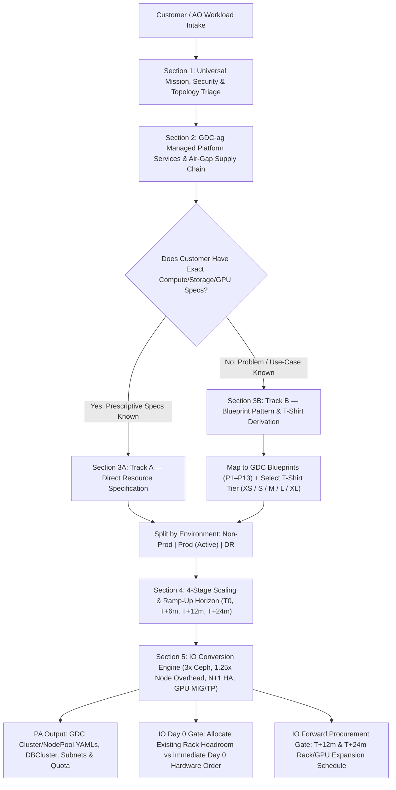

# GDC Air-Gapped (GDC-ag) Unified Workload Sizing, Ramp-Up & Intake Framework

> **Scope:** End-to-End Capacity Capture & Triage from Application Operator (AO) Intake through Platform Administrator (PA) Service Mapping to Infrastructure Operator (IO) Physical Rack & Procurement Planning.  
> **Consolidated Sources:**  
> * [Rich-G-workload capacity capture.md](file:///usr/local/google/home/gmollison/src/capacitystuff/Rich-G-workload%20capacity%20capture.md) (*Facilitator Guide 05*)  
> * [where-do-my-apps-go.md](file:///usr/local/google/home/gmollison/src/capacitystuff/where-do-my-apps-go.md) (*PA Workload Triaging Framework — stripped of VMware VCF specifics*)  
> * [GDC-blueprints Implementation Guides (Patterns 1–13 & Multi-Blueprint Synthesis)](file:///usr/local/google/home/gmollison/src/GDC-blueprints/docs/implementation-guides)

---

## Part 1: Architectural Critique & Stress-Test of Existing Approaches

Before consolidating the existing facilitator guide, triage questionnaire, and blueprint implementation guides into a single instrument, several structural flaws and blind spots across those sources must be corrected so the IO team does not misallocate Day 0 hardware or miss procurement windows:

### 1. The "Linear Multiplier vs. HA Floor" Fallacy (Flaw in *Facilitator Guide 05*)
* **The Defect:** *Facilitator Guide 05* (Path B) calculates compute linearly per 100 peak concurrent users (e.g., `1.0 vCPU | 2 GiB RAM` for stateless web, `4.0 vCPU | 8 GiB RAM` for transactional apps).
* **The GDC-ag Reality:** As demonstrated across the [GDC Blueprints](file:///usr/local/google/home/gmollison/src/GDC-blueprints/docs/implementation-guides), resilient air-gapped architectures enforce **minimum High Availability (HA) physical floors** regardless of whether there are 5 users or 500 users. Because of pod anti-affinity rules (`ZONAL_HA`), quorum requirements (e.g., 3 Kafka brokers in [Pattern 4](file:///usr/local/google/home/gmollison/src/GDC-blueprints/docs/implementation-guides/Solution-Reference-Implementation-Pattern-4-Event-Driven-Pipeline-Kafka.md#L99-L110) or 3 Vault Raft replicas in [Pattern 11](file:///usr/local/google/home/gmollison/src/GDC-blueprints/docs/implementation-guides/Solution-Reference-Implementation-Pattern-11-Resilient-Secret-Management-Vault.md#L56-L66)), and primary/standby database pairs, a workload cannot be sized below its **Minimum Viable HA Node Pool Footprint** (typically 2 to 3 physical hypervisor nodes, or `8–24 vCPUs` and `32–96 GiB RAM`).
* **Correction:** Sizing must apply a **Base Architectural Floor (by Blueprint Pattern) + Incremental Scaling Delta**, never a zero-floor linear multiplier.

### 2. The "Additive Silo" Double-Counting Trap (Risk in *GDC Blueprints*)
* **The Defect:** Each blueprint implementation guide ([P1](file:///usr/local/google/home/gmollison/src/GDC-blueprints/docs/implementation-guides/Solution-Reference-Implementation-Pattern-1-Resilient-3-Tier-Web-Application.md#L107-L120) through [P13](file:///usr/local/google/home/gmollison/src/GDC-blueprints/docs/implementation-guides/Solution-Reference-Implementation-Pattern-13-GDC-Dev.md#L203-L240)) sizes its own standalone node pool, PostgreSQL HA instance, Keycloak SSO, and LLM Gateway.
* **The GDC-ag Reality:** If a customer selects three patterns (e.g., Pattern 4 Kafka + Pattern 6 RAG + Pattern 7 Data Analyst, as in the [Multi-Blueprint Intelligence Synthesis](file:///usr/local/google/home/gmollison/src/GDC-blueprints/docs/implementation-guides/Solution-Reference-Implementation-Multi-Blueprint-Intelligence-Synthesis.md#L73-L99) architecture) and the intake script simply sums their individual T-shirt sizes, the IO team will **double- or triple-count** shared foundational components (`Keycloak P12`, `Vault P11`, `Gemma Inference Gateway P2/P5`, and shared `Cluster` node pools). Conversely, if hard multi-tenant accreditation requires strict `Project` or `Cluster` isolation (preventing shared services), consolidation will **under-size** the cluster control planes.
* **Correction:** The intake script must explicitly separate **Shared/Centralized Platform Services** (`platform` / `shared-services` namespace) from **Per-Workload Dedicated Resources** (`my-gdc-project` namespace) and verify accreditation sharing rules upfront.

### 3. Pod/VM Request vs. Physical Node Allocatable Overhead
* **The Defect:** Customers on Track A (known specs) report raw VM or Kubernetes Pod `resources.requests`. Neither existing document translates Pod/VM requests into **GKE Worker Node Pool & Hypervisor Physical Capacity**.
* **The GDC-ag Reality:** GKE User Clusters reserve ~15–20% of node CPU/RAM for `kubelet`, `containerd`, Cilium/network agents, and Prometheus monitoring agents. Furthermore, `ZONAL_HA` requires **N+1 node evacuation headroom** so that if one physical server blade fails or undergoes a GDC software upgrade (`1.15.1+`), its pods/VMs can reschedule onto surviving nodes without hitting `Insufficient cpu/memory/nvidia.com/gpu`.
* **Correction:** IO capacity conversion must apply a **1.25x Node Allocatable Multiplier + N+1 Fault Domain Headroom** on top of raw AO workload requests.

### 4. Continuous Ramp-Up vs. Discrete 9–18 Month IO Procurement Step-Functions
* **The Defect:** Users think of scaling as smooth curves ("10% more users per quarter"). Physical GDC-ag racks, Ceph storage shelves, and GPU chassis (L4 / A100 / H100 / H200 / B300) are deployed in **discrete physical increments** with a **9 to 18 month supply-chain lead time**.
* **The GDC-ag Reality:** Day 0 capacity allocation is determined by comparing **Day 0 + 12-Month Demand** against current unallocated rack headroom. If a workload's **T+12 Month** or **T+18 Month** ramp-up crosses a physical rack or GPU node boundary, the **IO hardware order must be triggered on Day 0**.
* **Correction:** Every sizing question must capture a **4-Point Time Horizon**:
  * **T0 (Day 0 Go-Live / Initial Operating Capability)**
  * **T+6 Months (Initial Ramp / Early Adoption)**
  * **T+12 Months (Full Operational Capability — *Critical Day 0 IO Procurement Gate*)**
  * **T+24 Months (Long-Term Horizon — *Month 6–12 IO Procurement Gate*)**

### 5. AI/ML Sizing Blind Spots: KV-Cache, Vector Index RAM, and Engine Tiering
* **The Defect:** *Where-do-my-apps-go.md* evaluates LLMs primarily on parameter count (7B vs 27B vs 70B) and streaming vs. batch.
* **The GDC-ag Reality:**
  * **Inference Engine Tiering:** As shown in the [Multi-Blueprint Synthesis Guide](file:///usr/local/google/home/gmollison/src/GDC-blueprints/docs/implementation-guides/Solution-Reference-Implementation-Multi-Blueprint-Intelligence-Synthesis.md#L75-L85), a proof-of-concept can run 4-bit quantized GGUF weights on **Ollama** using a single L4 GPU (`24 GB VRAM`), whereas full production requires unquantized FP16/FP8 weights on **vLLM** (`PagedAttention`, Tensor Parallelism) across multi-node A100 (`80 GB`) or H100/H200/B300 GPU pools.
  * **Vector DB Memory Bloat:** In RAG workloads ([Pattern 6](file:///usr/local/google/home/gmollison/src/GDC-blueprints/docs/implementation-guides/Solution-Reference-Implementation-Pattern-6-Resilient-RAG-Agent.md#L251-L265)), `pgvector` HNSW indexes must fit in PostgreSQL RAM (`16 GiB+` per replica) to avoid disk I/O thrashing during similarity search, and asynchronous batch ingestion (`doc-ingest` CronJob every 15 minutes) competes for LLM Gateway GPU tokens if not budgeted.

---

## Part 2: Architecture Decision & Intake Flow



---

## Part 3: Reference Blueprint & Use-Case T-Shirt Sizing Matrix

This matrix synthesizes the resource allocations across [`src/GDC-blueprints/docs/implementation-guides/`](file:///usr/local/google/home/gmollison/src/GDC-blueprints/docs/implementation-guides) and extends them into standardized **Small (PoC / Department)**, **Medium (Production Baseline)**, and **Large (Enterprise / High-Concurrency)** T-shirt tiers.

> [!IMPORTANT]
> **How to Read This Matrix:**
> * **AO Usable Request** = What the application pods, VMs, and databases request (`vCPU`, `RAM GiB`, `Usable Storage GiB/TiB`, `GPUs`).
> * **Recommended GDC Node Pool** = The underlying GKE worker node pool or VM instance types (`n2-standard-4-gdc`, `n2-standard-8-gdc`, `n2-standard-16-gdc`, `n2-highcpu-8-gdc`, `a2-ultragpu-1g-gdc` / H100) including HA anti-affinity headroom.
> * **IO Raw Storage** = `Usable Storage × 3` (Ceph replication factor), excluding snapshots/backups which are calculated in Section 5.

### 3.1 Application & Data Patterns (`Patterns 1, 3, 4, 11, 12, 13`)

| Blueprint Pattern & Use Case | GDC Platform Services Required | T-Shirt Tier | Operational Scale (Users / Throughput) | AO Workload Request (vCPU / RAM / Usable Disk) | Recommended GDC Node Pool / VM Footprint (with ZONAL_HA) | IO Raw Physical Storage (3x Ceph Base) |
| :--- | :--- | :---: | :--- | :--- | :--- | :--- |
| **[P1: Resilient 3-Tier Web App](file:///usr/local/google/home/gmollison/src/GDC-blueprints/docs/implementation-guides/Solution-Reference-Implementation-Pattern-1-Resilient-3-Tier-Web-Application.md)**<br>*(Web UI + Stateless API + Relational DB)* | • GKE User Cluster<br>• GDC Database Service (`POSTGRESQL_14` Zonal HA)<br>• GDC Gateway API (`gdc-gateway`)<br>• GDC Object Storage & KMS | **S** *(Blueprint Base)* | < 250 concurrent users | `4.35 vCPU` \| `16.3 GiB RAM`<br>`50 GiB` DB PVC | **2x `n2-standard-4-gdc`**<br>(`8 vCPU`, `32 GiB RAM`) | `150 GiB` Raw Block + Object Assets |
| | | **M** *(Standard Prod)* | 250 – 1,000 concurrent users | `12 vCPU` \| `36 GiB RAM`<br>`250 GiB` DB PVC | **2x `n2-standard-8-gdc`**<br>(`16 vCPU`, `64 GiB RAM`) | `750 GiB` Raw Block |
| | | **L** *(High Scale)* | 1,000 – 5,000 concurrent users | `28 vCPU` \| `96 GiB RAM`<br>`1 TiB` DB PVC | **3x `n2-standard-16-gdc`**<br>(`48 vCPU`, `192 GiB RAM`) | `3.0 TiB` Raw Block |
| **[P3: Legacy VM + Modern DB](file:///usr/local/google/home/gmollison/src/GDC-blueprints/docs/implementation-guides/Solution-Reference-Implementation-Pattern-3-Legacy-VM-Modern-Database.md)**<br>*(Monolithic Linux/Windows VM + Managed Postgres)* | • GDC VM Runtime (`VirtualMachine`)<br>• Custom VPC Subnet (`vm-net`)<br>• GDC Database Service (`db-custom` Zonal HA)<br>• GDC Block Storage | **S** *(Single VM + DB)* | 1 Legacy VM (`n2-standard-4-gdc`) + HA DB | `8 vCPU` \| `24 GiB RAM`<br>`150 GiB` Usable Disk | **1x VM (`4 vCPU/16Gi`)** + **DB (`4 vCPU/16Gi`)** | `450 GiB` Raw Block |
| | | **M** *(Blueprint Base)* | 1–2 High-CPU VMs (`n2-highcpu-8-gdc`) + HA DB | `16 vCPU` \| `40 GiB RAM`<br>`300 GiB` Usable Disk | **2x VM (`n2-highcpu-8-gdc`)** + **DB (`db-custom-4-16` HA)** | `900 GiB` Raw Block |
| | | **L** *(Legacy Farm)* | 4–8 VMs (`n2-standard-16-gdc`) + Large HA DB | `80+ vCPU` \| `320+ GiB RAM`<br>`2 TiB` Usable Disk | **6x VM (`n2-standard-16-gdc`)** + **DB (`db-custom-8-32` HA)** | `6.0 TiB` Raw Block |
| **[P4: Event-Driven Pipeline (Kafka)](file:///usr/local/google/home/gmollison/src/GDC-blueprints/docs/implementation-guides/Solution-Reference-Implementation-Pattern-4-Event-Driven-Pipeline-Kafka.md)**<br>*(High-velocity telemetry / message bus + DB sink)* | • GKE User Cluster<br>• 3-Node Anti-Affinity StatefulSet<br>• GDC Block Storage<br>• GDC Database Service (Postgres HA) | **S** *(Blueprint Base)* | < 5,000 msg/sec; 3 Brokers + 2 Consumers | `7.2 vCPU` \| `22.2 GiB RAM`<br>`250 GiB` PVC (`3x50G` Kafka + `2x50G` DB) | **3x `n2-standard-8-gdc`**<br>(`24 vCPU`, `96 GiB RAM`)<br>*(3-node quorum floor)* | `750 GiB` Raw Block |
| | | **M** *(Multi-Stream)* | 5,000 – 25,000 msg/sec; 7-day topic retention | `18 vCPU` \| `64 GiB RAM`<br>`1.5 TiB` Usable PVC | **3x `n2-standard-16-gdc`**<br>(`48 vCPU`, `192 GiB RAM`) | `4.5 TiB` Raw Block |
| | | **L** *(Heavy Telemetry)* | 25,000 – 100,000+ msg/sec; 30-day retention | `40 vCPU` \| `160 GiB RAM`<br>`6.0 TiB` Usable PVC | **5x `n2-standard-16-gdc`**<br>(`80 vCPU`, `320 GiB RAM`) | `18.0 TiB` Raw Block |
| **[P11: Resilient Secret Mgmt (Vault)](file:///usr/local/google/home/gmollison/src/GDC-blueprints/docs/implementation-guides/Solution-Reference-Implementation-Pattern-11-Resilient-Secret-Management-Vault.md)**<br>*(Shared Platform Security Service)* | • GKE User Cluster<br>• GDC KMS (Auto-Unseal)<br>• GDC Block Storage (Raft) | **Shared Baseline** | Organization-wide PKI / Secret Engine (3-Node Raft HA) | `12 vCPU` \| `48 GiB RAM`<br>`150 GiB` (`3x50Gi` Raft PVC) | **3x `n2-standard-8-gdc`**<br>(`24 vCPU`, `96 GiB RAM`) | `450 GiB` Raw Block |
| **[P12: Identity & SSO (Keycloak)](file:///usr/local/google/home/gmollison/src/GDC-blueprints/docs/implementation-guides/Solution-Reference-Implementation-Pattern-12-Identity-Keycloak.md)**<br>*(Shared OIDC / RBAC IdP)* | • GKE User Cluster<br>• GDC Database Service (Postgres HA)<br>• GDC Gateway API | **Shared Baseline** | Organization-wide OIDC / LDAP Federation | `4.5 vCPU` \| `17 GiB RAM`<br>`200 GiB` (`2x100Gi` HA DB) | **2x `n2-standard-4-gdc`**<br>(`8 vCPU`, `32 GiB RAM`) | `600 GiB` Raw Block |
| **[P13: GDC Sovereign Dev (`gdc-dev`)](file:///usr/local/google/home/gmollison/src/GDC-blueprints/docs/implementation-guides/Solution-Reference-Implementation-Pattern-13-GDC-Dev.md)**<br>*(Browser IDE Workspaces + AI Coding Assistant)* | • GKE Control Pool + Session Pool<br>• GDC Block Storage (`standard-rwo`)<br>• P12 Keycloak + P2/P5 Gemma GW | **S** *(Small Team)* | **10 Concurrent Devs** *(+ Control Plane)* | `6.6 vCPU` \| `12.8 GiB RAM`<br>`250 GiB` Workspace PVCs | **2x `n2-standard-4-gdc`** *(Ctrl)* + **2x `n2-standard-8-gdc`** *(Workers)* (`24 vCPU`, `96 GiB RAM`) | `750 GiB` Raw Block *(+ AI GW)* |
| | | **M** *(Department)* | **25 Concurrent Devs** *(+ Control Plane)* | `14.1 vCPU` \| `27.8 GiB RAM`<br>`625 GiB` Workspace PVCs | **2x `n2-standard-4-gdc`** *(Ctrl)* + **3x `n2-standard-8-gdc`** *(Workers)* (`32 vCPU`, `128 GiB RAM`) | `1.88 TiB` Raw Block *(+ AI GW)* |
| | | **L** *(Enterprise Eng)* | **50 Concurrent Devs** *(+ Control Plane)* | `26.6 vCPU` \| `52.8 GiB RAM`<br>`1.25 TiB` Workspace PVCs | **2x `n2-standard-4-gdc`** *(Ctrl)* + **4x `n2-standard-16-gdc`** *(Workers)* (`72 vCPU`, `288 GiB RAM`) | `3.75 TiB` Raw Block *(+ AI GW)* |

---

### 3.2 AI, RAG, Agentic & MLOps Patterns (`Patterns 2, 5, 6, 7, 8, 9, 10 & Multi-Blueprint`)

> [!NOTE]
> **Decoupled AI Architecture:** Patterns 6, 7, 9, and 10 consume inference via an OpenAI-compatible REST endpoint (`LLM_GATEWAY_URL`). They can either route to a **Centralized Shared Inference Gateway** (`Pattern 2 / Pattern 5` or Native `GDC Gemini AI Gateway`) or deploy a **Dedicated GPU Node Pool**. Always size the **Application/Database Tier** and the **GPU Inference Tier** separately to prevent GPU double-counting.

| Blueprint Pattern & Use Case | GDC Platform Services Required | T-Shirt Tier | Concurrency / Corpus / Model Profile | App & DB Compute Pool (CPU Node Pool) | GPU Inference Pool (`gdc_gemma_gw` / Vertex / vLLM) | Usable Storage -> IO Raw Storage (3x Ceph) |
| :--- | :--- | :---: | :--- | :--- | :--- | :--- |
| **[P2: HA ML/AI Inference](file:///usr/local/google/home/gmollison/src/GDC-blueprints/docs/implementation-guides/Solution-Reference-Implementation-Pattern-2-High-Availability-ML-AI-Inference.md) & [P5: Hybrid LLM Gateway](file:///usr/local/google/home/gmollison/src/GDC-blueprints/docs/implementation-guides/Solution-Reference-Implementation-Pattern-5-Resilient-Hybrid-LLM-Gateway.md)**<br>*(Centralized Model Serving)* | • GKE GPU Node Pool + CPU Proxy Pool<br>• GDC Gateway API (`HTTPRoute`)<br>• SAN/Block Storage (Model Weights) | **XS / Demo** *(Ollama)* | 1–10 concurrent streams; Quantized 4-bit `Gemma 26B/31B` | **2x `n2-standard-4-gdc`**<br>(`8 vCPU`, `32 GiB RAM`) | **1–2x NVIDIA L4 (`24GB`)**<br>(`g2-standard-24`) | `100 GiB` Weights -> `300 GiB` Raw |
| | | **M / Prod** *(vLLM Standard)* | 10–50 concurrent streams; FP16/FP8 `Gemma 27B/31B` (`<50ms` TTFT) | **2x `n2-standard-4-gdc`**<br>(`8 vCPU`, `32 GiB RAM`) | **2x `a2-ultragpu-1g-gdc` (2x A100 80GB)** or **2x H100/L40S** | `300 GiB` Weights -> `900 GiB` Raw |
| | | **L / Sovereign** *(vLLM + Gemini)* | 50–150+ streams; `70B+` Dense (`vLLM`) or `Gemini Flash 1M Context` | **2x `n2-standard-8-gdc`**<br>(`16 vCPU`, `64 GiB RAM`) | **Native GDC Gemini:** **NVIDIA B300 (`288GB HBM3e`) ONLY**<br>**Self-Hosted `70B+` vLLM:** 4–8x A100/H100 | `1 TiB` Weights -> `3.0 TiB` Raw |
| **[P6: Resilient RAG Agent](file:///usr/local/google/home/gmollison/src/GDC-blueprints/docs/implementation-guides/Solution-Reference-Implementation-Pattern-6-Resilient-RAG-Agent.md)**<br>*(Document Ingestion Cron + `pgvector` Search + Grounded Q&A)* | • GDC Object Storage (`raw-docs`)<br>• GDC Database Service (`PostgreSQL + pgvector` Zonal HA)<br>• P2/P5 LLM Gateway | **S** *(Blueprint Base)* | < 50k docs (`100 GiB`); < 20 concurrent query users | **2x `n2-standard-8-gdc`**<br>(`16 vCPU`, `64 GiB RAM`; hosts `2x 4vCPU/16Gi` Vector DB) | *Consumes Shared P2/P5 Gateway* (or +1x L4 / A100 dedicated) | `200 GiB` DB + `100 GiB` Bucket -> `900 GiB` Raw |
| | | **M** *(Enterprise SOPs)* | 50k – 500k docs (`500 GiB`); 50–100 concurrent query users | **2x `n2-standard-16-gdc`**<br>(`32 vCPU`, `128 GiB RAM`; `db-custom-8-32` HA for HNSW RAM) | **+2x A100 (80GB) or H100** *(1 for Query, 1 for 15-min Multimodal Ingestion)* | `500 GiB` DB + `500 GiB` Bucket -> `3.0 TiB` Raw |
| | | **L** *(All-Source Intel)* | 500k – 5M+ docs (`2 TiB+`); 200+ concurrent users | **4x `n2-standard-16-gdc`**<br>(`64 vCPU`, `256 GiB RAM`; Sharded/Read-Replica Vector DB) | **+4x A100 / H100 (80GB)** | `2 TiB` DB + `2 TiB` Bucket -> `12.0 TiB` Raw |
| **[P7: Agentic Data Analyst](file:///usr/local/google/home/gmollison/src/GDC-blueprints/docs/implementation-guides/Solution-Reference-Implementation-Pattern-7-Agentic-Data-Analyst.md)**<br>*(Natural Language to SQL Agent)* | • GKE User Cluster (ADK Worker)<br>• GDC Database Service (Postgres HA)<br>• P2/P5 LLM Gateway | **S / M** *(Blueprint Base)* | 10–50 concurrent analysts querying operational tables | **2x `n2-standard-4-gdc`**<br>(`8 vCPU`, `32 GiB RAM`) | *Consumes Shared P2/P5 Gateway* (Dense reasoning model preferred) | `100 GiB` DB (`2x50Gi`) -> `300 GiB` Raw |
| **[P8: Closed-Loop MLOps](file:///usr/local/google/home/gmollison/src/GDC-blueprints/docs/implementation-guides/Solution-Reference-Implementation-Pattern-8-Closed-Loop-MLOps.md)**<br>*(Continuous Model Training + Serving + MLflow)* | • GKE CPU Pool + Tainted GPU Pool (`nvidia.com/gpu:NoSchedule`)<br>• GDC Block/Object Storage | **M** *(Blueprint Base)* | 1 Active Training Pipeline + 1 Serving Endpoint + MLflow | **2x `n2-standard-8-gdc`**<br>(`16 vCPU`, `64 GiB RAM` Control/Tools) | **2x `a2-ultragpu-1g-gdc`**<br>(`2x A100 80GB`: 1 Serving, 1 Training) | `50 GiB` PVC + `500 GiB` Datasets -> `1.65 TiB` Raw |
| | | **L** *(Multi-Team Training)* | 4 Concurrent Fine-Tuning Jobs + HA Serving | **3x `n2-standard-16-gdc`**<br>(`48 vCPU`, `192 GiB RAM`) | **4–8x A100 (80GB) or H100** | `2.5 TiB` Datasets/Checkpoints -> `7.5 TiB` Raw |
| **[P9: Sovereign Notebook](file:///usr/local/google/home/gmollison/src/GDC-blueprints/docs/implementation-guides/Solution-Reference-Implementation-Pattern-9-Sovereign-Notebook.md) & [P10: Gemini GUI Chatbot](file:///usr/local/google/home/gmollison/src/GDC-blueprints/docs/implementation-guides/Solution-Reference-Implementation-Pattern-10-Gemini-GUI-Chatbot.md)** | • GKE User Cluster<br>• GDC Object Storage & Postgres HA<br>• P2/P5 or Gemini Gateway | **S / M** *(Blueprint Base)* | 20–100 interactive researchers / chat operators | **2x `n2-standard-4-gdc`**<br>(`8 vCPU`, `32 GiB RAM`) | *Consumes **GDC Native Gemini (`NVIDIA B300 288GB` ONLY)** or Shared P2/P5 Gemma Gateway (`A100/H100`)* | `100 GiB` DB + `200 GiB` Bucket -> `900 GiB` Raw |
| **[Multi-Blueprint Synthesis](file:///usr/local/google/home/gmollison/src/GDC-blueprints/docs/implementation-guides/Solution-Reference-Implementation-Multi-Blueprint-Intelligence-Synthesis.md)**<br>*(Integrated P4 Kafka + P6 RAG + P7 SQL + P5 GW + P10 UI + P12 SSO)* | • Full GDC Managed Stack (`Postgres 16 + pgvector`, Object Storage, Gateway API, GPU Pools) | **M / L** *(Joint C2 Production)* | Multi-domain sensor feeds + All-source SITREP RAG + Commander SQL Console | **5x `n2-standard-8-gdc`** or **3x `n2-standard-16-gdc`**<br>(`40–48 vCPU`, `160–192 GiB RAM`, `db-custom-8-32768` HA) | **Option A (Demo):** 1–2x L4 (`Ollama`)<br>**Option B (Prod):** 2–4x A100/H100 (`vLLM` MoE + Dense pools) | `200 GiB` DB (`2x200G` HA) + `150 GiB` Kafka + `1 TiB` Bucket -> `4.65 TiB` Raw |

---

## Part 4: Consolidated Customer Questionnaire & Facilitator Interview Script

> **Facilitator Instructions:**  
> This script is designed for a single structured discovery session.  
> * **Sections 1, 2, and 4** are mandatory for **ALL** customers.  
> * **Section 3** branches based on customer technical readiness: use **Track A** if the customer brings a concrete bill of materials (VMs, K8s manifests, DB sizing), or **Track B** if the customer describes an operational problem/use case without infrastructure metrics.

---

### SECTION 1: Universal Workload Identity, Security Isolation & Resilience (All Users)

**Q1.1 Workload Overview & Operational Mission**
* *Conversational Prompt:* "What operational problem does this application solve, who are the primary users (e.g., analysts, commanders, software developers, automated sensors), and what happens to the mission if this application is offline for 4 hours?"
* *Data Captured:*
  * `[ ]` Mission Criticality Tier: **Tier 1 (Mission-Critical / Zero Downtime ZONAL_HA)** | **Tier 2 (Business Operational / <4h RTO)** | **Tier 3 (Dev / Lab / Best-Effort)**
  * `[ ]` Recovery Point Objective (RPO — max tolerable data loss): `______ minutes/hours`
  * `[ ]` Recovery Time Objective (RTO — max tolerable outage): `______ minutes/hours`

**Q1.2 Accreditation & Tenancy Isolation Boundary (Crucial for IO/PA Overcommit & Sharing)**
* *Conversational Prompt:* "Can this workload run inside a shared Kubernetes cluster and consume shared organization services (like a central SSO login or shared AI gateway), or does your security accreditor mandate dedicated physical cores (1:1 reservation) and an isolated single-tenant cluster?"
* *Data Captured:*
  * **Compute Overcommit Policy:**
    * `[ ]` **Strict 1:1 Dedicated Physical Reservation** *(Mandatory for high-side defence production to prevent cross-tenant side-channel/noisy-neighbor risk)*
    * `[ ]` **Standard 2:1 vCPU Overcommit Permitted** *(Typical for Non-Prod, Dev/Test, or same-classification internal workloads)*
  * **Cluster & Service Sharing Topology:**
    * `[ ]` **Multi-Tenant Shared (`ProjectBinding` on `shared-cluster`)**: Reuses existing platform Keycloak (`P12`), Vault (`P11`), and centralized AI Inference Gateway (`P2/P5`).
    * `[ ]` **Single-Tenant Dedicated (`standard-cluster` in project namespace)**: Requires dedicated node pools (+8 vCPU / 32 GiB RAM control/service overhead per isolated cluster).

**Q1.3 Fault Domain & High Availability Topology**
* *Conversational Prompt:* "Does the workload require active-passive/active-active redundancy across separate physical fault domains (separate racks/zones) AND/OR replication to a secondary Disaster Recovery (DR) site?"
* *Data Captured:*
  * `[ ]` Single-Zone (No hardware fault tolerance; 1x footprint)
  * `[ ]` `ZONAL_HA` (Multi-zone/multi-rack anti-affinity within primary GDC-ag site; enforces minimum 2-node CPU pool and Primary+Standby DB)
  * `[ ]` Cross-Site Disaster Recovery (DR) Cluster Required (Requires full or scaled secondary site allocation + inter-site replication bandwidth calculation)

---

### SECTION 2: GDC-ag Platform Services & Day 0 Air-Gap Supply Chain Checklist (All Users)

*Facilitators: Map the user's answers directly to the GDC platform services below so the PA team knows which APIs/Operators must be enabled and the IO team knows what non-compute appliances/quotas are impacted.*

| GDC Platform Service / Capability | Probing Question (Non-Technical / Technical) | Required? | Configuration & Sizing Signal for PA / IO |
| :--- | :--- | :---: | :--- |
| **1. GKE User Cluster (`cluster.gdc.goog/v1`)** | "Is your application packaged as Docker containers / Kubernetes Helm charts?" | `[ ] Yes` `[ ] No` | Subnet CIDR size (`podCIDRSize` default `/21`, `serviceCIDRSize` default `/23`). |
| **2. GDC VM Runtime (`VirtualMachine`)** | "Do you have legacy applications or custom OS binaries (Windows Server, RHEL, Ubuntu) that must run as full Virtual Machines rather than containers?" | `[ ] Yes` `[ ] No` | Custom VPC Network (`Network` + `/24` `Subnet`), guest OS ISO/QCOW2 image import size (`gradec-images`). |
| **3. GDC Database Service (`DBCluster` / `DatabaseInstance`)** | "Does your app need a relational database (SQL) or vector search (`pgvector`)? Can it use managed PostgreSQL 14/16?" | `[ ] Yes` `[ ] No` | Instance tier (`db-custom-vCPU-RAM`), `ZONAL_HA` (doubles DB compute/storage for standby), extensions (`vector`, `uuid-ossp`). |
| **4. GDC Native Object Storage (`Bucket`)** | "Does your app store unstructured files, PDFs, imagery, logs, backups, or ML model weights?" | `[ ] Yes` `[ ] No` | Bucket count, S3-compatible IAM `ProjectPolicy`, Usable TiB (`× 3` for IO Ceph raw disk). |
| **5. GDC Gateway API (`Gateway` / `HTTPRoute`)** | "Do end users or external systems connect to this workload over HTTP/HTTPS?" | `[ ] Yes` `[ ] No` | L7 Envoy Load Balancer VIP allocation, mTLS certificate (`cert-manager`) integration. |
| **6. GDC KMS & Secret Management (`P11 Vault`)** | "Do you require hardware-backed encryption keys (KMS) for database/storage encryption at rest or dynamic secret rotation (HashiCorp Vault)?" | `[ ] Yes` `[ ] No` | `roles/cloudkms.encrypterDecrypter` binding; shared vs dedicated 3-node Vault Raft cluster. |
| **7. Enterprise Identity & SSO (`P12 Keycloak`)** | "Do you need OIDC/SAML single sign-on or role-based access control (RBAC) federated with Active Directory/LDAP?" | `[ ] Yes` `[ ] No` | Reuses shared `p12-keycloak` realm or provisions dedicated Keycloak + Postgres HA. |
| **8. AI Inference & Pre-Trained APIs (`P2/P5 Gemma GW` / `Gemini AI GW` / `Vertex`)** | "Does your workload use LLMs (chat, summarization, code assist, RAG) or pre-trained APIs (OCR, Translation, Speech)?" | `[ ] Yes` `[ ] No` | **Self-Hosted Open Weights (`gdc_gemma_gw`):** Ollama (L4) vs vLLM (A100/H100).<br>**Native GDC AI Endpoint:** Gemini 3.5 Flash (1M token context) / OCR / Translation API quota. |
| **9. Day 0 Air-Gap Supply Chain Artifact Bundle (`Harbor`)** | "How many container images, Helm charts, VM base images, and LLM weight files must be sideloaded across the air-gap into Harbor on Day 0?" | `[ ] Yes` `[ ] No` | Total Harbor Registry storage footprint (`GiB/TiB`): App images (`~5–50 GiB`) + LLM Model Weights (`~50–150 GiB` per unquantized model). |

---

### SECTION 3: Branching Workload Sizing Capture

#### TRACK A: Direct Resource Specification *(For Customers Who Know Their Exact VM / K8s / DB Specs)*

*Facilitators: Do not accept a single aggregated number ("We need 200 vCPUs"). Force the customer to break down resources by **Environment** and **Compute Type** in the table below.*

| Resource Metric | Non-Prod (Dev / Test / Staging)<br>*(2:1 CPU Overcommit Eligible)* | Production — Day 0 Active<br>*(1:1 Dedicated or ZONAL_HA)* | Disaster Recovery (DR Site)<br>*(Active-Standby / Warm / Cold)* | IO Physical Conversion Rule Applied |
| :--- | :--- | :--- | :--- | :--- |
| **GKE Container Compute (`vCPU` Requests / Limits)** | `______ vCPU` | `______ vCPU` | `______ vCPU` | `× 1.25` (Kubelet/System overhead) + `N+1` node failure capacity |
| **GKE Container Memory (`GiB RAM` Requests / Limits)** | `______ GiB` | `______ GiB` | `______ GiB` | `× 1.25` (System reservation) + `N+1` node failure capacity |
| **Dedicated VM Compute (`vCPU` & Machine SKU)** | `___ VMs` (`______ vCPU`) | `___ VMs` (`______ vCPU`) | `___ VMs` (`______ vCPU`) | Mapped to `n2-standard-*-gdc` or `n2-highcpu-*-gdc` |
| **Dedicated VM Memory (`GiB RAM`)** | `______ GiB` | `______ GiB` | `______ GiB` | 1:1 physical RAM reservation + hypervisor overhead |
| **Managed PostgreSQL DB (`vCPU` / `GiB RAM`)** | `___ vCPU` / `___ GiB` *(Single)* | `___ vCPU` / `___ GiB` *(`×2` for ZONAL_HA)* | `___ vCPU` / `___ GiB` | `ZONAL_HA` automatically provisions `2x` instances (Primary + Standby) |
| **Usable Block Storage — PVCs & VM Disks (`TiB`)** | `______ TiB` | `______ TiB` | `______ TiB` | **IO Raw Block = `Usable × 3` (Ceph 3x Replication)** |
| **Usable Object Storage — Buckets (`TiB`)** | `______ TiB` | `______ TiB` | `______ TiB` | **IO Raw Object = `Usable × 3` (Ceph 3x Replication)** |
| **GPU Accelerators (Count & Target Tier)** | `___ GPUs` (`L4 / A100 / H100`) | `___ GPUs` (`L4 / A100 / H100 / H200 / B300`) | `___ GPUs` | Specify full GPU vs MIG slice (`1g.10gb`, `2g.20gb`, `4g.40gb`) |

---

#### TRACK B: Problem-Centric & Blueprint Derivation *(For Customers Who Only Know Their Problem / Operational Scale)*

*Facilitators: Walk the customer through these 4 behavioral questions to map their problem to one or more **GDC Blueprint Patterns (Section 3 Matrix)** and select the corresponding **T-Shirt Size (S / M / L)**.*

**Step B1: Match the Problem Archetype to GDC Reference Blueprints**
* `[ ]` **"We need a standard web portal, dashboard, or form-entry system backed by a database."**  
  $\rightarrow$ Map to **Pattern 1 (Resilient 3-Tier Web App)**.
* `[ ]` **"We are moving an existing Windows or Linux server application that cannot be containerized, plus its database."**  
  $\rightarrow$ Map to **Pattern 3 (Legacy VM + Modern Database)**.
* `[ ]` **"We ingest continuous streams of sensor data, logs, or tactical messages that cannot be dropped during spikes."**  
  $\rightarrow$ Map to **Pattern 4 (Event-Driven Kafka Pipeline)**.
* `[ ]` **"Users need to search, summarize, and ask questions across thousands of private PDFs, SOPs, SITREPs, or images."**  
  $\rightarrow$ Map to **Pattern 6 (Resilient RAG Agent)** + **Pattern 2/5 (Inference Gateway)** *(or **Pattern 9 Sovereign Notebook** for research teams)*.
* `[ ]` **"Commanders or analysts need to ask natural language questions against live operational SQL databases without writing SQL."**  
  $\rightarrow$ Map to **Pattern 7 (Agentic Data Analyst)** + **Pattern 2/5 (Inference Gateway)**.
* `[ ]` **"Our data scientists need to continuously fine-tune/train ML models on new air-gapped data and deploy updated models."**  
  $\rightarrow$ Map to **Pattern 8 (Closed-Loop MLOps)**.
* `[ ]` **"We need a secure, browser-based software development environment (IDE, container builds, AI coding assistant) for engineers."**  
  $\rightarrow$ Map to **Pattern 13 (GDC Sovereign Dev Environment)**.
* `[ ]` **"We need an integrated command center combining live telemetry feeds, document RAG, and database analytics."**  
  $\rightarrow$ Map to **Multi-Blueprint Intelligence Synthesis (`P4 + P6 + P7 + P5 + P10 + P12`)**.

**Step B2: Determine Operational Concurrency (Selects Compute T-Shirt Tier S / M / L)**
1. **Total Registered Users vs. Peak Concurrent Active Users:**
   * *Question:* "How many total people have accounts, and what is the maximum number of users actively clicking, querying, or compiling **at the exact same second** (e.g., during a shift change or crisis briefing)?"
   * *Sizing Rule:* Size compute strictly on **Peak Concurrent Active Users** (especially for `P13 GDC-Dev` which hibernates idle pods after 30 minutes), but size persistent storage on **Total Registered Users** (e.g., `20 GiB × Registered Devs × 1.25` in `P13`).
   * `[ ]` **Small Tier (S):** `< 50` concurrent app users (or `10` concurrent devs / `< 10` simultaneous AI prompt streams)
   * `[ ]` **Medium Tier (M):** `50 – 250` concurrent app users (or `25` concurrent devs / `10 – 50` simultaneous AI prompt streams)
   * `[ ]` **Large Tier (L):** `250 – 1,000+` concurrent app users (or `50+` concurrent devs / `50 – 150+` simultaneous AI prompt streams)

**Step B3: Determine AI / LLM Workload Characteristics (Selects GPU Tier & Engine)**
1. **Interaction Mode & Latency SLA:**
   * `[ ]` **Background / Batch / Asynchronous** *(e.g., overnight log categorization, 15-minute `doc-ingest` CronJob)* $\rightarrow$ Can queue requests; lower GPU count (`1–2x L4` or `1x A100`).
   * `[ ]` **Real-Time Interactive Stream** *(e.g., live chat, IDE autocomplete as-you-type, `< 50ms` Time-To-First-Token)* $\rightarrow$ Requires **vLLM Engine** (`Option B`) on high-bandwidth **A100 / H100 / H200** GPUs.
2. **Context Window & Reasoning Complexity:**
   * `[ ]` **Standard Context (`< 8k–32k tokens` — short docs, SQL schemas, code snippets):** Self-hosted `Gemma 4 26B (MoE)` or `Gemma 4 31B (Dense)` on `gdc_gemma_gw`.
   * `[ ]` **Massive Context (`100k – 1,000,000 tokens` — 500-page PDF reports, raw packet captures, multi-video feeds) or Native Gemini (`P9/P10`):** Requires **GDC Native Gemini 3.5 Flash / Pro Endpoint**, which is delivered **exclusively on dedicated NVIDIA B300 (`288GB HBM3e`) hardware** (cannot be scheduled on A100, H100, or L4 GPUs).

**Step B4: Determine Data Volume, Velocity & Retention (Calculates Storage & Backup Footprint)**
1. **Initial Day 0 Baseline Data:** `______ GB / TiB` (existing databases, historical PDFs, map tiles, model weights).
2. **Daily New Data Ingestion Rate:** `______ GB / day` (new sensor logs, daily reports uploaded, database transactions).
3. **Mandatory Retention Period:** `______ Days / Years` before data can be purged or archived off-appliance.
4. **Backup & Snapshot Policy:**
   * Daily incremental change rate (`%` of data modified per day, default `0.05` for 5%): `______`
   * Number of local daily/weekly snapshot retention days (`Retention Days`, default `30`): `______`
   * Number of full base backups retained locally (`Base Full Backups`, default `2`): `______`

---

### SECTION 4: Forward-Looking Ramp-Up & Scaling Horizon (Mandatory for IO Procurement Planning)

> [!WARNING]
> **Critical IO Procurement Lead-Time Alert (9 to 18 Months):**  
> Physical GDC-ag expansion racks and GPU node chassis require **9 to 18 months** for supply-chain security validation, manufacturing, delivery, and site accreditation.  
> * Any capacity required at **T+12 Months** that exceeds Day 0 physical rack headroom **MUST be ordered on Day 0**.  
> * Any capacity required at **T+24 Months** **MUST be ordered no later than Month 6**.

*Facilitators: Capture the customer's rollout roadmap across the four milestones below. Ask: "What is launching on Day 0 (e.g., Pilot/MVP), when do additional user groups or data feeds onboard, and when do you transition from PoC engines (Ollama) to full production (vLLM / ZONAL_HA)?"*

| Scaling Dimension | **T0: Day 0 Go-Live**<br>*(Initial Operating Capability)* | **T+6 Months**<br>*(Early Expansion)* | **T+12 Months**<br>*(Full Operational Capability — **Triggers Day 0 IO Order**)* | **T+24 Months**<br>*(Target End-State — **Triggers M6 IO Order**)* | Scaling Mechanism & Architectural Trigger |
| :--- | :--- | :--- | :--- | :--- | :--- |
| **1. Deployment Stage & Blueprint Tier** | *e.g., PoC / Pilot (Tier XS/S)* | *e.g., Prod Launch (Tier M)* | *e.g., Full Prod + DR (Tier L)* | *e.g., Multi-Domain Org Scale (Tier XL)* | Upgrades from single-zone / Ollama to `ZONAL_HA` / vLLM. |
| **2. Registered / Peak Concurrent Users** | `____ Reg` / `____ Peak` | `____ Reg` / `____ Peak` | `____ Reg` / `____ Peak` | `____ Reg` / `____ Peak` | Horizontal Pod Autoscaling (HPA) -> Node Pool expansion (`nodeCount`). |
| **3. Cumulative Usable Data (`TiB`)**<br>*(Baseline + Ingestion × Days)* | `______ TiB` | `______ TiB` | `______ TiB` | `______ TiB` | Triggers `×3` Ceph raw disk consumption + backup multiplier. |
| **4. Cumulative IO Raw Storage (`TiB`)**<br>*(3x Ceph + Backup Footprint)* | `______ TiB Raw` | `______ TiB Raw` | `______ TiB Raw` | `______ TiB Raw` | Compare against available Ceph storage appliance TiB. |
| **5. Total Compute Node Pool (`vCPU` / `GiB RAM`)** | `____ vCPU` / `____ GiB` | `____ vCPU` / `____ GiB` | `____ vCPU` / `____ GiB` | `____ vCPU` / `____ GiB` | Determines physical compute blade count across fault domains. |
| **6. Total GPU Count & SKU** | `____ x [L4 / A100 / H100]` | `____ x [L4 / A100 / H100]` | `____ x [A100 / H100 / H200]` | `____ x [H100 / H200 / B300]` | **Hardest IO constraint:** GPU chassis cannot be overcommitted without MIG. |
| **7. New Data Sources / Onboarding Events** | *e.g., 1st Squadron only* | *e.g., +2nd Brigade + Live Kafka feed* | *e.g., +Full Theatre Historical Archive* | *e.g., +Coalition Partner Tenant* | Identifies step-function jumps in network CIDR, IOPS, or security zones. |

---

## Part 5: Deterministic IO & PA Calculation Engine (Formulas & Handoff Sheet)

Once Sections 1–4 are completed, the Facilitator / PA applies the following deterministic formulas to generate the **IO Capacity Allocation & Procurement Handoff Summary**.

### 5.1 Compute Node Pool Conversion (AO Request $\rightarrow$ IO Physical Cores)

1. **Production GKE Node Pool (`vCPU` & `RAM`):**
   $$\text{Required Node Pool vCPU (at Horizon } T_i\text{)} = \left\lceil \frac{\text{Total Prod Pod vCPU Requests}(T_i) + \text{Managed DB vCPU}(T_i)}{0.80 \text{ (Kubelet/System Allocatable Factor)}} \right\rceil + \text{One Full Node Capacity (N+1 HA Evacuation)}$$
   *(Note: If 1:1 physical core accreditation is selected in Q1.2, 1 vCPU = 1 Physical Hyperthread/Core with zero overcommit. For Non-Prod environments with 2:1 overcommit permitted, divide Non-Prod vCPU requests by `2` before applying node sizing).*

2. **Minimum Node Count Constraint:**
   * Standard Stateless / HA DB Workloads (`P1, P5, P6, P7, P9, P10, P12`): **Minimum `2` physical nodes** across separate fault domains.
   * Quorum StatefulSet Workloads (`P4 Kafka`, `P11 Vault`): **Minimum `3` physical nodes** across separate fault domains (`podAntiAffinity`).

### 5.2 Storage, Ceph Replication & Backup Footprint Conversion (at Horizon $T_i$)

1. **Cumulative Usable Storage ($U_{T_i}$ in TiB):**
   $$U_{T_i} = \frac{\text{Baseline Data (GB)} + (\text{Daily Ingestion (GB/day)} \times \text{Days Elapsed at } T_i)}{1024} \times 1.20 \text{ (Filesystem/Index Overhead)}$$

2. **Usable Backup & Snapshot Storage ($B_{T_i}$ in TiB):**
   $$B_{T_i} = U_{T_i} \times \left( \text{Daily Snapshot Change Rate (decimal)} \times \text{Snapshot Retention Days} + \text{Base Full Backups} \right)$$
   *(Default Baseline if customer cannot specify: $0.05 \text{ daily change} \times 14 \text{ days} + 1 \text{ base backup} = 1.70 \times U_{T_i}$).*

3. **Total IO Raw Physical Storage Required ($R_{T_i}$ in TiB):**
   $$R_{T_i} = \left( U_{T_i} + B_{T_i} \right) \times 3 \text{ (GDC-ag Ceph 3x Physical Replication Multiplier)}$$

### 5.3 DR Network Replication Bandwidth Formula

$$\text{Required DR Bandwidth (Mbps)} = \frac{\text{Daily Ingestion (GB)} \times 8 \times 1024}{\text{Allowed Replication Window (Hours)} \times 3600} \times 1.50 \text{ (Peak Burst Factor)}$$

---

### 5.4 Final IO & PA Handoff Decision Matrix (Template Output)

| Handoff Target | Decision Gate | Actionable Metric Provided by This Framework | Action Triggered |
| :--- | :--- | :--- | :--- |
| **IO Team — Day 0 Allocation** | `T0 (Day 0) Total Physical Demand` $\le$ `Current Unallocated GDC-ag Rack Headroom` | • **T0 Physical vCPUs (Prod 1:1 + Non-Prod 2:1)**<br>• **T0 Physical RAM (GiB)**<br>• **T0 Raw Ceph Storage ($R_{T_0}$ in TiB)**<br>• **T0 GPU Count by SKU (L4 / A100 / H100)** | Allocate quota immediately on existing racks; authorize PA to provision clusters. |
| **IO Team — Day 0 Emergency Hardware Order** | `T0 Demand` $>$ `Current Rack Headroom` **OR** `T+12m Demand` $>$ `Current Rack Headroom` | • **Net Deficit at T0 and T+12m:**<br>  $\Delta\text{Nodes} = \text{Required}(T_{12}) - \text{Unallocated}$<br>  $\Delta\text{Raw TiB} = R_{T_{12}} - \text{Unallocated Raw TiB}$<br>  $\Delta\text{GPUs} = \text{GPUs}(T_{12}) - \text{Unallocated GPUs}$ | **Initiate Physical Hardware Procurement on Day 0** (accounts for 9–18 month delivery/accreditation cycle before T+12m exhaustion). If T0 is in deficit, enforce **Tier S / Ollama PoC Staging** until hardware lands. |
| **IO Team — Forward Capacity Roadmap (M6–M12)** | `T+24m Demand` $>$ `Current + Day 0 Ordered Hardware` | • **Net Deficit between T+12m and T+24m:**<br>  $\Delta\text{Nodes}(T_{24} - T_{12})$, $\Delta\text{Raw TiB}(R_{T_{24}} - R_{T_{12}})$, $\Delta\text{GPUs}(T_{24} - T_{12})$ | Schedule secondary hardware procurement order at **T+6 Months** for installation at **T+18 Months**. |
| **PA Team — Day 1 Platform Provisioning** | GDC Service & Topology Specification | • `Cluster` & `NodePool` declarations (`n2-standard-*-gdc`, `a2-ultragpu-*-gdc`)<br>• `ProjectBinding` & CIDR allocations<br>• Managed `DBCluster` (`POSTGRESQL_14/16`, `ZONAL_HA`, `pgvector`)<br>• Shared vs Dedicated `Keycloak (P12)`, `Vault (P11)`, `Gemma GW (P2/P5)` | Execute declarative provisioning against Zonal Management API server (`zonal-management.kubeconfig`). |
| **AO Team — Day 2 Workload Onboarding** | Blueprint Selection & Harbor Sideload BOM | • Matched Blueprint Pattern(s) (`P1`–`P13`)<br>• Harbor Registry storage quota (`GiB`) & `configure-blueprints.sh` hydration parameters | Package air-gapped `.tar` bundles (`package-for-gdc.sh`), push to Harbor, and deploy via GitOps (`Config Sync` / `Argo CD`). |

---

## Part 6: End-to-End Worked Example — How Captured Questionnaire Data Feeds the Calculator to Generate IO Deliverables

This worked example illustrates the complete workflow from an **offline SCIF interview** (where live calculators are prohibited) to the **CLI / HTML Calculator**, showing how each captured parameter translates into actionable Day 0 allocation and 9–18 month hardware procurement decisions for the **IO Team**.

### Step 1: Offline Interview Data Capture (`PATH_B` Problem-Centric Customer)
* **Customer:** J3 Operations (`tactical-c2-prod`)
* **Operational Problem:** Needs to ingest continuous tactical sensor streams (`25 GiB/day`), index daily SITREP PDFs for grounded Q&A, and allow commanders to query readiness SQL tables via natural language.
* **Key Interview Selections (`[F-01]` to `[F-28]`):**
  * `[F-03] = PATH_B` (Problem-driven; customer has no VM/K8s sizing BOM).
  * `[F-05] = SHARED_DEFAULT` (Reuses shared platform Keycloak/Vault; `$0` dedicated platform quorum tax).
  * `[F-06] = PROD_1_TO_1` (1:1 physical CPU reservation in Prod; 2:1 overcommit in Non-Prod).
  * `[F-07] = ZONAL_HA_PLUS_DR` (Multi-rack HA in Primary site **plus** active Disaster Recovery site — **Note:** doubles total site compute & storage across Primary + DR).
  * `[F-08] = MIG_3G_40GB` & `[F-09] = ENGINE_VLLM_PROD` (Hardware-isolated 40GB MIG slices per namespace running vLLM for `Gemma 4 26B/31B`).
  * `[F-18B] = ["P4_KAFKA_EVENT", "P6_RAG_AGENT", "P7_SQL_AGENT"]` at `[F-19B] = TIER_M` (`50–250` concurrent users).
  * `[F-25]` Storage: `500 GiB` initial DB/docs + `180 GiB` Harbor bundle (`[F-17]`), `25 GiB/day` ingestion, `730 days` retention cap, `5%` daily change rate (`0.05`), `14 days` snapshots, `2` base full backups.
  * `[F-26]`–`[F-28]` Ramp-Up: **T+6m** (`1.25x` CPU / `1.5x` GPU), **T+12m** (`2.0x` CPU / `2.0x` GPU), **T+24m** (`3.0x` CPU / `4.0x` GPU).

---

### Step 2: Feeding Transcribed Data into the Calculator

Outside the SCIF, the facilitator saves the Section 6 transcription ledger as `/tmp/interview_capture.json` and runs the calculator CLI (or pastes into `gdc_ag_sizing_calculator.html`):

```bash
cat << 'EOF' > /tmp/interview_capture.json
{
  "F01_PROJECT_ID": "tactical-c2-prod",
  "F02_ORG_UNIT": "J3 Operations",
  "F03_ENTRY_PATH": "PATH_B",
  "F05_TENANCY_MODE": "SHARED_DEFAULT",
  "F06_OVERCOMMIT_POLICY": "PROD_1_TO_1",
  "F07_HA_DR_TOPOLOGY": "ZONAL_HA_PLUS_DR",
  "F08_GPU_MIG_PROFILE": "MIG_3G_40GB",
  "F09_AI_ENGINE": "ENGINE_VLLM_PROD",
  "F15_SECRET_MGMT": "VAULT_SHARED",
  "F16_IDENTITY_SSO": "KEYCLOAK_SHARED",
  "F17_HARBOR_BUNDLE_GIB": 180,
  "F18B_BLUEPRINT_PATTERNS": ["P4_KAFKA_EVENT", "P6_RAG_AGENT", "P7_SQL_AGENT"],
  "F19B_TSHIRT_TIER": "TIER_M",
  "F20B_NONPROD_POLICY": "NONPROD_HALF",
  "F25_STORAGE_PARAMS": {
    "baseline_gib": 500,
    "daily_ingest_gib": 25,
    "retention_days": 730,
    "daily_change_rate": 0.05,
    "snapshot_days": 14,
    "base_full_backups": 2,
    "dr_window_hours": 4
  },
  "F26_RAMP_M6_COMPUTE_GPU": [1.25, 1.5],
  "F27_RAMP_M12_COMPUTE_GPU": [2.0, 2.0],
  "F28_RAMP_M24_COMPUTE_GPU": [3.0, 4.0]
}
EOF

python3 docs/capacity-sizing/gdc_ag_sizing_cli.py --input /tmp/interview_capture.json
```

#### Calculator Output:
```json
{
  "project_id": "tactical-c2-prod",
  "tenancy_mode": "SHARED_DEFAULT",
  "isolation_tax_vcpu_ram": [0.0, 0.0],
  "mig_profile": "nvidia.com/mig-3g.40gb",
  "advisories": [],
  "horizons": [
    {
      "horizon": "T0 (Day 0)",
      "nodes_n2_standard_8": 12,
      "physical_vcpu": 96,
      "physical_ram_gib": 384,
      "usable_tib": 4.92,
      "raw_ceph_tib": 54.58,
      "mig_slices": 5,
      "physical_gpu_cards": 3
    },
    {
      "horizon": "T+6m",
      "nodes_n2_standard_8": 13,
      "physical_vcpu": 104,
      "physical_ram_gib": 416,
      "usable_tib": 15.46,
      "raw_ceph_tib": 171.63,
      "mig_slices": 7,
      "physical_gpu_cards": 4
    },
    {
      "horizon": "T+12m (Day 0 IO Order Gate)",
      "nodes_n2_standard_8": 16,
      "physical_vcpu": 128,
      "physical_ram_gib": 512,
      "usable_tib": 26.30,
      "raw_ceph_tib": 291.90,
      "mig_slices": 9,
      "physical_gpu_cards": 5
    },
    {
      "horizon": "T+24m (Month 6 IO Order Gate)",
      "nodes_n2_standard_8": 20,
      "physical_vcpu": 160,
      "physical_ram_gib": 640,
      "usable_tib": 47.68,
      "raw_ceph_tib": 529.22,
      "mig_slices": 17,
      "physical_gpu_cards": 9
    }
  ]
}
```

---

### Step 3: How the IO Team Translates Output Data Points into Hardware Actions

Suppose the IO Team currently has **Unallocated Rack Headroom** of **`96 Physical Cores`**, **`384 GiB RAM`**, **`80.0 TiB Raw Ceph`**, and **`3 Physical A100/H100 GPUs`**:

| IO Operational Question | Calculator Data Point Used | IO Action & Technical Justification |
| :--- | :--- | :--- |
| **1. Can Day 0 (`T0`) resources be allocated immediately from existing racks?** | • `T0 Physical vCPU = 96` (`12` nodes)<br>• `T0 Physical RAM = 384 GiB`<br>• `T0 Raw Ceph = 54.58 TiB`<br>• `T0 Physical GPUs = 3` (`5x 3g.40gb` slices) | **APPROVE DAY 0 ALLOCATION:**<br>• All Day 0 metrics fit within current unallocated rack headroom (`96c / 384Gi / 80TiB / 3 GPUs`).<br>• **Critical Storage Multiplier Note:** Why does `500 GiB` DB + `180 GiB` Harbor turn into **`54.58 TiB Raw Ceph`**? Because `ZONAL_HA_PLUS_DR` mirrors data across Primary + DR sites (`×2`), local backups add `2.70x` (`14d × 0.05 + 2 base`), and Ceph enforces `3x` physical disk replication (`2 × 3.70 × 3 = 22.2x` raw-to-baseline ratio!). Without this calculator, IOs routinely under-provision storage by 80%+. |
| **2. Does IO need to order additional hardware on Day 0?** | **Compare `T+12m` vs Available Headroom:**<br>• `T+12m vCPU = 128` (*Deficit: `+32 vCPU`*)<br>• `T+12m Raw Ceph = 291.90 TiB` (*Deficit: `+211.90 TiB`*)<br>• `T+12m GPUs = 5` (*Deficit: `+2 GPUs`*) | **TRIGGER EMERGENCY DAY 0 HARDWARE PURCHASE ORDER:**<br>• Because physical rack/GPU delivery and site accreditation require **9 to 18 months**, waiting until storage runs out at Month 5 (`171.63 TiB` vs `80 TiB` available) would cause an 8-month operational outage.<br>• **Day 0 Purchase Order:** Order **`+4 Compute Nodes (`32 vCPU / 128 GiB`)`**, **`+212+ TiB Raw Ceph Storage`**, and **`+2 Physical NVIDIA A100/H100 (80GB) GPUs`** immediately on Day 0. |
| **3. What extra resources are required when for the ramp-up plan?** | **Compare `T+24m` vs `T+12m`:**<br>• `T+24m vCPU = 160` (*Delta: `+32 vCPU`*)<br>• `T+24m Raw Ceph = 529.22 TiB` (*Delta: `+237.32 TiB`*)<br>• `T+24m GPUs = 9` (*Delta: `+4 GPUs`*) | **SCHEDULE MONTH 6 PURCHASE ORDER (FOR MONTH 18 RACKING):**<br>• Issue a second hardware procurement order at **Month 6 (`T+6m`)** for **`+4 Compute Nodes`**, **`+238 TiB Raw Ceph`**, and **`+4 Physical GPUs`** so they arrive and complete accreditation before Month 18–24 ramp-up. |

---

## Part 6: Zero-Rewrite Calculator Maintenance & Adding New Services (`SIZING_CONFIG`)

To keep the sizing calculator portable across disconnected SCIF environments while allowing engineers to add new workload patterns, platform services, or GPU SKUs **without HTML edits or formula rewrites**, both [`gdc_ag_sizing_calculator.html`](./gdc_ag_sizing_calculator.html) and [`gdc_ag_sizing_cli.py`](./gdc_ag_sizing_cli.py) use a **Single Declarative Catalog (`SIZING_CONFIG`)** at the top of the file.

* **Full Maintainer's Guide:** See [`MAINTENANCE.md`](./MAINTENANCE.md) (or click **`🛠️ Maintain / Add Service`** in the top navigation bar of the Web Calculator).
* **How to Add a New Workload Blueprint (`P14+`):** Add one object entry to `SIZING_CONFIG.blueprints`. On page load, `initCatalogUI()` automatically renders the UI checkbox, Customer-Friendly/Coded mode toggle labels, T-shirt math, and JSON import/export.
* **How to Update GPU SKUs (e.g., `NVIDIA B300` for Native Gemini):** Edit `SIZING_CONFIG.gpuProfiles`. Currently, **GDC Native Gemini (`NATIVE_GEMINI_ENDPOINT`) requires `NVIDIA B300 (288GB HBM3e)` hardware exclusively**, whereas self-hosted open-weights (`Gemma 4`) run on `A100/H100 (80GB MIG)` or `L4 (24GB)`.
* **How to Add Services to the CLI Without Editing Code:** Run `python3 ./docs/capacity-sizing/gdc_ag_sizing_cli.py --dump-catalog custom_catalog.json`, add your new service to `custom_catalog.json`, and run `python3 ./docs/capacity-sizing/gdc_ag_sizing_cli.py --catalog custom_catalog.json --input customer_intake_example.json`.


