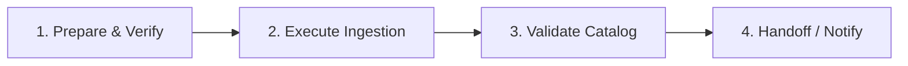
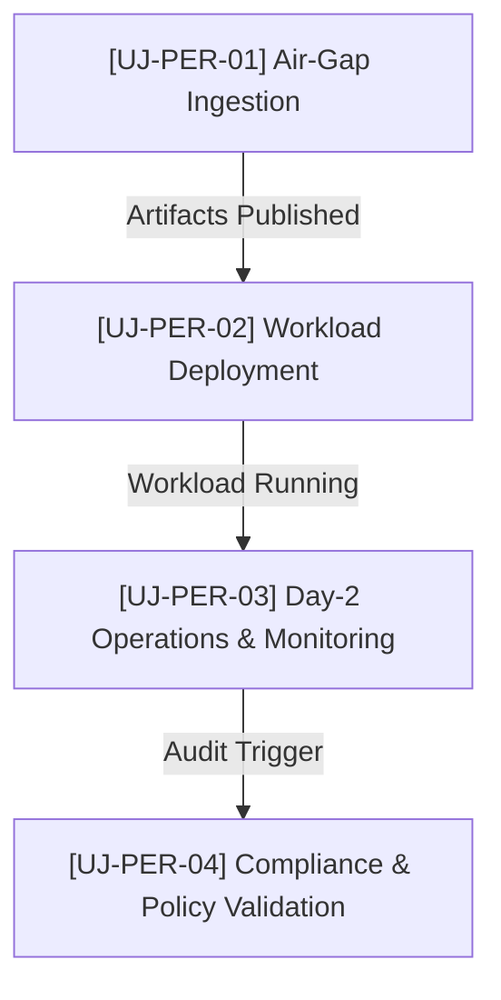

Copyright 2026 Google. This software is provided as-is, without warranty or representation for any use or purpose. Your use of it is subject to your agreement with Google.

# User Persona & Journeys: [Persona Name / Title]

> **Document Version:** 1.0  
> **Status:** [Draft | Under Review | Approved | Deprecated]  
> **Persona Code:** [e.g., PER-PLATFORM-ADMIN, PER-APP-DEV, PER-SEC-OPS, PER-DATA-ENG]  
> **Target Environment:** Google Distributed Cloud air-gapped (GDCag)  
> **Last Updated:** [YYYY-MM-DD]  
> **Author / Maintainer:** [Author Name / Team]

---

## 1. Persona Profile

### 1.1 Overview & Role Summary
* **Role / Job Title:** [e.g., Platform Administrator, Application Developer, Security & Compliance Officer, Data Scientist]
* **Organizational Function:** [e.g., Infrastructure & Platform Engineering, Mission Workload Team, Information Assurance]
* **Primary Mission:** [Summarize what this persona is fundamentally responsible for delivering or maintaining in 1-2 sentences.]

### 1.2 Responsibilities & Scope
* **Key Responsibilities:**
  * [Responsibility 1: e.g., Bootstrap and maintain GDC landing zones and foundational services]
  * [Responsibility 2: e.g., Ingest and verify air-gap OCI bundles into local Harbor registry]
  * [Responsibility 3: e.g., Enforce least-privilege RBAC and OPA Gatekeeper security policies]
* **Cluster & Architectural Scope:**
  * [ ] **Global API Cluster** (e.g., Project lifecycle, global IAM, service account provisioning)
  * [ ] **Org Admin / Zone Cluster** (e.g., Bare metal nodes, storage pools, virtual machines, networking)
  * [ ] **Standard / User Clusters** (e.g., Tenant workloads, GKE application namespaces, GitOps pipelines)
  * [ ] **Connected Sideloading Workstation** (e.g., External bundle preparation, container mirroring)

### 1.3 Technical Profile & Air-Gap Familiarity
* **Core Technical Competencies:** [e.g., Kubernetes, Helm/Helmfile, GitOps (ArgoCD/Config Sync), Linux, networking]
* **Familiarity with Air-Gapped Operations:** [Low | Medium | High | Expert]
* **Interaction Preference:** [CLI-first (`gdcloud`, `kubectl`, `helmfile`) | Manifest-first (GitOps) | Web Console / UI]

### 1.4 Motivations, Pain Points & Constraints
| Dimension | Description |
| :--- | :--- |
| **Core Motivations** | What makes this user successful? (e.g., zero-touch deployments, predictable uptime, rapid compliance sign-off) |
| **Primary Frustrations** | What slows them down? (e.g., air-gap transfer friction, obscure validation errors, missing image dependencies) |
| **Operational Constraints** | Strict environment limits (e.g., zero internet egress, strict SCIF physical controls, immutable OCI artifacts) |
| **Risk Tolerance** | [Low (production/security critical) | Medium (internal tenant) | High (experimental/lab)] |

### 1.5 Tooling, Credentials & Access
* **Primary Tools & CLIs:** [e.g., `gdcloud`, `kubectl`, `helmfile`, `cosign`, Harbor UI, Keycloak Admin Console, ArgoCD]
* **Identity & Authentication:** [e.g., Keycloak OIDC, GDC IAM service account, mTLS certificates, Vault token]
* **Assigned Roles / Privileges:** [e.g., `project-admin`, `cluster-admin`, `developer`, `viewer`, Keycloak realm roles]

---

## 2. Journey Index for this Persona

The following journeys represent the primary workflows and operational tasks performed by this persona.

| Journey ID | Journey Title | Lifecycle Phase | Frequency | Trigger / Business Need |
| :--- | :--- | :--- | :--- | :--- |
| `[UJ-PER-01]` | [e.g., Ingest New Air-Gap Bundle into Harbor] | Day 0: Sideloading | Weekly / On Release | New version tag or security patch released |
| `[UJ-PER-02]` | [e.g., Deploy Resilient Workload via GitOps] | Day 1: Provisioning | Per Sprint / Ad-hoc | New mission application onboarding |
| `[UJ-PER-03]` | [e.g., Diagnose and Remediate Workload Crash] | Day 2: Operations | Event-driven | Monitoring alert or failed health check |
| `[UJ-PER-04]` | [e.g., Rotate Secrets and Validate Policy] | Day 2: Governance | Monthly / Compliance | Scheduled security audit or certificate expiry |

---

## 3. Detailed User Journeys

<!-- 
INSTRUCTIONS FOR AUTHORING JOURNEYS:
- Copy the journey block below (from Journey Header to End of Journey) for each journey listed in the index above.
- Fill in concrete commands, manifests, expected outputs, and decision paths.
- Ensure all steps observe the air-gapped constraint (no external downloads or internet access).
-->

### Journey 1: [UJ-PER-01] — [Journey Title]

#### 1. Journey Overview & User Story
* **Journey ID:** `[UJ-PER-01]`
* **Title:** [e.g., Ingest and Verify an Air-Gapped OCI Bundle into Harbor]
* **User Story:**
  > **As a** [Persona Role, e.g., Platform Administrator],  
  > **I want to** [Action or capability, e.g., verify and mirror an air-gap software bundle into the internal Harbor registry],  
  > **So that** [Business outcome, e.g., tenant engineering teams can deploy certified workloads without external internet connectivity].
* **Lifecycle Phase:** [Day 0: Supply Chain & Bootstrap | Day 1: Provisioning & Deployment | Day 2: Operations & Maintenance | Day 2: Incident & Diagnostics]
* **Estimated Duration / Frequency:** [e.g., 45 minutes / Bi-weekly per software release]

#### 2. Preconditions & Starting State
* **System Prerequisites:**
  * [e.g., Target GDC environment is reachable via internal bastion or workstation]
  * [e.g., Internal Harbor registry (`harbor.gdc.local`) is operational with valid TLS certificates]
* **User Permissions & Credentials:**
  * [e.g., Harbor robot account or admin credentials with push rights to `project-helm` and `project-images`]
* **Required Input Artifacts:**
  * [e.g., `gdc-iac-airgap-vX.Y.Z.tar.gz` archive transferred via secure physical media / optical diode]
  * [e.g., Cosign public key or cryptographic checksum file (`SHA256SUMS.sig`)]

#### 3. Step-by-Step Flow

| Step # | Stage / User Intent | User Action (CLI / Manifest / UI) | System Response / Expected Behavior | Verification & Health Check |
| :---: | :--- | :--- | :--- | :--- |
| **1** | **Artifact Verification** | Validate SHA-256 hash and cryptographic signature of the bundle. | Checksum matches release manifest; Cosign attestation is verified. | Hash comparison matches release notes. |
| **2** | **Extract & Ingest** | Run the air-gap ingestion script or upload OCI artifacts to Harbor. | Script unbundles OCI layers and pushes images/charts to local project. | Registry returns HTTP `201 Created` for all tags. |
| **3** | **Catalog Validation** | Inspect Harbor repository via Web UI or API. | Helm charts and container images appear in the target repository. | Helm search or Harbor API lists new version tags. |
| **4** | **Downstream Notification** | Notify workload teams and update GitOps repository values with new image tags. | PR opened or ticket updated with available image/chart digests. | Tenant teams confirm artifact visibility. |

#### 4. Decision Points & Failure Modes
| Condition / Error State | Root Cause | Remediation / Recovery Path |
| :--- | :--- | :--- |
| **Signature Verification Failure** | Corrupted bundle or mismatched public key | Abort ingestion immediately. Re-verify the source bundle on the transfer station before retrying. |
| **Harbor Push Quota Exceeded** | Harbor project storage quota reached | Clean up deprecated or untagged images, or request quota increase from storage admin. |
| **Missing Dependency / Layer** | Incomplete air-gap bundling during Day 0 staging | Consult `scripts/ingest-airgap-bundle.sh` logs, identify missing OCI digest, and update connected build script. |

#### 5. Postconditions & Definition of Done
* [ ] All container images and Helm charts from the bundle are indexed in the target Harbor project.
* [ ] Provenance metadata and SBOM attestations are archived in the platform compliance log.
* [ ] Downstream workload templates and Helmfile values can successfully resolve all references.

#### 6. Friction Points & Improvement Opportunities
* **Current Friction:** [e.g., Manual execution of ingestion script requires interactive credential entry.]
* **Proposed Enhancement:** [e.g., Automate Harbor robot credential retrieval via HashiCorp Vault.]

---

### Journey 2: [UJ-PER-02] — [Journey Title]

#### 1. Journey Overview & User Story
* **Journey ID:** `[UJ-PER-02]`
* **Title:** [e.g., Deploy and Hydrate a Blueprint Pattern via GitOps]
* **User Story:**
  > **As a** [Persona Role, e.g., Application Developer],  
  > **I want to** [Action, e.g., customize and commit pattern configuration values to the GitOps repository],  
  > **So that** [Business outcome, e.g., the workload automatically synchronizes onto the user cluster with GDC database bindings].
* **Lifecycle Phase:** [Day 1: Provisioning & Deployment]
* **Estimated Duration / Frequency:** [e.g., 20 minutes / Once per new workload deployment]

#### 2. Preconditions & Starting State
* **System Prerequisites:**
  * [e.g., Target namespace `workload-apps` exists on User Cluster `user-cluster-01`]
  * [e.g., Config Sync / ArgoCD root sync is active and tracking the main Git repository]
* **User Permissions & Credentials:**
  * [e.g., Git repository write permissions to `deployments/dev/` branch/directory]
  * [e.g., Read access to the target namespace to observe Pod rollouts via `kubectl`]
* **Required Input Artifacts:**
  * [e.g., Blueprint values template from `blueprints/patterns/pX-.../values.yaml`]

#### 3. Step-by-Step Flow

| Step # | Stage / User Intent | User Action (CLI / Manifest / UI) | System Response / Expected Behavior | Verification & Health Check |
| :---: | :--- | :--- | :--- | :--- |
| **1** | **Parameter Hydration** | Configure project-specific values (DB names, ports, replica counts) using configuration script or manual edit. | `values.yaml` generated with correct local Harbor URLs and cluster references. | Validate YAML syntax and schema compliance. |
| **2** | **Commit to GitOps Repo** | Commit and push the manifest bundle to the environment branch. | Git server accepts push; webhook triggers GitOps engine reconciliation. | Commit is visible on remote Git branch. |
| **3** | **Reconciliation** | Monitor Config Sync / ArgoCD synchronization status. | GitOps controller applies Custom Resources (Deployments, Services, HTTPRoutes). | Controller reports `SYNCED` and `HEALTHY`. |
| **4** | **Workload Verification** | Check Pod status and invoke smoke test endpoint. | Workload Pods enter `Running` state; readiness probes pass. | HTTP `200 OK` from health check endpoint. |

#### 4. Decision Points & Failure Modes
| Condition / Error State | Root Cause | Remediation / Recovery Path |
| :--- | :--- | :--- |
| **ImagePullBackOff** | Pod cannot pull image from Harbor | Verify Harbor secret exists in namespace and image path matches the air-gap repository. |
| **OPA Policy Rejection** | Manifest violates security policy (e.g., running as root, missing resource limits) | Review Gatekeeper admission webhook error; update manifest with required security context. |
| **Database Connection Refused** | Managed PostgreSQL instance not ready or credentials invalid | Verify GDC Database Service CR status and check Vault/Kubernetes secret injection. |

#### 5. Postconditions & Definition of Done
* [ ] Application is running in the designated namespace with required replica count.
* [ ] HTTPRoute / Gateway API is routing incoming requests correctly.
* [ ] Logs and Prometheus metrics are flowing to the centralized monitoring stack.

#### 6. Friction Points & Improvement Opportunities
* **Current Friction:** [e.g., Manual verification of schema required before pushing to Git.]
* **Proposed Enhancement:** [e.g., Implement pre-commit hook running `helm lint` and OPA validation.]

---

<!-- 
DUPLICATE AS NEEDED:
To add additional journeys for this user, copy the section above (Journey 2) and increment the Journey ID ([UJ-PER-03], [UJ-PER-04], etc.).
-->

## 4. Cross-Journey Dependency & Traceability Matrix

This section maps how journeys for this persona interconnect and hand off to other journeys or personas.

| Source Journey | Output / State Produced | Downstream Journey / Persona | Hand-off Mechanism |
| :--- | :--- | :--- | :--- |
| `[UJ-PER-01]` | Certified OCI images in Harbor | `[UJ-PER-02]` (App Developer) | Harbor image catalog update / Git tag notification |
| `[UJ-PER-02]` | Deployed Kubernetes workload | `[UJ-PER-03]` (Platform SRE) | Prometheus monitoring dashboards / alert endpoints |
| `[UJ-PER-03]` | Runtime incident report / logs | Platform Engineering / Post-mortem | Issue tracker / RCA documentation |

---

## 5. References & Associated Assets
* **Related Blueprints & Patterns:** [e.g., `blueprints/patterns/p1-resilient-3-tier-webapp`, `blueprints/gdc_gemma_gw`]
* **Related Helm Charts:** [e.g., `charts/gdc-application`, `charts/gdc-database`]
* **Policy & Governance Rules:** [e.g., `policy/workload-security.rego`, Gatekeeper constraints]
* **Operational Runbooks:** [e.g., `docs/operational-guides/operational-administration-and-data-ingestion-guide.md`]
