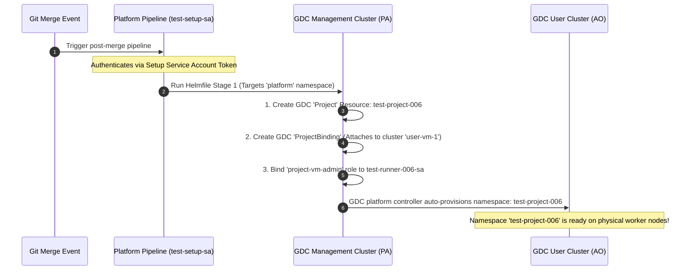
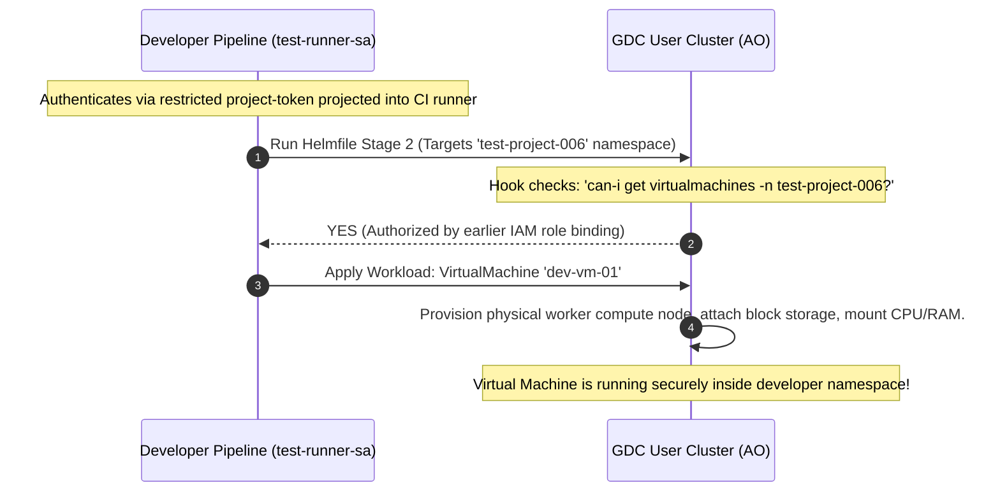

# GDC IaC GitOps & Architecture Blueprint

This document provides a comprehensive, production-ready architectural reference detailing GDC physical-to-logical cluster mappings, namespace boundaries, and the PR-driven GitOps lifecycle.

---

## 1. Cluster & Namespace Mapping Topology

GDC isolates resources into logical tiers to protect physical hardware from workload failures and limit the blast radius of individual runner identities.

| GDC Physical/Logical Tier | GDC Role & API Scope | Namespace | Active Persona | Logical Assets Deployed |
| :--- | :--- | :--- | :--- | :--- |
| **`root-admin`** (IO) | **Infrastructure Operations (IO):** End-to-end hardware virtualization, storage switches, HSM modules, Org-to-HW physical mapping, and crypto encryption. | *Pre-set system* | GDC Infrastructure Operator | Bare-metal control planes, organizations boundaries, cryptographic isolation. |
| **`infra`** (IO) | **Infrastructure Operations (IO):** Responsible for hardware allocation inside the customer org and managing K8s engines. | *Pre-set system* | GDC Infrastructure Operator | Customer organization infrastructure provisioning, physical compute clusters. |
| **`management`** (PA) | **Platform Administration (PA):** Logical organizational boundary control plane. | **`platform`** | **Persona A:** Setup Identity (`test-setup-sa`) | `Project` containers, `ProjectBindings`, and global `IAMRoleBindings`. |
| **`user`** (AO) | **Application Operations (AO):** User Cluster hosting worker nodes for application workloads. | **Project-specific Namespace** (e.g., `test-project-006`) | **Persona B:** Workload Runner (`test-runner-sa`) | Zonal virtual machines (`VirtualMachine`), databases (`DBCluster`), zonal `Subnets`, and ingress rules. |

---

## 2. GDC Security Isolation Architecture

```
                    GDC PHYSICAL TOPOLOGY & IAAS BOUNDARY
  +---------------------------------------------------------------------------+
  |  1. "ROOT-ADMIN" CLUSTER (IO)                                             |
  |     Handles Org creation, hardware mapping, and end-to-end encryption.     |
  |     ==> Invisible, operating entirely behind the scenes.                  |
  +---------------------------------------------------------------------------+
                                      |
                                      | Creates infra cluster
                                      v
   +---------------------------------------------------------------------------+
  |  2. "INFRA" CLUSTER (IO)                                                  |
        Inside customer org - resoposible for hw allocation in customer org 
        Runs K8s engine 
  +---------------------------------------------------------------------------+
                                      |
                                      | Allocates physical hardware boundaries
                                      v
  +---------------------------------------------------------------------------+
  |  3. "MANAGEMENT" CLUSTER (PA)                                             |
  |     Active Namespace: platform                                            |
  |     ==> Monitored by test-setup-sa (Elevated Setup Platform CI/CD)        |
  |     ==> Logical assets created: Project, ProjectBinding, Global Roles     |
  +---------------------------------------------------------------------------+
                                      |
                                      | ProjectBinding maps project logical boundaries
                                      v
  +---------------------------------------------------------------------------+
  |  4. "USER" CLUSTER (AO)                                           |
  |     Active Namespace: ioc-test-project-001 (Created by Project controller)|
  |     ==> Monitored by test-runner-sa (Restricted Developer CI/CD)          |
  |     ==> Physical workloads created: VirtualMachines, Subnets, NetworkPods  |
  +---------------------------------------------------------------------------+
```

---

## 3. PR-Driven IaC Workflow & Hand-Off Lifecycle

In a true production GitOps environment, human operators never authenticate directly to physical GDC hardware. Instead, all operations are declared in Git and verified by automated pipelines running split-privilege service accounts.

### Phase 1: The Developer PR (Access & Project Request)
1. A developer submits a Pull Request (PR) modifying `tenants.yaml` to declare their target infrastructure:
   ```yaml
   # tenants.yaml
   global:
     projects:
       - name: "test-project-006"
         cluster_bindings:
           - clusterName: "user-vm-1"
         iamrolebindings:
           - role: "project-vm-admin"
             subject_name: "system:serviceaccount:iac-root:test-runner-006-sa"
         resources:
           vms:
             - name: "dev-vm-01"
               machine_type: "n3-standard-2-gdc"
   ```

---

### Phase 2: The Platform Admin Pipeline (Project Provisioning)
This pipeline triggers immediately upon PR merge. It is executed by the central platform pipeline running as the elevated **`test-setup-sa`** identity.



---

### Phase 3: The Restricted Developer Pipeline (Workload Provisioning)
Once Stage 1 completes, the platform orchestrator hands off execution to the developer application pipeline, which runs with restricted **`test-runner-sa`** privileges.



---

## 4. Key Production Rules & Best Practices

> [!IMPORTANT]
> **Dynamic Environment Overrides**
> The setup scripts and Helmfiles support dynamic environment overrides (`ORG_NAME` and `IAC_PROJECT`).
> When running on production staging hardware (such as organizations named `community` and custom namespace logical containers):
> ```bash
> export ORG_NAME="community"
> export IAC_PROJECT="iac-staging"
> ./setup-customer-base.sh
> ```

> [!TIP]
> **Least Privilege Enforced**
> Developer workload pipelines should never be granted cluster-admin or platform-admin permissions. Always route access through the `Project` IAM Role Binding schema inside `tenants.yaml` to enforce absolute multi-tenant boundary separation.
