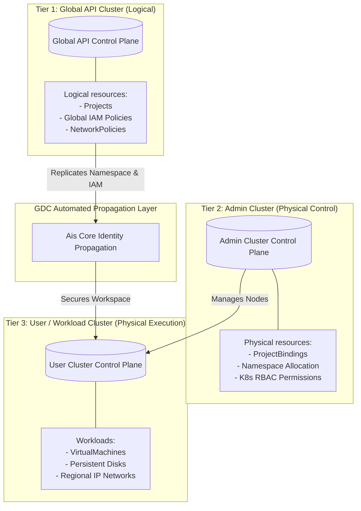
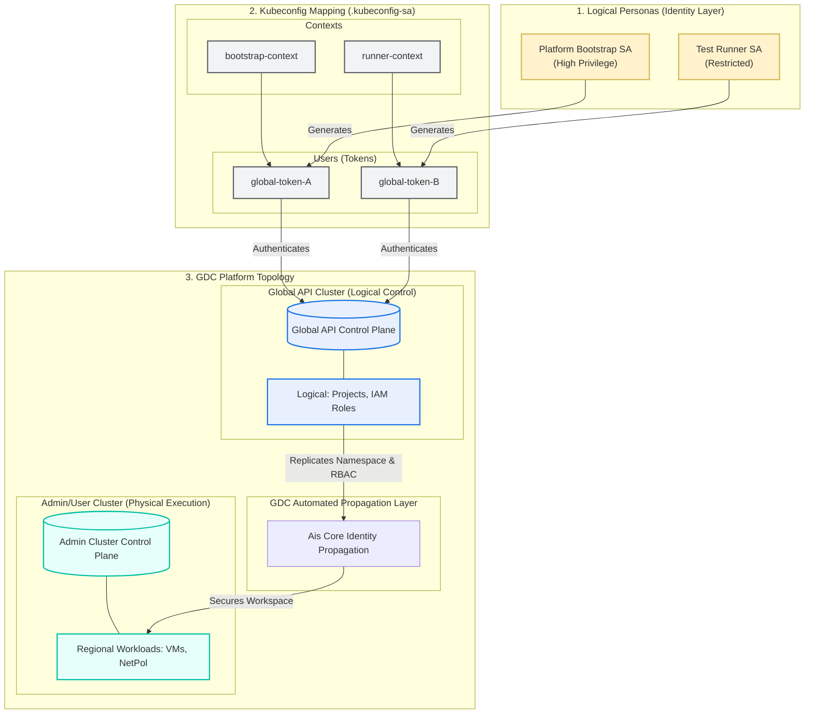
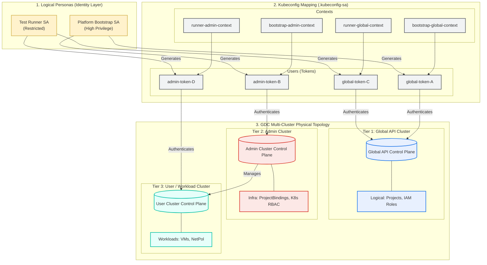

# GDC Staging Platform Setup: Architecture & Security Design Manual

This directory contains the shared core platform setup templates, cryptographic TLS trust managers, and Service Account credential generation scripts for GDC staging and test execution pipelines.

---

## 1. GDC Multi-Plane Control Plane Topology

GDC architecture divides operations across separate API planes to isolate physical resources from logical configuration metadata.

* **Central logical Plane:** Decouples customer identity and tenancy configurations from physical bare-metal. Creating a logical `Project` triggers asynchronous GDC propagation engines to provision a corresponding regional namespace and sync permissions (~15-20 seconds propagation delay).
* **Regional Compute Plane:** Manages localized hypervisors, node storage pools, and physical network leaf routing.

---

## 2. Non-Interactive Authentication Models

Automated CI/CD pipelines (e.g. runners in GitHub Actions, GitLab CI, or Jenkins) cannot execute interactive, browser-based OIDC sign-ins. To bypass human front-door logins, GDC pipelines authenticate via **Headless Service Accounts** with isolated API client credentials.

Because GDC clusters operate as completely separate API endpoints without a shared trust domain for local Kubernetes-native tokens, a standard Global API token is natively rejected by Admin/User clusters. To solve this, this repository implements two distinct operational execution scopes:

### Model A: Customer-Scoped Pathway (Standard Production Mode)
Operates 100% inside standard customer tenant boundaries, requiring zero raw platform-operator administrative authority.
* **Mechanism:** Service Accounts are created strictly on the Global API Cluster. Permissions are assigned through GDC-native logical `IAMRoleBindings`. The GDC AIS background Identity Engine securely replicates logical access down to regional namespaces.
* **Client Configuration:** A client-side 2-context `.kubeconfig-sa` mapping:
  - `bootstrap-context` (delegated customer setup)
  - `runner-context` (case workload runner)

This represents the standard production-aligned architecture. The client-side Kubeconfig contains **2 contexts** mapped strictly to GDC's Global logical API. Workload security, namespace creation, and target cluster role assignments are governed 100% by GDC-native logical IAM policies, which GDC's background propagation services replicate to the physical layers.

### Model B: Operator-Scoped Pathway (Time-Zero Bootstrap & Fallback Mode)
Designed for infrastructure platform operators to verify compute hypervisors during time-zero bring-up or diagnostic runs when global identity services (AIS) are degraded or bypassed.
* **Mechanism:** Service Accounts are deployed on the Global API and applied **directly and out-of-band** onto the physical Admin Cluster control plane using native Kubernetes `ClusterRoleBindings`.
* **Client Configuration:** A client-side 4-context `.kubeconfig-sa` mapping both Logical and Physical cluster contexts for both SAs.

This represents the low-level infrastructure bootstrap and diagnostic architecture. It is used out-of-band to verify local compute hypervisors and physical node connectivity. The client-side Kubeconfig maps **4 hybrid contexts** to bypass GDC's global propagation layer, establishing direct, K8s-native `RoleBindings` on the target Admin Cluster control plane.

---

## 3. Service Account Scoping & Least Privilege

To restrict the pipeline's security blast radius and satisfy security audit reviews, Service Account identities are separated by duty and scoped to prevent permission creep:

| Service Account | Naming Scope | Permission Level | Responsibilities |
| :--- | :--- | :--- | :--- |
| **`test-setup-sa`** | **Global Shared** | High Privilege | Provisions GDC logical projects, assigns project-level role bindings, and handles regional project bindings. |
| **`test-runner-${TEST_CASE_NO}-sa`** | **Case-Scoped** | Namespace Restricted | Scoped strictly to a single test case (e.g. `test-runner-001-sa` for VM workloads). Deploys regional assets (VirtualMachines, Subnets) inside its own project namespace. |

---

## 4. Role Bindings: System vs. Workload Scopes

Role bindings are strictly divided into two groups with distinct lifetimes and scopes:

### A. System-Level Role Bindings (Permanent System Roles)
* **Declared In:** `000-SETUP/base-customer-identity.yaml` & `000-SETUP/base-operator-identity.yaml`
* **Target:** System service accounts (`test-setup-sa` and `test-runner-${TEST_CASE_NO}-sa`).
* **Purpose:** Authorizes the IaC runner components to execute pipeline sync commands.
* **Lifecycle:** Permanent; persists across all runs.

### B. Workload-Level Role Bindings (Ephemeral User Roles)
* **Declared In:** Local test case `tenants.yaml` (e.g., `001-AO-VM-CREATE/tenants.yaml`)
* **Target:** End users and consumer personas (such as developer OIDC accounts like `fop-iac@example.com`).
* **Purpose:** Grants permissions to consume regional resources inside their dedicated projects.
* **Lifecycle:** Ephemeral; instantly deleted when the logical GDC `Project` is destroyed.
