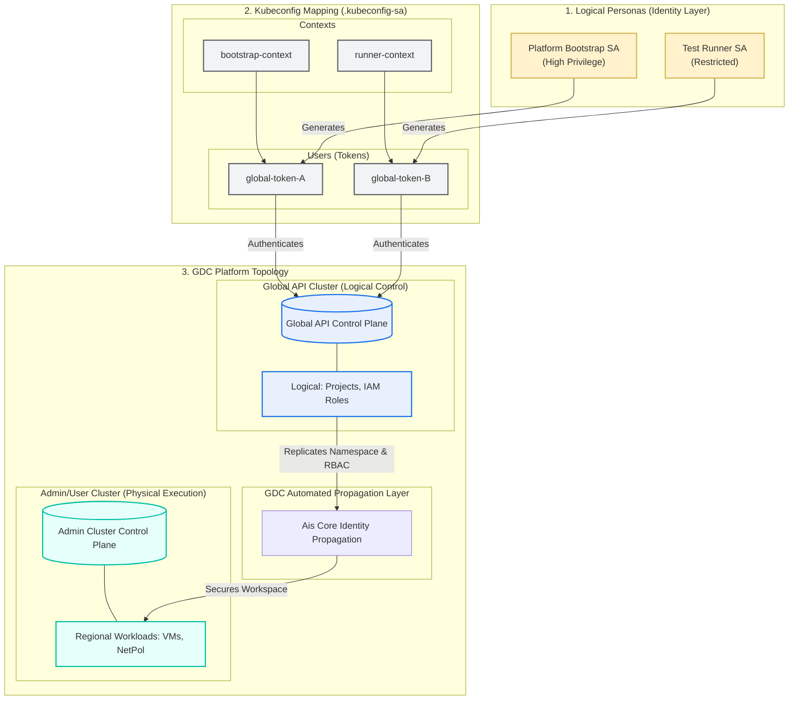

# 001-AO-VM-CREATE: Virtual Machine Provisioning

### TL;DR: GDC IaC Pipeline Automation

This directory contains a self-contained IaC (Infrastructure as Code) setup to satisfy the requirements of the **001-AO-VM-CREATE** test case, which automates secure Virtual Machine provisioning across GDC’s split logical/physical API planes using a **progressive, bottom-up staging stance**:

1. **Adhoc Sandbox ([setup-adhoc-env.sh](./setup-adhoc-env.sh)):** Validates OIDC/AIS identity synchronization loops interactively.
2. **Operator Scope ([setup-operator-sa.sh](./setup-operator-sa.sh)):** Performs out-of-band K8s-native bootstrapping directly on physical Admin Clusters for time-zero platform start-up.
3. **Tenant Scope ([setup-tenant-sa.sh](./setup-tenant-sa.sh)):** Provisions resources strictly within GDC-native customer tenant boundaries.

The orchestration is driven by `helmfile.yaml.gotmpl`, which dynamically routes cross-plane tokens and uses a namespaced `auth can-i` presync hook to securely handle asynchronous namespace and IAM replication delays without requiring cluster-wide administrative privileges.

---

## 1. Overview & Context

### Test Case Overview
- **ID:** 001-AO-VM-CREATE
- **Description:** Verify that authorized users can provision virtual machines.
- **Goal:** Automate the provisioning of the `ioc-test-vm` in the `ioc-test-project-001` namespace, including networking and IAM.

### Mapping to 001-AO-VM-CREATE Test Spec
- **PR-01 (RBAC):** satisfy via `tenants.yaml` and `gdc-iam-role-bindings` chart.
- **PR-02 (Images):** Uses `ubuntu-24.04-v20260224-gdch` from the `vm-system` namespace.
- **Step 2-5 (Creation):** Automated via `gdc-vm` Helm chart with specific hardware requirements (`n3-standard-2-gdc`, `20Gi` disk).
- **Step 6 (Verification):** Automated check for `Running` state.

### Assets
- **`tenants.yaml`**: The declarative desired-state manifest defining the tenant topology, target projects, regional cluster bindings, dynamic user IAM permissions, and Virtual Machine hardware parameters.
- **`helmfile.yaml.gotmpl`**: The core logical orchestration engine that dynamically parses `tenants.yaml` into ordered Helm releases. It implements multi-phase execution and incorporates the optimized namespaced `auth can-i` presync hook to poll regional cluster readiness safely without requiring cluster-wide Namespace privileges.
- **`tenant-bootstrap.yaml`**: The declarative Kubernetes manifest applied to the Global API Cluster to bootstrap the logical Service Accounts (`platform-bootstrap-sa`, `test-runner-sa`) and GDC-native IAM bindings.
- **`operator-bootstrap.yaml`**: The declarative Kubernetes manifest applied out-of-band directly to the regional Admin Cluster to provision local Service Accounts and local K8s `RoleBindings` scoped strictly to the `iac-root` namespace.
- **`setup-adhoc-env.sh`**: The interactive adhoc testing script that establishes certificate trust, guides the operator through double interactive OIDC logins (Platform Admin + IAC User) against GDC's AIS, and enforces a **30-second logical propagation wait** before executing Helm.
- **`setup-tenant-sa.sh`**: The automated script that deploys `tenant-bootstrap.yaml` to the Global API, extracts the resulting tokens, and generates the client-side **2-context** `.kubeconfig-sa` to authenticate headless tenant-scoped pipeline runs.
- **`setup-operator-sa.sh`**: The automated script that deploys `tenant-bootstrap.yaml` to the Global API and `operator-bootstrap.yaml` directly to the Admin Cluster out-of-band, extracts all 4 tokens, and constructs the **4-context** `.kubeconfig-sa` to authenticate headless operator-scoped bootstrap runs.

---
## 2. Execution Steps

### Option A: Adhoc / Sandbox Execution (Interactive OIDC)

For local sandbox validation and rapid design iterations, operators can use the full interactive workflow that directly integrates with the GDC AIS (Authentication & Identity Service). This method requires interactive OIDC logins and manual certificate trust establishment.

### Execution Steps

This flow is captured in the `setup-adhoc-env.sh` script and follows this sequence:

1. **Run the Adhoc Setup Script:**
   Execute the script to fetch certificates, perform the double login, and grant roles. You can pass a `VERSION` variable to avoid GDC Project ID reuse collisions:
   ```bash
    VERSION=-v2 ./setup-adhoc-env.sh
   ```
2. **The Script Flow Includes:**
   * **Certificate Fetching & Trust:** Fetches TLS certificates for the Console, AIS, and KMS endpoints and adds them to the local machine's trust store.
   * **Step 1: Platform Admin Login:** Prompts the operator to log in interactively as a highly privileged **Platform Admin** to perform organization-level bootstrapping.
   * **Project & IAM Bootstrap:** Creates the GDC `Project` and grants global roles (`platform-admin`, `project-creator`, `organization-iam-admin`, `user-cluster-admin`) to the target IaC user (`fop-iac@example.com`).
   * **Step 2: IAC User Login:** Prompts the operator to switch context by logging in again as the restricted **IAC User** to verify that the assigned roles have propagated via AIS.
   * **Execution:** Finally, runs `helmfile sync` using the active user context authorized by AIS.

This workflow is maintained in `setup-adhoc-env.sh` for adhoc testing scenarios where interactive authentication is acceptable.

---

### Option B: Executing the Operator-Scoped Pathway

For physical/local testing without Interactive OIDC, run as an operator with Service Accounts. Suitable also for execution on Adhoc Environments, Bare-Metal Bring-Up (T=0), and Physical Test Labs to ensure direct multi-plane routing and bypass OIDC/AIS propagation dependency entirely.

1. **Generate Service Account Credentials & 4-Context Kubeconfig:**
   Run the script using your active operator context to provision the Service Accounts and write their tokens into a local Kubeconfig file (`.kubeconfig-sa`):
   ```bash
   ./setup-operator-sa.sh
   ```

2. **Run Phase 1 - Project Infrastructure (Platform Admin SA Context):**
   Deploy the project logically on the Global API and bind the cluster on the Admin plane:
   ```bash
   KUBECONFIG=./.kubeconfig-sa VERSION=-v1 GLOBAL_API_CONTEXT=bootstrap-global-context ADMIN_CLUSTER_CONTEXT=bootstrap-admin-context helmfile --selector tier!=vm sync
   ```

3. **Run Phase 2 - Provision VM Workloads (Restricted Runner SA Context):**
   Provision VM instances and network policies directly in the regional project workspace:
   ```bash
   KUBECONFIG=./.kubeconfig-sa VERSION=-v1 GLOBAL_API_CONTEXT=bootstrap-global-context ADMIN_CLUSTER_CONTEXT=runner-admin-context helmfile --selector tier=vm sync
   ```

---
### Option C: Executing the Tenant-Scoped Pathway (Production & Staging)

Designed for Production GDC-AG tenant environments and automated GitOps pipelines.

#### 1. Execution Commands

1. **Generate Service Account Credentials:**
   Run the bootstrap script using your active platform context to provision the Service Accounts and write their tokens into a local Kubeconfig file (`.kubeconfig-sa`):
   ```bash
   ./setup-tenant-sa.sh
   ```

   > [!WARNING]
   > **Role & Namespace Propagation Delay:**
   > GDC's background identity propagation engines require around **15 to 20 seconds** to replicate namespaces, projects, and IAM role permissions down from the logical Global API to physical regional clusters. Running step 2 immediately may result in immediate authentication or authorization failures.
   
   * **Optional: Verify Role Propagation Status:**
     Before proceeding, run the following access check to confirm the restricted runner credentials have propagated and are active in the target project namespace:
     ```bash
     kubectl --kubeconfig=./.kubeconfig-sa --context=runner-context auth can-i get virtualmachines -n ioc-test-project-001-v1
     ```
     *Do not proceed to step 2 until this command returns `yes`.*

2. **Deploy the Project and VM Workloads:**
   Run the `helmfile sync` using the generated `.kubeconfig-sa` file to provision both the GDC logical project environment and the regional VM workloads:
   ```bash
   KUBECONFIG=./.kubeconfig-sa VERSION=-v1 GLOBAL_API_CONTEXT=bootstrap-context ADMIN_CLUSTER_CONTEXT=runner-context helmfile sync
   ```

#### 2. Critical Production Parameters (T&C Checklist)
Prior to running the sync, verify and ensure the following environment-specific parameters match the target cloud instance to avoid immediate schema or scheduler validation failures:
* **`imageName` Overrides:** Base VM OS image names (e.g. `rocky-8-image`, `ubuntu-2204`) are environment-specific. The default catalog image in `tenants.yaml` may not exist in production.
* **VM API Group Version:** GDC control planes roll out updates progressively. Ensure the target Admin Cluster supports the API version configured in the VM Helm templates.
* **OIDC/AIS Token Domain Trust:** Confirm the global token signed by the tenant's identity provider is synchronized to regional user cluster namespaces.

> [!TIP]
> For concrete commands on how to query, audit, and dynamically override these environmental parameters, refer to **[## 7. Production Alignment & Environment Assumptions](#7-production-alignment--environment-assumptions)**.

> [!NOTE]
> **Dynamic Role Application:** Dynamic user/workload role mappings (such as `project-editor` bound to `test-runner-sa`) are declared logically on the Global API in Phase 1, synced automatically via GDC's AIS identity propagation engine, and used to provision VM workloads in Phase 2.
---

## 3. Verification Steps

### 1. Resource Creation Verification
Confirm that all resources have been created in the project namespace (on the Admin Cluster):
```bash
# Verify the VM status
kubectl --kubeconfig=./.kubeconfig-sa --context=runner-admin-context get virtualmachine ioc-test-vm -n ioc-test-project-001-v1

# Verify the Boot Disk
kubectl --kubeconfig=./.kubeconfig-sa --context=runner-admin-context get virtualmachinedisk ioc-test-vm-boot-disk -n ioc-test-project-001-v1

# Verify the Network Policy
kubectl --kubeconfig=./.kubeconfig-sa --context=runner-admin-context get projectnetworkpolicy ioc-test-vm-ingress -n ioc-test-project-001-v1
```

### 2. Traffic & Metrics Verification
```bash
# Get the Ingress IP
INGRESS_IP=$(kubectl --kubeconfig=./.kubeconfig-sa --context=runner-admin-context get virtualmachineexternalaccess ioc-test-vm -n ioc-test-project-001-v1 -o jsonpath='{.status.ingressIP}')

# Test connectivity to the SSH port (22)
nc -zv -w 5 $INGRESS_IP 22
```

### 3. Visual Verification
To capture the current state of the VM in the console:
```bash
google-chrome --headless --disable-gpu --ignore-certificate-errors --screenshot=vm_verification.png --window-size=1280,1024 "https://console.org-1.zone1.google.gdch.test/#/virtual-machines?project=ioc-test-project-001-v1&zone=zone1"
```

---

## 4. Air-Gapped Transfer & Execution

To deploy this test case in the air-gapped environment, bundle the required binaries and repository on an internet-connected machine before transferring it.

### 1. Create the Bundle (Connected Machine)
```bash
mkdir -p ~/gdc-bundle/bin
cd ~/gdc-bundle

# Download Helmfile (Linux AMD64)
HELMFILE_VERSION="1.5.1"
wget https://github.com/helmfile/helmfile/releases/download/v${HELMFILE_VERSION}/helmfile_${HELMFILE_VERSION}_linux_amd64.tar.gz
tar -xzvf helmfile_${HELMFILE_VERSION}_linux_amd64.tar.gz -C bin/ helmfile
chmod +x bin/helmfile
rm helmfile_${HELMFILE_VERSION}_linux_amd64.tar.gz

# Clone the repository
GIT_REPO_URL="git@github.com:gdc-iac/gdc-iac-org.git"
git clone ${GIT_REPO_URL} iac-repo

# Package into a tarball
cd ~
tar czvf gdc-iac-bundle.tar.gz gdc-bundle/
```

### 2. Transfer to GDC-AG Environment
Transfer `~/gdc-iac-bundle.tar.gz` to env via the established pathway:
1. Upload to a GCS bucket: `gsutil cp ~/gdc-iac-bundle.tar.gz gs://[YOUR_BUCKET]`
2. Download from GCS on the GCP Jumphost.
3. `scp` from Jumphost to the GDC-AG bootstrapper node.

### 3. Unpack and Execute (GDC-AG Environment)
```bash
# Extract
tar xzvf gdc-iac-bundle.tar.gz
cd gdc-bundle

# Add Helmfile to PATH
export PATH=$PWD/bin:$PATH

# Navigate to test case and execute the Tenant-scoped pathway
cd iac-repo/examples/platform-test/001-AO-VM-CREATE
./setup-tenant-sa.sh
```

---

## 5. Teardown

To remove all resources created for this test case:

### A. Teardown Tenant-Scoped Deployments
```bash
KUBECONFIG=./.kubeconfig-sa GLOBAL_API_CONTEXT=bootstrap-context ADMIN_CLUSTER_CONTEXT=runner-context helmfile destroy
kubectl --context "$GLOBAL_API_CONTEXT" delete -f tenant-bootstrap.yaml
rm -f .kubeconfig-sa
```

### B. Teardown Operator-Scoped Deployments
```bash
# Teardown VM workloads on the Admin Cluster
KUBECONFIG=./.kubeconfig-sa GLOBAL_API_CONTEXT=bootstrap-global-context ADMIN_CLUSTER_CONTEXT=runner-admin-context helmfile --selector tier=vm destroy

# Teardown project and platform bootstrap
KUBECONFIG=./.kubeconfig-sa GLOBAL_API_CONTEXT=bootstrap-global-context ADMIN_CLUSTER_CONTEXT=bootstrap-admin-context helmfile --selector tier!=vm destroy

# Delete the bootstrap service accounts and bindings
kubectl --context "$GLOBAL_API_CONTEXT" delete -f tenant-bootstrap.yaml
rm -f .kubeconfig-sa
```


## 6. Architecture & Security Design

To respect GDC's strict split-plane topology, the pipeline is designed around two separate architectural pathways, serving different stages of our **Progressive Staging Stance**.

### Pathway A: Standard GDC-Native Tenant-Scoped Architecture (Primary / Staging)
This represents the standard production-aligned architecture. The client-side Kubeconfig contains **2 contexts** mapped strictly to GDC's Global logical API. Workload security, namespace creation, and target cluster role assignments are governed 100% by GDC-native logical IAM policies, which GDC's background propagation services replicate to the physical layers.



---

### Pathway B: Operator-Scoped Bootstrapping & Diagnostics Architecture (Secondary / Fallback)
This represents the low-level infrastructure bootstrap and diagnostic architecture. It is used out-of-band to verify local compute hypervisors and physical node connectivity. The client-side Kubeconfig maps **4 hybrid contexts** to bypass GDC's global propagation layer, establishing direct, K8s-native `RoleBindings` on the target Admin Cluster control plane.


---

### Key Architectural Principles

* **Control Plane Separation:** GDC splits operations between the centralized **Global API Cluster** (logical projects, tenancy, IAM) and the physical **Admin Cluster** (computational resources, VMs, network policies, project-to-cluster attachments).
* **Asynchronous Namespace Replication:** Creating a `Project` on the Global API triggers a background GDC synchronization that provisions a corresponding namespace on the physical Admin Cluster (~20 seconds delay). The pipeline is split into **two phases** to respect this physical dependency and prevent race-condition deployment failures.
* **Local Token Domain Isolation (Pathway B Fallback):** Kubernetes Service Account tokens are local to the control plane that signed them and bypass the central AIS (Identity Service) used by human operators (`gdcloud auth login`). Because GDC's clusters are separate API planes without a shared trust for these local tokens, a Global API token is natively rejected by the Admin Cluster. We resolve this under Pathway B by provisioning twin Service Accounts on both clusters, extracting their native tokens, and constructing a client-side multi-context `.kubeconfig-sa` (4 distinct contexts) to dynamically route Helm commands.
* **Least-Privilege Persona Separation:** `platform-bootstrap-sa` handles broad org-level resources, while `test-runner-sa` is locked entirely to workload namespace scope with zero platform administrative rights, minimizing the pipeline's security blast radius.
---

## 7. Production Alignment & Environment Assumptions

When transitioning this IaC pipeline from a staging/validation path to a live GDC production environment, operators must account for key deviations between local test configurations and production hardening standards:

> [!WARNING]
> **1. APIServer Network Isolation**
> In testing, the pipeline assumes direct network accessibility to raw Admin Cluster API endpoints. In production, Admin Clusters are strictly isolated behind enterprise-grade firewalls, and all client routing must proceed through GDC's authenticated OIDC/AIS gateway networks.

> [!WARNING]
> **2. Zero Global Cluster Permissions for Workload Runners**
> In our hardened model, the `test-runner-sa` possesses **zero global K8s-native ClusterRoleBindings** on the Admin Cluster. It is granted `admin` access strictly within the `iac-root` namespace (via a local K8s `RoleBinding`) to manage Helm release metadata. 
> Workload-level permissions inside the target project namespace (e.g., `ioc-test-project-001-v1`) are handled 100% dynamically through GDC-native IAM RoleBindings, which GDC’s controllers automatically propagate down to regional nodes after project creation.

> [!IMPORTANT]
> **3. OIDC/AIS Token Enforcement**
> While the test environment generates and extracts raw JWT token secrets out-of-band, production pipelines are governed by strict short-lived Token lifetimes, multi-factor OIDC/AIS validation, and centralized credential vaults (e.g., HashiCorp Vault).

> [!IMPORTANT]
> **4. Dynamic Parameter Auditing (Image & API Catalogs)**
> In production or air-gapped (GDC-AG) environments, base OS virtual machine images or specific CRD API schemas frequently vary from testing defaults. Run these queries from your pipeline runner context to fetch the correct values before syncing:
> * **Query available OS image catalog names:**
>   ```bash
>   kubectl --kubeconfig=./.kubeconfig-sa --context=runner-context get virtualmachineimages
>   ```
> * **Query supported VirtualMachine schema API groups:**
>   ```bash
>   kubectl --kubeconfig=./.kubeconfig-sa --context=runner-context api-resources | grep virtualmachine
>   ```
> * **Apply Overrides:** Override values dynamically inside `tenants.yaml` or by passing `--set virtualMachines[0].imageName=<verified-image>` to Helmfile during execution.

---

## 8. Access Scopes & Operational Models

To satisfy different enterprise structures, this repository supports two distinct non-interactive execution pathways based on Strategy 1 (Access Scope):

### Pathway A: Tenant Scope (GDC-Native Automation)
This pathway is designed for **Customer GDC Administrators** operating inside their standard Org sandboxes.

* **Operational Assumption:** The GDC platform services (AIS, logical project replication, and IAM propagation loops) are fully operational and stable.
* **Security Stance:** Fits entirely within standard GDC tenant boundaries. It does not require raw Kubernetes-level cluster-admin privileges on physical Admin clusters.
* **Mechanism:** Applies only GDC-native IAM bindings ([tenant-bootstrap.yaml](./tenant-bootstrap.yaml)) to the Global API. It relies entirely on GDC’s automated IAM propagation engine to replicate permissions down to regional namespaces.
* **Client Kubeconfig:** Simplified client config containing **2 contexts** (bootstrap and runner contexts mapped to the Global API).

### Pathway B: Operator Scope (Platform Infrastructure Automation)
This pathway is designed for **Infrastructure/Canary Operators** who own the underlying cloud control plane.

* **Operational Assumption:** Useful when bootstrapping the cloud at time-zero, debugging low-level system components, or running testing pipelines where GDC global identity services (AIS) are degraded or being bypassed.
* **Security Stance:** Bypasses standard GDC tenant limits to write out-of-band native Kubernetes `ClusterRoleBindings` directly to Admin clusters.
* **Mechanism:** Deploys GDC-native IAM on the Global API Cluster and applies regional native K8s RBAC ([operator-bootstrap.yaml](./operator-bootstrap.yaml)) directly to the Admin Cluster control plane.
* **Client Kubeconfig:** Complex client configuration mapping **4 hybrid contexts** (global-api and admin cluster endpoints for both service account tokens).

### Identity & Propagation Mechanics: Human OIDC vs. Headless SAs

The execution models differ in how Kubernetes authenticates the deploying identity, impacting propagation timing and access paths:

* **Human OIDC Front-Door (Interactive Adhoc / `setup-adhoc-env.sh`):** Operates 100% as a native customer tenant. GDC IAM bindings are assigned directly to the human operator's OIDC email context (`fop-iac@example.com`). Because this flows through the logical platform "front door," a **30-second synchronization pause** is required for GDC's background AIS identity propagation engines to replicate namespaces and roles down to regional control planes before executing Helm commands.
* **Headless SA Automation (Automated Pipeline / `setup-tenant-sa.sh` or `setup-operator-sa.sh`):** Uses headless Kubernetes Service Accounts to eliminate human interactive logins.
  * **Pathway A (Tenant-Scoped SA):** Declares Service Accounts strictly on the logical Global API. Permissions propagate down naturally via GDC-native logical mapping, keeping validation within standard tenant boundaries.
  * **Pathway B (Operator-Scoped SA):** Bypasses central AIS propagation entirely. Because Service Account tokens are cluster-local, regional Admin clusters naturally reject Global API SA tokens. To execute headless bootstrapping without OIDC propagation, `setup-operator-sa.sh` applies K8s-native `RoleBindings` (`operator-bootstrap.yaml`) **directly and out-of-band** to the Admin Cluster. This eliminates propagation latency but requires physical platform-operator administrative authority.

---

## 9. Deployed Role Bindings: System vs. Workload Scopes

To maintain strict security separation of duties, role bindings are divided into two groups with different targets and lifetimes:

### A. System-Level Role Bindings (Infrastructure Bootstrap)
* **Defined In:** [tenant-bootstrap.yaml](./tenant-bootstrap.yaml) & [operator-bootstrap.yaml](./operator-bootstrap.yaml)
* **Scope:** Applied once by a Platform Administrator to the `platform` tenancy namespace or global Admin control planes.
* **Purpose:** Authorizes the **IaC system service accounts** (`platform-bootstrap-sa` and `test-runner-sa`) to execute pipeline commands (declaring projects, creating cluster bindings, and deploying workloads).
* **Lifecycle:** Static and permanent; persists across all pipeline executions.

### B. Workload-Level Role Bindings (Tenant Consumption)
* **Defined In:** [tenants.yaml](./tenants.yaml) & [helmfile.yaml.gotmpl](./helmfile.yaml.gotmpl) (Stage 1a)
* **Scope:** Dynamically scoped and isolated strictly within the **new project namespace** (e.g., `ioc-test-project-001-v1`).
* **Purpose:** Authorizes **end users / consumers** (such as developer `fop-iac@example.com`) to utilize regional resources (booting VMs, reading local secrets, and setting network policies) inside their dedicated project namespace.
* **Lifecycle:** Dynamic and ephemeral; tied directly to the GDC logical `Project` resource. If the project is deleted, these bindings are instantly destroyed.

