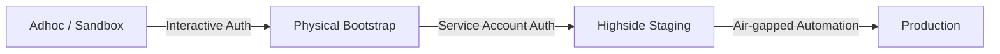
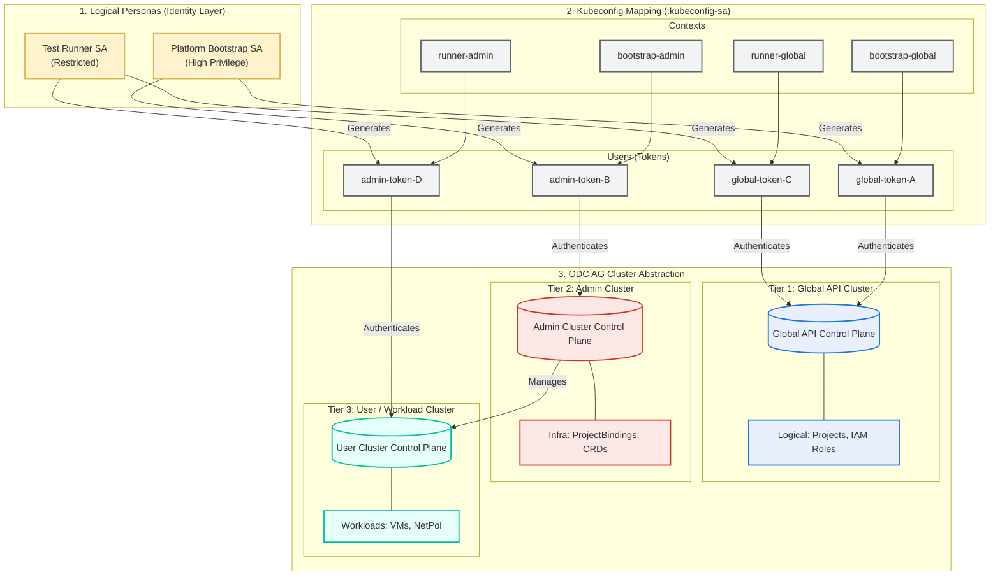

# 001-AO-VM-CREATE: Virtual Machine Provisioning (Unified GitOps Pipeline)

This directory contains a self-contained IaC (Infrastructure as Code) setup to satisfy the requirements of the **001-AO-VM-CREATE** test case.

---

## 1. Overview & Context

### Test Case Overview
- **ID:** 001-AO-VM-CREATE
- **Description:** Verify that authorized users can provision virtual machines.
- **Goal:** Automate the provisioning of the `ioc-test-vm` in the `ioc-test-project-001` namespace, including networking and IAM.

### Production Validation Pathway
To validate our landing zone and workloads before deploying to production, this repository defines a progressive staging and verification pathway:



1.  **Adhoc / Sandbox (Interactive Verification):** Local sandbox validation using user OIDC credentials. Useful for developers to run rapid design iterations.
2.  **Physical Bootstrapping (Automated Pathfinder):** High-fidelity, declarative automation validation. Models the transition to non-interactive ServiceAccounts and isolated contexts to establish least-privilege boundaries.
3.  **Highside Staging (Staging Verification):** Mirroring production-grade network isolation and identity configurations.
4.  **Production (Live Environment):** The final, fully locked-down target deployment environment.

### Operational Model and Security Posture
We execute this verification pipeline strictly within standard GDC operational procedures, ensuring full compliance with security guidelines while demonstrating the platform's capabilities to customers.

#### The Bootstrap Phase (Standard Platform Admin Role)
To run the initial setup and execute Phase 1 of the pipeline, we authenticate using the standard **Platform Administrator (PA)** role.
*   **Operational Standard:** The PA role is the documented, expected role for infrastructure operators or customer administrators responsible for managing tenancy and cross-cluster bindings in GDC.
*   **Process:** We use this administrative context exclusively to establish the secure boundaries of the test case, create the target project namespace, and provision the restricted service accounts. High privileges are dropped immediately after this phase completes.

#### The Workload Phase (Standard Application Runner Role)
Once the infrastructure boundaries are established, we drop all administrative contexts and execute Phase 2 of the pipeline using the restricted `test-runner-sa`.
*   **Operational Standard:** This simulates the standard workflow of a customer application developer or a non-interactive GitOps pipeline operating in a locked-down environment.
*   **Process:** We deploy the actual VM instance and associated network policies entirely within this restricted context. The runner account possesses no privileges to create new projects, view other tenants, or alter platform-wide IAM boundaries.

---

## 2. Architecture & Security Design

This pipeline is engineered to align with GDC's enterprise-grade multi-cluster boundaries:



*   **Control Plane Separation:** GDC splits operations between the centralized **Global API Cluster** (logical projects, tenancy, IAM) and the physical **Admin Cluster** (computational resources, VMs, network policies, project-to-cluster attachments).
*   **Asynchronous Namespace Replication:** Creating a `Project` on the Global API triggers a background GDC synchronization that provisions a corresponding namespace on the physical Admin Cluster (~20 seconds delay). The pipeline is split into **two phases** to respect this physical dependency and prevent race-condition deployment failures.
*   **Local Token Domain Isolation:** Kubernetes Service Account tokens are local to the control plane that signed them and bypass the central AIS (Identity Service) used by human operators (`gdcloud auth login`). Because GDC's clusters are separate API planes without a shared trust for these local tokens, a Global API token is natively rejected by the Admin Cluster. We resolve this cleanly by provisioning twin Service Accounts on both clusters, extracting their native tokens, and constructing a client-side multi-context `.kubeconfig-sa` (4 distinct contexts) to dynamically route Helm commands.
*   **Least-Privilege Persona Separation:** `platform-bootstrap-sa` handles broad org-level resources, while `test-runner-sa` is locked entirely to workload namespace scope with zero platform administrative rights, minimizing the pipeline's security blast radius.

---

## 3. Execution Steps

### Assets
- `tenants.yaml`: Defines the desired state including the project, IAM roles, and VM configuration.
- `helmfile.yaml.gotmpl`: Orchestration engine to deploy the resources using Helm.
- `physical-bootstrap.yaml`: Declarative manifests for Global API SAs and bindings.
- `admin-bootstrap.yaml`: Declarative manifests for Admin Cluster SAs and bindings.
- `setup-sa-prereqs.sh`: Script to automate token extraction and Kubeconfig generation.

### Step 1: Bootstrap Service Accounts & Contexts
Execute the unified setup script to deploy the declarative Service Account manifests and extract credentials to an isolated `.kubeconfig-sa` configuration file.

Run using your active platform/cluster administrator context:
```bash
chmod +x setup-sa-prereqs.sh
./setup-sa-prereqs.sh
```

### Step 2: Run Phase 1 - Project Infrastructure (Platform Admin SA Context)
Execute the platform/project-level bootstrap. Helmfile dynamically routes the project creation to the Global API and the cluster binding to the Admin Cluster:
```bash
KUBECONFIG=./.kubeconfig-sa VERSION=-v1 GLOBAL_API_CONTEXT=bootstrap-global-context ADMIN_CLUSTER_CONTEXT=bootstrap-admin-context helmfile --selector tier!=vm sync
```

### Step 3: Run Phase 2 - Provision VM Workloads (Restricted Runner SA Context)
Execute the second phase entirely under the restricted runner context. We map the Global API context to the bootstrap phase context so Helmfile can resolve dependencies:
```bash
KUBECONFIG=./.kubeconfig-sa VERSION=-v1 GLOBAL_API_CONTEXT=bootstrap-global-context ADMIN_CLUSTER_CONTEXT=runner-admin-context helmfile --selector tier=vm sync
```

---

## 4. Verification Steps

### 1. Resource Creation Verification
Confirm that all resources have been created in the project namespace (on the Admin Cluster):
```bash
# Verify the VM status
kubectl --kubeconfig=./.kubeconfig-sa --context=runner-admin-context get virtualmachine ioc-test-vm -n ioc-test-project-001-v1

# Verify the Boot Disk
kubectl --kubeconfig=./.kubeconfig-sa --context=runner-admin-context get virtualmachinedisk ioc-test-vm-boot-disk -n ioc-test-project-001-v1

# Verify the Network Policy
kubectl --kubeconfig=./.kubeconfig-sa --context=runner-admin-context get projectnetworkpolicy ioc-test-vm-ingress -n ioc-test-project-001-v1
```

### 2. Traffic & Metrics Verification
```bash
# Get the Ingress IP
INGRESS_IP=$(kubectl --kubeconfig=./.kubeconfig-sa --context=runner-admin-context get virtualmachineexternalaccess ioc-test-vm -n ioc-test-project-001-v1 -o jsonpath='{.status.ingressIP}')

# Test connectivity to the SSH port (22)
nc -zv -w 5 $INGRESS_IP 22
```

### 3. Visual Verification
To capture the current state of the VM in the console:
```bash
google-chrome --headless --disable-gpu --ignore-certificate-errors --screenshot=vm_verification.png --window-size=1280,1024 "https://console.org-1.zone1.google.gdch.test/#/virtual-machines?project=ioc-test-project-001-v1&zone=zone1"
```

---

## 5. Air-Gapped Transfer & Execution

To deploy this test case in the air-gapped environment, bundle the required binaries and repository on an internet-connected machine before transferring it.

### 1. Create the Bundle (Connected Machine)
```bash
mkdir -p ~/gdc-bundle/bin
cd ~/gdc-bundle

# Download Helmfile (Linux AMD64)
HELMFILE_VERSION="1.5.1"
wget https://github.com/helmfile/helmfile/releases/download/v${HELMFILE_VERSION}/helmfile_${HELMFILE_VERSION}_linux_amd64.tar.gz
tar -xzvf helmfile_${HELMFILE_VERSION}_linux_amd64.tar.gz -C bin/ helmfile
chmod +x bin/helmfile
rm helmfile_${HELMFILE_VERSION}_linux_amd64.tar.gz

# Clone the repository
GIT_REPO_URL="git@github.com:gdc-iac/gdc-iac-org.git"
git clone ${GIT_REPO_URL} iac-repo

# Package into a tarball
cd ~
tar czvf gdc-iac-bundle.tar.gz gdc-bundle/
```

### 2. Transfer to GDC-AG Environment
Transfer `~/gdc-iac-bundle.tar.gz` to env via the established pathway:
1. Upload to a GCS bucket: `gsutil cp ~/gdc-iac-bundle.tar.gz gs://[YOUR_BUCKET]`
2. Download from GCS on the GCP Jumphost.
3. `scp` from Jumphost to the GDC-AG bootstrapper node.

### 3. Unpack and Execute (GDC-AG Environment)
```bash
# Extract
tar xzvf gdc-iac-bundle.tar.gz
cd gdc-bundle

# Add Helmfile to PATH
export PATH=$PWD/bin:$PATH

# Navigate to test case and execute
cd iac-repo/examples/platform-test/001-AO-VM-CREATE
./setup-sa-prereqs.sh
```

---

## 6. Teardown

To remove all resources created for this test case:
```bash
# Teardown VM workloads on the Admin Cluster
KUBECONFIG=./.kubeconfig-sa GLOBAL_API_CONTEXT=bootstrap-global-context ADMIN_CLUSTER_CONTEXT=runner-admin-context helmfile --selector tier=vm destroy

# Teardown project and platform bootstrap
KUBECONFIG=./.kubeconfig-sa GLOBAL_API_CONTEXT=bootstrap-global-context ADMIN_CLUSTER_CONTEXT=bootstrap-admin-context helmfile --selector tier!=vm destroy

# Delete the bootstrap service accounts and bindings
kubectl --context "$GLOBAL_API_CONTEXT" delete -f physical-bootstrap.yaml
rm -f .kubeconfig-sa
```

---

## Appendix A: Adhoc / Sandbox Execution (Interactive OIDC)

For local sandbox validation and rapid design iterations, operators can use the full interactive workflow that directly integrates with the GDC AIS (Authentication & Identity Service). This method requires interactive OIDC logins and manual certificate trust establishment.

### Execution Steps

This flow is captured in the `adhoc-setup.sh` script and follows this sequence:

1. **Run the Adhoc Setup Script:**
   Execute the script to fetch certificates, perform the double login, and grant roles. You can pass a `VERSION` variable to avoid GDC Project ID reuse collisions:
   ```bash
   chmod +x adhoc-setup.sh
   VERSION=-v2 ./adhoc-setup.sh
   ```
2. **The Script Flow Includes:**
   * **Certificate Fetching & Trust:** Fetches TLS certificates for the Console, AIS, and KMS endpoints and adds them to the local machine's trust store.
   * **Step 1: Platform Admin Login:** Prompts the operator to log in interactively as a highly privileged **Platform Admin** to perform organization-level bootstrapping.
   * **Project & IAM Bootstrap:** Creates the GDC `Project` and grants global roles (`platform-admin`, `project-creator`, `organization-iam-admin`, `user-cluster-admin`) to the target IaC user (`fop-iac@example.com`).
   * **Step 2: IAC User Login:** Prompts the operator to switch context by logging in again as the restricted **IAC User** to verify that the assigned roles have propagated via AIS.
   * **Execution:** Finally, runs `helmfile sync` using the active user context authorized by AIS.

This workflow is maintained in `adhoc-setup.sh` for adhoc testing scenarios where interactive authentication is acceptable.

## Appendix B: Mapping to 001-AO-VM-CREATE Test Spec
- **PR-01 (RBAC):** satisfy via `tenants.yaml` and `gdc-iam-role-bindings` chart.
- **PR-02 (Images):** Uses `ubuntu-24.04-v20260224-gdch` from the `vm-system` namespace.
- **Step 2-5 (Creation):** Automated via `gdc-vm` Helm chart with specific hardware requirements (`n3-standard-2-gdc`, `20Gi` disk).
- **Step 6 (Verification):** Automated check for `Running` state.
