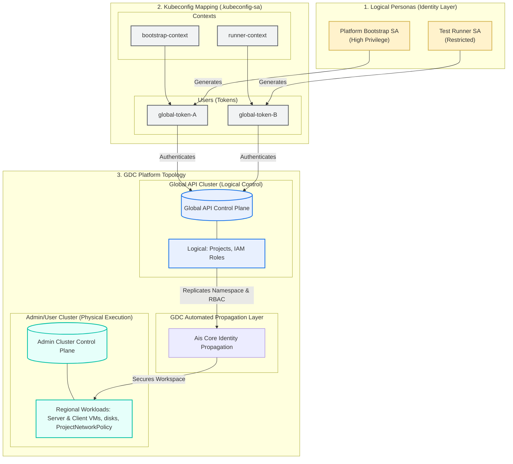

# 003-VM-IPERF3: Virtual Machine to Virtual Machine Network Performance Test

### TL;DR: GDC IaC Pipeline Automation

This directory contains a self-contained IaC (Infrastructure as Code) setup to satisfy the requirements of the **003-VM-IPERF3** test case, which automates secure virtual-machine-to-virtual-machine network performance and connectivity verification across GDC's logical and physical API planes using a **progressive, bottom-up staging stance**:

1. **Adhoc Sandbox ([setup-adhoc-env.sh](./setup-adhoc-env.sh)):** Validates OIDC/AIS identity synchronization loops interactively.
2. **Operator Scope ([setup-operator-sa.sh](./setup-operator-sa.sh)):** Performs out-of-band K8s-native bootstrapping directly on physical Admin/User Clusters for time-zero platform start-up.
3. **Tenant Scope ([setup-tenant-sa.sh](./setup-tenant-sa.sh)):** Provisions resources strictly within GDC-native customer tenant boundaries.

The orchestration is driven by `helmfile.yaml.gotmpl`, which dynamically routes cross-plane tokens and uses a namespaced `auth can-i` presync hook to securely handle asynchronous namespace and IAM replication delays without requiring cluster-wide administrative privileges.

---

## 1. Overview & Context

### Test Case Overview
- **ID:** 003-VM-IPERF3
- **Description:** Verify that virtual machines can establish secure internal network connections and measure performance using iperf3 between virtual machines inside the regional GDC project space.
- **Goal:** Automate the provisioning of the `iperf3-server-vm` and `iperf3-client-vm` along with the necessary GDC `ProjectNetworkPolicy` to allow traffic on port `5201` (TCP/UDP) within the `ioc-test-project-003` namespace, validating network isolation and virtualized VM network throughput.

### Mapping to 003-VM-IPERF3 Test Spec
- **PR-01 (RBAC):** Satisfied via `tenants.yaml` and `gdc-iam-role-bindings` chart.
- **PR-02 (VM Images):** Uses `ubuntu-24.04-v20260224-gdch` from the `vm-system` namespace.
- **Step 2-5 (Creation):** Automated via GDC's production-native `gdc-vm` Helm chart to spin up two virtual machines, and `gdc-project-network-policies` to open port `5201`.
- **Step 6 (Verification):** Automated check for VM `Running` states, SSH connectivity, and manual or script-driven iperf3 execution.

### Assets
- **`tenants.yaml`**: The declarative desired-state manifest defining the tenant topology, target projects, regional cluster bindings, dynamic user IAM permissions, and virtual machines/network policy parameters.
- **`helmfile.yaml.gotmpl`**: The core logical orchestration engine that dynamically parses `tenants.yaml` into ordered Helm releases. It implements multi-phase execution and incorporates the optimized namespaced `auth can-i` presync hook to poll regional cluster readiness safely without requiring cluster-wide Namespace privileges.
- **`tenant-bootstrap.yaml`**: The declarative Kubernetes manifest applied to the Global API Cluster to bootstrap the logical Service Accounts (`platform-bootstrap-sa`, `test-runner-sa`) and GDC-native IAM bindings.
- **`operator-bootstrap.yaml`**: The declarative Kubernetes manifest applied out-of-band directly to the regional Admin Cluster to provision local Service Accounts and local K8s `RoleBindings` scoped strictly to the `iac-root` namespace.
- **`setup-adhoc-env.sh`**: The interactive adhoc testing script that establishes certificate trust, guides the operator through double interactive OIDC logins (Platform Admin + IAC User) against GDC's AIS, and enforces a **30-second logical propagation wait** before executing Helm.
- **`setup-tenant-sa.sh`**: The automated script that deploys `tenant-bootstrap.yaml` to the Global API, extracts the resulting tokens, and generates the client-side **2-context** `.kubeconfig-sa` to authenticate headless tenant-scoped pipeline runs.
- **`setup-operator-sa.sh`**: The automated script that deploys `tenant-bootstrap.yaml` to the Global API and `operator-bootstrap.yaml` directly to the Admin Cluster out-of-band, extracts all 4 tokens, and constructs the **4-context** `.kubeconfig-sa` to authenticate headless operator-scoped bootstrap runs.

---
## 2. Execution Steps

### Option A: Adhoc / Sandbox Execution (Interactive OIDC)

For local sandbox validation and rapid design iterations, operators can use the full interactive workflow that directly integrates with the GDC AIS (Authentication & Identity Service). This method requires interactive OIDC logins and manual certificate trust establishment.

### Execution Steps

This flow is captured in the `setup-adhoc-env.sh` script and follows this sequence:

1. **Run the Adhoc Setup Script:**
   Execute the script to fetch certificates, perform the double login, and grant roles. You can pass a `VERSION` variable to avoid GDC Project ID reuse collisions:
   ```bash
   VERSION=-v2 ./setup-adhoc-env.sh
   ```
2. **The Script Flow Includes:**
   * **Certificate Fetching & Trust:** Fetches TLS certificates for the Console, AIS, and KMS endpoints and adds them to the local machine's trust store.
   * **Step 1: Platform Admin Login:** Prompts the operator to log in interactively as a highly privileged **Platform Admin** to perform organization-level bootstrapping.
   * **Project & IAM Bootstrap:** Creates the GDC `Project` and grants global roles (`platform-admin`, `project-creator`, `organization-iam-admin`, `user-cluster-admin`) to the target IaC user (`fop-iac@example.com`).
   * **Step 2: IAC User Login:** Prompts the operator to switch context by logging in again as the restricted **IAC User** to verify that the assigned roles have propagated via AIS.
   * **Execution:** Finally, runs `helmfile sync` using the active user context authorized by AIS.

---

### Option B: Executing the Operator-Scoped Pathway

For physical/local testing without Interactive OIDC, run as an operator with Service Accounts. Suitable also for execution on Adhoc Environments, Bare-Metal Bring-Up (T=0), and Physical Test Labs to ensure direct multi-plane routing and bypass OIDC/AIS propagation dependency entirely.

1. **Generate Service Account Credentials & 4-Context Kubeconfig:**
   Run the script using your active operator context to provision the Service Accounts and write their tokens into a local Kubeconfig file (`.kubeconfig-sa`):
   ```bash
   ./setup-operator-sa.sh
   ```

2. **Run Phase 1 - Project Infrastructure (Platform Admin SA Context):**
   Deploy the project logically on the Global API and bind the cluster on the Admin plane:
   ```bash
   KUBECONFIG=./.kubeconfig-sa VERSION=-v1 GLOBAL_API_CONTEXT=bootstrap-global-context ADMIN_CLUSTER_CONTEXT=bootstrap-admin-context helmfile --selector tier!=vm sync
   ```

3. **Run Phase 2 - Provision VM Workloads (Restricted Runner SA Context):**
   Provision virtual machines directly in the regional project workspace:
   ```bash
   KUBECONFIG=./.kubeconfig-sa VERSION=-v1 GLOBAL_API_CONTEXT=bootstrap-global-context ADMIN_CLUSTER_CONTEXT=runner-admin-context helmfile --selector tier=vm sync
   ```

---
### Option C: Executing the Tenant-Scoped Pathway (Production & Staging)

Designed for Production GDC-AG tenant environments and automated GitOps pipelines.

#### 1. Execution Commands

1. **Generate Service Account Credentials:**
   Run the bootstrap script using your active platform context to provision the Service Accounts and write their tokens into a local Kubeconfig file (`.kubeconfig-sa`):
   ```bash
   ./setup-tenant-sa.sh
   ```

   > [!WARNING]
   > **Role & Namespace Propagation Delay:**
   > GDC's background identity propagation engines require around **15 to 20 seconds** to replicate namespaces, projects, and IAM role permissions down from the logical Global API to physical regional clusters. Running step 2 immediately may result in immediate authentication or authorization failures.
   
   * **Optional: Verify Role Propagation Status:**
     Before proceeding, run the following access check to confirm the restricted runner credentials have propagated and are active in the target project namespace:
     ```bash
     kubectl --kubeconfig=./.kubeconfig-sa --context=runner-context auth can-i get virtualmachines -n ioc-test-project-003-v1
     ```
     *Do not proceed to step 2 until this command returns `yes`.*

2. **Deploy the Project and VM Workloads:**
   Run the `helmfile sync` using the generated `.kubeconfig-sa` file to provision both the GDC logical project environment and the regional VM workloads:
   ```bash
   KUBECONFIG=./.kubeconfig-sa VERSION=-v1 GLOBAL_API_CONTEXT=bootstrap-context ADMIN_CLUSTER_CONTEXT=runner-context helmfile sync
   ```

---

## 3. Verification Steps

### 1. Resource Creation Verification
Confirm that all VM resources have been created in the project namespace (on the Admin Cluster):
```bash
# Verify the iperf3 Server VM status
kubectl --kubeconfig=./.kubeconfig-sa --context=runner-admin-context get virtualmachine iperf3-server-vm -n ioc-test-project-003-v1

# Verify the iperf3 Client VM status
kubectl --kubeconfig=./.kubeconfig-sa --context=runner-admin-context get virtualmachine iperf3-client-vm -n ioc-test-project-003-v1

# Verify the Boot Disks
kubectl --kubeconfig=./.kubeconfig-sa --context=runner-admin-context get virtualmachinedisks -n ioc-test-project-003-v1

# Verify the general iperf3 Project Network Policy
kubectl --kubeconfig=./.kubeconfig-sa --context=runner-admin-context get projectnetworkpolicy allow-iperf3-traffic -n ioc-test-project-003-v1
```

### 2. Traffic & Performance Verification
Because the virtual machines are assigned local virtual IP addresses inside GDC's software-defined network, you can run the benchmark using the following interactive verification flow:

1. **Retrieve the Internal IPs of both VMs:**
   ```bash
   ## USING .kubeconfig-sa
   # Server VM IP
   SERVER_IP=$(kubectl --kubeconfig=./.kubeconfig-sa --context=runner-admin-context get virtualmachine iperf3-server-vm -n ioc-test-project-003-v1 -o jsonpath='{.status.network.interfaces[0].ipAddresses[0]}' | cut -d/ -f1)
   
   # Client VM IP
   CLIENT_IP=$(kubectl --kubeconfig=./.kubeconfig-sa --context=runner-admin-context get virtualmachine iperf3-client-vm -n ioc-test-project-003-v1 -o jsonpath='{.status.network.interfaces[0].ipAddresses[0]}' | cut -d/ -f1)

   ## USING existing contexts
   # Server VM IP
   SERVER_IP=$(kubectl --context=org-1-admin-zone1-gdch_console-org-1-zone1-google-gdch-test_org-1-admin get virtualmachine iperf3-server-vm -n ioc-test-project-003-v1 -o jsonpath='{.status.network.interfaces[0].ipAddresses[0]}' | cut -d/ -f1)

   # Client VM IP
   CLIENT_IP=$(kubectl --context=org-1-admin-zone1-gdch_console-org-1-zone1-google-gdch-test_org-1-admin get virtualmachine iperf3-client-vm -n ioc-test-project-003-v1 -o jsonpath='{.status.network.interfaces[0].ipAddresses[0]}' | cut -d/ -f1)

   ```

2. **Retrieve SSH Ingress IPs (if external access is configured) or execute commands via GDC VM Console:**
   ```bash
   ## USING .kubeconfig-sa
   # Get Server external ingress IP
   SERVER_EXT=$(kubectl --kubeconfig=./.kubeconfig-sa --context=runner-admin-context get virtualmachineexternalaccess iperf3-server-vm -n ioc-test-project-003-v1 -o jsonpath='{.status.ingressIP}')
   
   # Get Client external ingress IP
   CLIENT_EXT=$(kubectl --kubeconfig=./.kubeconfig-sa --context=runner-admin-context get virtualmachineexternalaccess iperf3-client-vm -n ioc-test-project-003-v1 -o jsonpath='{.status.ingressIP}')

   ## USING existing contexts
   # Get Server external ingress IP
   SERVER_EXT=$(kubectl --context=org-1-admin-zone1-gdch_console-org-1-zone1-google-gdch-test_org-1-admin get virtualmachineexternalaccess iperf3-server-vm -n ioc-test-project-003 -o jsonpath='{.status.ingressIP}')

   # Get Client external ingress IP
   CLIENT_EXT=$(kubectl --context=org-1-admin-zone1-gdch_console-org-1-zone1-google-gdch-test_org-1-admin get virtualmachineexternalaccess iperf3-client-vm -n ioc-test-project-003 -o jsonpath='{.status.ingressIP}')

   ```

3. **Start iperf3 Server on `iperf3-server-vm`:**
   SSH into the Server VM and spin up the iperf3 server daemon:
   ```bash
   ssh -i [YOUR_SSH_KEY] user@$SERVER_EXT "sudo apt-get update && sudo apt-get install -y iperf3 && iperf3 -s -D"
   ```

4. **Run Benchmark from `iperf3-client-vm`:**
   SSH into the Client VM and trigger the network test targeting the Server's internal IP:
   ```bash
   ssh -i [YOUR_SSH_KEY] user@$CLIENT_EXT "sudo apt-get update && sudo apt-get install -y iperf3 && iperf3 -c $SERVER_IP -t 10"
   ```

5. **Examine output logs:**
   A successful test indicates fully authorized VM-to-VM cross-hypervisor traffic, outputting throughput metrics similar to:
   ```text
   [ ID] Interval           Transfer     Bitrate         Retr
   [  5]   0.00-10.00  sec  10.2 GBytes  8.76 Gbits/sec    0             sender
   [  5]   0.00-10.04  sec  10.2 GBytes  8.72 Gbits/sec                  receiver
   ```

---

## 4. Teardown

To remove all resources created for this test case:

### A. Teardown Tenant-Scoped Deployments
```bash
KUBECONFIG=./.kubeconfig-sa GLOBAL_API_CONTEXT=bootstrap-context ADMIN_CLUSTER_CONTEXT=runner-context helmfile destroy
kubectl --context "$GLOBAL_API_CONTEXT" delete -f tenant-bootstrap.yaml
rm -f .kubeconfig-sa
```

### B. Teardown Operator-Scoped Deployments
```bash
# Teardown VM workloads on the Admin/User Cluster
KUBECONFIG=./.kubeconfig-sa GLOBAL_API_CONTEXT=bootstrap-global-context ADMIN_CLUSTER_CONTEXT=runner-admin-context helmfile --selector tier=vm destroy

# Teardown project, platform bootstrap, and network policies
KUBECONFIG=./.kubeconfig-sa GLOBAL_API_CONTEXT=bootstrap-global-context ADMIN_CLUSTER_CONTEXT=bootstrap-admin-context helmfile --selector tier!=vm destroy

# Delete the bootstrap service accounts and bindings
kubectl --context "$GLOBAL_API_CONTEXT" delete -f tenant-bootstrap.yaml
rm -f .kubeconfig-sa
```

---

## 5. Architecture & Security Design

### Pathway A: Standard GDC-Native Tenant-Scoped Architecture (Primary / Staging)

This represents the standard production-aligned architecture. The client-side Kubeconfig contains **2 contexts** mapped strictly to GDC's Global logical API. Workload security, namespace creation, and target cluster role assignments are governed 100% by GDC-native logical IAM policies, which GDC's background propagation services replicate to the physical layers.


