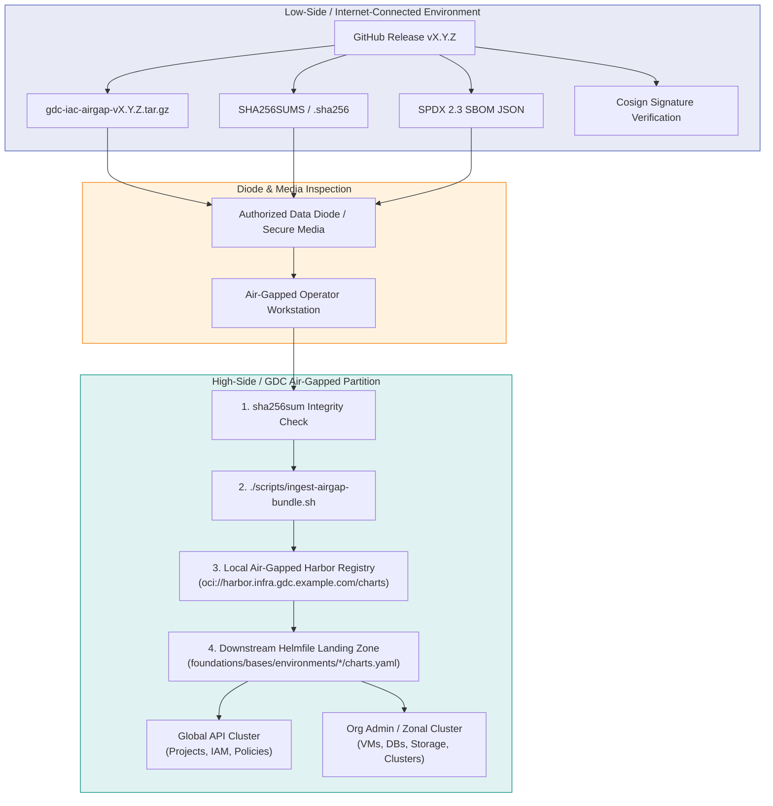

<!--
Copyright 2026 Google LLC

Licensed under the Apache License, Version 2.0 (the "License");
you may not use this file except in compliance with the License.
You may obtain a copy of the License at

    http://www.apache.org/licenses/LICENSE-2.0

Unless required by applicable law or agreed to in writing, software
distributed under the License is distributed on an "AS IS" BASIS,
WITHOUT WARRANTIES OR CONDITIONS OF ANY KIND, either express or implied.
See the License for the specific language governing permissions and
limitations under the License.
-->

# GDC Air-Gapped Operations: Bundle Ingestion & Harbor Synchronization Guide

Google Distributed Cloud air-gapped (GDCag 1.16+) partitions operate in classified, physically isolated, or disconnected networks without access to the public internet.

To deploy infrastructure and workloads into GDCag, all software deliverables—Helm charts, container images, Helmfile landing zone templates, and reference blueprints—must be transferred across an authorized data diode or secure transport media and seeded into the partition's localized container registry (e.g., **Harbor**).

This guide provides the complete end-to-end runbook for platform administrators and security officers to **download, verify, ingest, and consume** GDC IaC releases.

---

## 1. Release Architecture & Ingestion Flow



---

## 2. Low-Side Preparation & Attestation Verification

Before moving assets across the air-gap boundary, download the official release assets and verify cryptographic integrity.

### Step 1: Download Release Deliverables
From the official [GitHub Releases page](https://github.com/gdc-iac/gdc-iac-org/releases):
```bash
VERSION="0.2.0" # Target release version
TAG="v${VERSION}"

# Download standalone air-gap archive & checksum
curl -sLO "https://github.com/gdc-iac/gdc-iac-org/releases/download/${TAG}/gdc-iac-airgap-${TAG}.tar.gz"
curl -sLO "https://github.com/gdc-iac/gdc-iac-org/releases/download/${TAG}/gdc-iac-airgap-${TAG}.tar.gz.sha256"

# Download SPDX 2.3 Software Bill of Materials (SBOM)
curl -sLO "https://github.com/gdc-iac/gdc-iac-org/releases/download/${TAG}/gdc-iac-sbom.spdx.json"
```

### Step 2: Validate Archive Checksum
```bash
# Verify archive integrity
sha256sum -c "gdc-iac-airgap-${TAG}.tar.gz.sha256"
# Expected output: gdc-iac-airgap-v0.2.0.tar.gz: OK
```

### Step 3: Verify Cosign OCI Signatures (Optional for Connected Testbeds)
If testing from a connected environment, verify the OCI chart signatures in GitHub Container Registry (GHCR):
```bash
cosign verify \
  --certificate-identity-regexp "https://github.com/gdc-iac/gdc-iac-org/" \
  --certificate-oidc-issuer "https://token.actions.githubusercontent.com" \
  "ghcr.io/gdc-iac/gdc-iac-org/charts/gdc-clusters:0.1.3"
```

---

## 3. High-Side Ingestion: Turnkey Harbor Synchronization

Once the bundle is transferred to the air-gapped administrative workstation, use the included turnkey ingestion utility to populate the on-prem Harbor registry.

### Step 1: Extract the Air-Gap Distribution Bundle
```bash
tar -xzf "gdc-iac-airgap-v${VERSION}.tar.gz"
cd "gdc-iac-airgap-v${VERSION}"
```

The bundle contains:
- `charts/`: 30+ pre-packaged Helm charts (`*.tgz`).
- `foundations/`: Phased Helmfile execution stages (`0-bootstrap` through `4-notebooks`).
- `blueprints/`: 100% self-contained application reference architectures (P0–P13).
- `policy/`: Security, OPA, and Conftest compliance rules.
- `scripts/ingest-airgap-bundle.sh`: Automated bundle ingestion utility.
- `SHA256SUMS`: Cryptographic manifest of every individual file inside the bundle.

### Step 2: Dry-Run Simulation (Recommended)
Simulate the ingestion without making network calls or modifying Harbor state:
```bash
./scripts/ingest-airgap-bundle.sh \
  --registry harbor.infra.gdc.example.com \
  --project gdc-iac \
  --dry-run
```

### Step 3: Execute Ingestion
Run the script to verify internal checksums, authenticate against Harbor, and push all OCI charts:

#### Interactive Execution (Operator Prompted):
```bash
./scripts/ingest-airgap-bundle.sh \
  --registry harbor.infra.gdc.example.com \
  --project gdc-iac
```
*The script will prompt securely for username and password if not set in the environment.*

#### Automated Execution (CI / Service Robot Account):
```bash
./scripts/ingest-airgap-bundle.sh \
  --registry harbor.infra.gdc.example.com \
  --project gdc-iac \
  --user "robot$gdc-iac-ingest" \
  --password "${ROBOT_TOKEN}" \
  --insecure
```

> [!TIP]
> Use `--insecure` if your air-gapped Harbor registry uses internal enterprise Certificate Authorities that are not yet added to the workstation's system trust store.

### Utility Options Reference

| Flag | Long Option | Description | Default |
| :--- | :--- | :--- | :--- |
| `-r` | `--registry` | Target registry hostname and optional port (e.g. `harbor.infra.gdc.example.com`) | **Required** |
| `-p` | `--project` | Target project or namespace in registry | `charts` |
| `-u` | `--user` | Registry username | `$HARBOR_USER` / prompt |
| `-P` | `--password` | Registry password | `$HARBOR_PASSWORD` / prompt |
| `-d` | `--bundle-dir` | Path to extracted bundle directory | Parent directory of script |
| | `--skip-checksum` | Skip internal `SHA256SUMS` validation | `false` |
| | `--insecure` | Allow HTTP or self-signed TLS certificates | `false` |
| | `--dry-run` | Simulate actions without pushing to registry | `false` |
| `-h` | `--help` | Show usage help and exit | |

---

## 4. Downstream Helmfile Configuration (Day-2 Consumption)

Once the charts are ingested into your local Harbor registry, configure your downstream Helmfile environment values to resolve charts from Harbor instead of the local filesystem.

Open `foundations/bases/environments/<env>/charts.yaml` (e.g. `dev`, `stg`, or `prd`) and set the chart path and pinned version variables:

```yaml
# ==============================================================================
# Air-Gapped Harbor Registry Chart Resolution
# ==============================================================================

# Zonal & Cluster Charts
gdc_clusters_chart_path: "oci://harbor.infra.gdc.example.com/gdc-iac/gdc-clusters"
gdc_clusters_chart_version: "0.1.3"

gdc_standard_clusters_chart_path: "oci://harbor.infra.gdc.example.com/gdc-iac/gdc-standard-clusters"
gdc_standard_clusters_chart_version: "0.1.1"

# Tenancy & Global Resource Charts
gdc_projects_chart_path: "oci://harbor.infra.gdc.example.com/gdc-iac/gdc-projects"
gdc_projects_chart_version: "0.1.1"

gdc_projects_sa_chart_path: "oci://harbor.infra.gdc.example.com/gdc-iac/gdc-project-service-accounts"
gdc_projects_sa_chart_version: "0.1.1"

gdc_iam_roles_chart_path: "oci://harbor.infra.gdc.example.com/gdc-iac/gdc-iam-roles"
gdc_iam_roles_chart_version: "0.1.3"

gdc_iam_rolebindings_chart_path: "oci://harbor.infra.gdc.example.com/gdc-iac/gdc-iam-role-bindings"
gdc_iam_rolebindings_chart_version: "0.1.3"

# Workload & Resource Charts
gdc_vm_chart_path: "oci://harbor.infra.gdc.example.com/gdc-iac/gdc-vm"
gdc_vm_chart_version: "0.1.5"

gdc_buckets_chart_path: "oci://harbor.infra.gdc.example.com/gdc-iac/gdc-buckets"
gdc_buckets_chart_version: "0.1.2"

gdc_dbs_chart_path: "oci://harbor.infra.gdc.example.com/gdc-iac/gdc-dbs"
gdc_dbs_chart_version: "0.1.1"

gdc_notebooks_chart_path: "oci://harbor.infra.gdc.example.com/gdc-iac/gdc-notebooks"
gdc_notebooks_chart_version: "0.1.2"
```

### Validate Ingested Resolution:
Verify that Helmfile resolves the charts directly from Harbor:
```bash
helmfile -f foundations/releases/3-clusters/clusters.yaml.gotmpl -e dev list
```
**Expected Output:**
```text
NAME                  CHART                                                         VERSION
mellons-cluster       oci://harbor.infra.gdc.example.com/gdc-iac/gdc-clusters       0.1.3
mellons-user-cluster  oci://harbor.infra.gdc.example.com/gdc-iac/gdc-clusters       0.1.3
```

---

## 5. External Container Image Mirroring (Skopeo / Crane)

While Helm charts are packaged directly inside the air-gap bundle, referenced base container images (e.g. for Jupyter notebooks or validation tests) can be mirrored using `skopeo`:

### Image Inventory

| Category | Source Public Reference | Target Local Harbor Reference |
| :--- | :--- | :--- |
| **Stage 4 (Notebooks)** | `gcr.io/private-cloud-staging/notebooks/deeplearning-platform-release/pytorch-gpu:m125_ext` | `<gdc-harbor-domain>/library/pytorch-gpu:m125_ext` |
| **Validation / Testing** | `docker.io/library/alpine:3.20` | `<gdc-harbor-domain>/library/alpine:3.20` |
| **Validation / Testing** | `docker.io/library/busybox:latest` | `<gdc-harbor-domain>/library/busybox:latest` |

### Mirroring Procedure

#### Low-Side (Internet-Connected):
```bash
mkdir -p images
skopeo copy docker://gcr.io/private-cloud-staging/notebooks/deeplearning-platform-release/pytorch-gpu:m125_ext dir:./images/pytorch-gpu
skopeo copy docker://docker.io/library/alpine:3.20 dir:./images/alpine
tar -czf gdc-images.tar.gz ./images
```

#### High-Side (Air-Gapped Workstation):
```bash
tar -xzf gdc-images.tar.gz
skopeo login --tls-verify=false -u <registry-user> -p <registry-password> harbor.infra.gdc.example.com

skopeo copy --dest-tls-verify=false dir:./images/pytorch-gpu docker://harbor.infra.gdc.example.com/library/pytorch-gpu:m125_ext
skopeo copy --dest-tls-verify=false dir:./images/alpine docker://harbor.infra.gdc.example.com/library/alpine:3.20
```

---

## 6. Troubleshooting & Operational FAQ

### Q1: Checksum verification fails during ingestion
- **Symptom**: `❌ Checksum verification FAILED! Bundle files may be corrupted or altered.`
- **Cause**: Media transmission truncation or file modification in transit across the diode.
- **Remediation**: Run `sha256sum -c SHA256SUMS` to identify the failing files. Re-export the archive from the low-side transfer station.

### Q2: Harbor returns `x509: certificate signed by unknown authority`
- **Symptom**: `helm push` fails with TLS handshake error.
- **Remediation**:
  1. Add your enterprise root CA certificate to the system trust store (`/etc/pki/ca-trust/source/anchors/` on Rocky Linux).
  2. Alternatively, pass `--insecure` to `./scripts/ingest-airgap-bundle.sh` to allow self-signed certificates during staging rollouts.

### Q3: Helmfile reports `failed to fetch oci://...`
- **Symptom**: `helmfile apply` fails to resolve chart.
- **Remediation**: Ensure the user running Helmfile has executed `helm registry login <harbor-domain>` or that the Helmfile environment has appropriate credentials configured.
