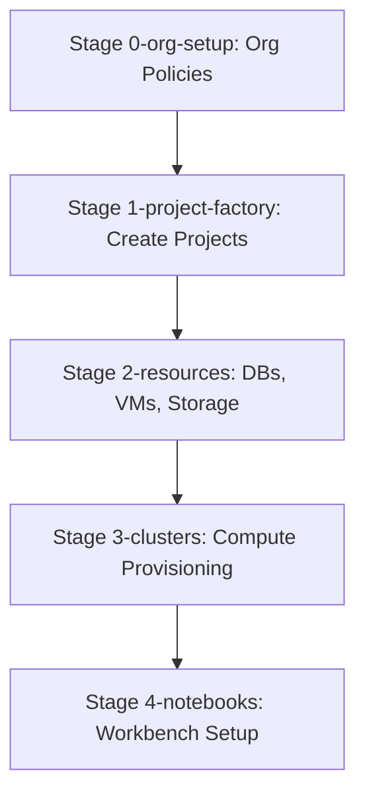
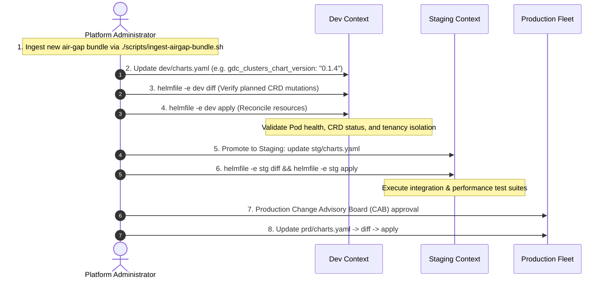

# GDC Foundations: Step-by-Step IaC Deployment Manual

This operational playbook guides GDC Hosted administrators through manual execution, state verification, and rollback procedures for all 5 foundational stages.

---

## Prerequisites & Pre-Flight Checklist

Before deploying the foundational stages, complete the following initial bootstrapping and environment setup:

### 1. RBAC Bootstrapping (First Run Only)
The user running Helmfile (e.g., `fop-iac@example.com`) requires `secret-admin` and `project-iam-admin` privileges on the `iac-root` project to manage Helm state files (release secrets).

Run these commands once to bootstrap permissions:

> [!NOTE]
> Ensure the `fop-platform-admin@example.com` user has the roles **IAM Org Admin**, **Organization Grafana Viewer**, and **Project Creator** assigned before executing these commands.

```bash
# Export environment variables 
export ORG_NAME="org-1"
export IAC_PROJECT="iac-root"
export IAC_USER="fop-iac@example.com"

### Create a project to host IaC resources
gdcloud auth login # (as platform-admin)
gdcloud projects create $IAC_PROJECT

### Grant IAC_USER required Org roles:
for role in \
  organization-iam-admin \
  project-creator \
  project-editor \
  user-cluster-admin \
; do \
   gdcloud organizations add-iam-policy-binding "$ORG_NAME" \
   --member="user:$IAC_USER" \
   --role="$role";\
done

### Grant IAC_USER required IAM permissions on IAC_PROJECT:
for role in \
  secret-admin \
; do \
  gdcloud projects add-iam-policy-binding $IAC_PROJECT \
  --member=user:$IAC_USER \
  --role=$role;\
done
```

### 2. Authenticate as IaC User
```bash
gdcloud auth login # (as fop-iac@example.com)
```

### 3. Configure Kubernetes Contexts
Set the correct Kubernetes cluster contexts in `foundations/bases/environments/dev/globals.yaml`:
```yaml
gdc_context_global: "global-api-gdch_console-org-1-zone1-google-gdch-test_global-api"
gdc_context_zone: "org-1-admin-zone1-gdch_console-org-1-zone1-google-gdch-test_zone1_org-1-admin"
```

### 4. Chart Resolution Mode Configuration (Dual-Mode)
Helmfile supports two operational modes configured in `foundations/bases/environments/<env>/charts.yaml`:
- **Mode 1: Local Filesystem Resolution (Default / Dev)**:
  Uses relative paths (`../../../charts/<chart>`). Ideal for rapid development and testing directly within the cloned repository.
- **Mode 2: Air-Gapped OCI Registry Resolution (Enterprise / Prod)**:
  Pulls packaged, immutable charts from your local Harbor registry (seeded via `./scripts/ingest-airgap-bundle.sh` as detailed in [`AIRGAP_MIRRORING.md`](AIRGAP_MIRRORING.md)). Charts are pinned to exact versions:
  ```yaml
  gdc_clusters_chart_path: "oci://harbor.infra.gdc.example.com/gdc-iac/gdc-clusters"
  gdc_clusters_chart_version: "0.1.3"
  ```

### 5. Workstation & Pipeline Validation
1. Verify your local workstation is prepared as detailed in [`WORKSTATION_ONBOARDING.md`](WORKSTATION_ONBOARDING.md).
2. Ensure all required container images and Helm charts are mirrored to local registries as detailed in [`AIRGAP_MIRRORING.md`](AIRGAP_MIRRORING.md).
3. Execute the validation script to ensure there are no syntax or schema violations:
   ```bash
   ./foundations/scripts/validate.sh dev
   ```
4. Proceed with deploying the stages below.

---

## Stage Execution Runbook



---

### 🏁 Stage 0: Bootstrap & Organization Setup

Provisions root platform settings, billing configurations, organizational policies, and baseline operator role bindings.

```bash
# 1. Perform dry-run diff validation
helmfile -e dev -l stage=0-bootstrap diff
helmfile -e dev -l stage=0-org-setup diff

# 2. Apply the stage releases
helmfile -e dev -l stage=0-bootstrap apply
helmfile -e dev -l stage=0-org-setup apply
```

* **Verification**:
  * Verify that the target administrative namespace exists: `kubectl get ns iac-root`
  * Verify root OrgPolicy resources are active: `kubectl get orgpolicies -n platform`
* **Rollback Plan**:
  * Revert change and rollback using helmfile: `helmfile -e dev -l stage=0-org-setup rollback`

---

### 🏗️ Stage 1: Project Factory

Dynamically provisions target GDC Hosted tenant namespaces, maps project-level custom roles, establishes project service accounts, and applies cross-project networking isolation policies.

```bash
# 1. Perform dry-run diff validation
helmfile -e dev -l stage=1-project-factory diff

# 2. Apply the stage releases
helmfile -e dev -l stage=1-project-factory apply
```

* **Verification**:
  * Verify that tenant namespaces are active: `kubectl get projects -n platform` (checks custom resources) and `kubectl get ns` (checks physical namespaces).
  * Verify that service accounts are provisioned: `kubectl get sa -n mellons-prj`
* **Rollback Plan**:
  * In case of failures, execute: `helmfile -e dev -l stage=1-project-factory rollback`

---

### 💾 Stage 2: Zonal Application Resources

Deploys foundational customer services inside tenant projects: databases, virtual machine templates, storage buckets, and custom dashboards.

```bash
# 1. Perform dry-run diff validation
helmfile -e dev -l stage=2-resources diff

# 2. Apply the stage releases
helmfile -e dev -l stage=2-resources apply
```

* **Verification**:
  * Verify that object storage buckets are active: `kubectl get buckets -n mellons-prj`
  * Verify virtual machine instances: `kubectl get virtualmachines -n mellons-prj`
* **Rollback Plan**:
  * Execute rollback command: `helmfile -e dev -l stage=2-resources rollback`

---

### 🖥️ Stage 3: Compute Clusters (Standard & User Clusters)

Provisions dedicated Kubernetes workloads compute pools (Standard and User clusters) and configures ProjectBindings.

```bash
# 1. Perform dry-run diff validation
helmfile -e dev -l stage=3-clusters diff

# 2. Apply the stage releases
helmfile -e dev -l stage=3-clusters apply
```

* **Verification**:
  * Verify physical cluster creation progress: `kubectl get clusters -n platform`
  * Verify user project access bindings: `kubectl get projectbindings -n platform`
* **Rollback Plan**:
  * Execute rollback command: `helmfile -e dev -l stage=3-clusters rollback`

---

### 🧠 Stage 4: Jupyter Notebook Workbenches

Configures dedicated AI/ML workbench notebooks mapping GPUs, service accounts, environment variables, and custom dataset storage volumes inside tenant user namespaces.

```bash
# 1. Perform dry-run diff validation
helmfile -e dev -l stage=4-notebooks diff

# 2. Apply the stage releases
helmfile -e dev -l stage=4-notebooks apply
```

* **Verification**:
  * Verify that Notebook workbench custom resources exist: `kubectl get notebooks -n mellons-prj`
  * Verify that the workbench server pods are successfully scheduled and active.
* **Rollback Plan**:
  * Execute rollback command: `helmfile -e dev -l stage=4-notebooks rollback`

---

## Pipeline Rollback Strategy

If an entire pipeline run encounters errors and you must restore the environment to a previously known stable revision:
```bash
# Rollback all stages sequentially in reverse order
helmfile -e dev -l stage=4-notebooks rollback
helmfile -e dev -l stage=3-clusters rollback
helmfile -e dev -l stage=2-resources rollback
helmfile -e dev -l stage=1-project-factory rollback
helmfile -e dev -l stage=0-org-setup rollback
```

---

## Day-2 Operations: Chart Upgrades & Environment Promotion

When new chart versions or air-gap releases are published, follow this phased progression to promote changes safely across environments:



### Promotion Commands:
```bash
# 1. Update charts.yaml in the target environment:
# foundations/bases/environments/dev/charts.yaml
# gdc_clusters_chart_version: "0.1.4"

# 2. Inspect differences before applying:
helmfile -e dev diff

# 3. Apply changes declaratively:
helmfile -e dev apply
```

