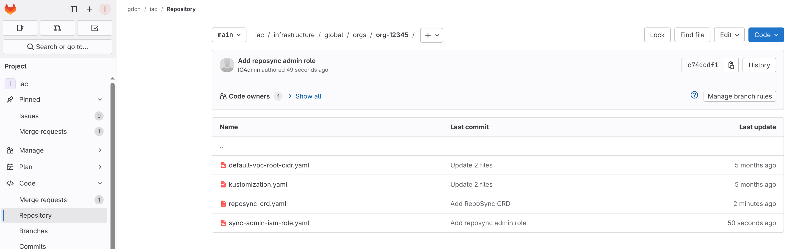
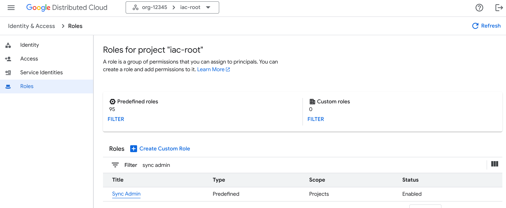

# Config Sync 

Config sync allows to deploy and manage cluster-level resources as code from a git repository. It is a GitOps solution that allows to deploy and manage cluster-level resources as code from a git repository. 

In order to use ConfigSync on the clusters, it needs to be installed on them and configured to sync with a git repository. Proposed setup consists of:
- ConfigSync installed and running on a user cluster
- Git repository containing Helm Charts for Global API cluster, Management API clusters and user clusters. 
- RepoSync CRDs created on Global API cluster, Management API clusters and user clusters. The CRDs need to be created once by IO in the first place.
- IAM and RBAC roles created on Global API cluster, Management API clusters and user clusters. The roles need to be created once by IO in the first place.
- Kubeconfig secrets created on user cluster

You can find examples of configuration in [examples/config-sync](../../examples/config-sync). 

## Prerequisites

1. Go through the [bootstrap process](../../tools/bootstrap/README.md).

2. Create harbor instance in the `iac-root` project and sign in to harbor (see [configure docker authentication](https://docs.cloud.google.com/distributed-cloud/hosted/docs/latest/gdcag/platform-application/pa-ao-operations/configure-docker-authentication))

```bash
. ../bootstrap/config.sh
export HARBOR_INSTANCE_NAME="${IAC_PROJECT:?}-mhs"
gdcloud config set project ${IAC_PROJECT:?}
gdcloud harbor instances create ${HARBOR_INSTANCE_NAME} \
  --project=${IAC_PROJECT:?}
gdcloud harbor harbor-projects create ${IAC_PROJECT:?} \
--project=${IAC_PROJECT:?} \
--instance=${HARBOR_INSTANCE_NAME:?}
export HARBOR_REGISTRY=$(kubectl get harborinstance $HARBOR_INSTANCE_NAME -n $IAC_PROJECT -o jsonpath='{.status.url}' | sed s#https://##)
echo $HARBOR_REGISTRY
docker-credential-mhs configure-docker --registries=${HARBOR_REGISTRY}
```

**Note:**
If `docker-credential-mhs` is not installed, run the following command:
```
gdcloud components install docker-credential-mhs
```

## IO prerequisites
These actions require Infrastructure Operator (IO) privileges.


1. Use IaC to create IAM and RBAC roles that allow managing RepoSync objects using provided manifests [sync-admin-iam-role.yaml](sync-admin-iam-role.yaml) and [sync-admin-iam.yaml](sync-admin-iam.yaml):



- Global API
  └─ iac/infrastructure/global/orgs/${ORG_NAME}/
    ├─ sync-admin-iam-role.yaml
    ├─ sync-admin-role.yaml
    └─ ... update kustomization.yaml to apply it

- Each Zone Management API
  └─ iac/infrastructure/zonal/zones/${GDCH_ZONE:?}/gdchservices-admin-management
    ├─ sync-admin-role.yaml
    └─ ... update kustomization.yaml to apply it
    

2. Create RepoSync CRD using manifest [reposync-crd.yaml](reposync-crd.yaml).
**Note**: 
Config Sync reconciler does not allow creating resources in `configsync.gke.io` API group. Thus the CRDs need to be created by IO in the cluster directly.

```bash
# apply to Global API
export KUBECONFIG=... # global api admin kubeconfig
kubectl apply -f reposync-crd.yaml

# apply to each Zone Management API
export KUBECONFIG=... # management api admin kubeconfig
kubectl apply -f reposync-crd.yaml

# apply to each user cluster
export KUBECONFIG=... # user cluster iodebug kubeconfig
kubectl apply -f reposync-crd.yaml
```

In order to create RepoSync CRD in user cluster and apply roles you need to obtain user cluster io-debug kubeconfig.
```bash
export KUBECONFIG=... # org admin kubeconfig
kubectl get secrets io-debug-kubeconfig \
 -n ${CLUSTER_NAME:?}-cluster\
 --template {{.data.value}} | base64 -d > ../bootstrap/generated/kubeconfig/${CLUSTER_NAME:?}-io-debug.kubeconfig
```

```bash
export KUBECONFIG=../bootstrap/generated/kubeconfig/${CLUSTER_NAME:?}-io-debug.kubeconfig
kubectl apply -f reposync-crd.yaml
kubectl apply -f sync-admin-role.yaml
```

## Config Sync Setup
1. Verify that sync-admin role exists in the `iac-root` project:


2. Assign `sync-admin` role to the ${IAC_SA} user:
```bash
. ../bootstrap/config.sh
gdcloud projects add-iam-policy-binding $IAC_PROJECT \
  --member="serviceAccount:${IAC_PROJECT:?}:${IAC_SA:?}" \
  --role="sync-admin"
```

1. [Optional] Download latest `config-sync-manifest.yaml` for your setup from [Config Sync releases](https://github.com/GoogleContainerTools/kpt-config-sync/releases).

- [v.1.23.3](https://github.com/GoogleContainerTools/config-sync/releases/download/v1.23.3/config-sync-manifest.yaml)
- [v.1.24.0-rc.4](https://github.com/GoogleContainerTools/config-sync/releases/download/v1.24.0-rc.4/config-sync-manifest.yaml)

2. Use `pull_images.py` script to pull the images from GCR to the local machine

Example usage:

```bash
python3 pull_images.py \
    --manifest patched-config-sync-manifest-v.1.23.3.yaml \
    --out-dir /tmp/config-sync-images
```

3. Push the images to the harbor instance:

```bash
python3 push_images.py \
  --manifest patched-config-sync-manifest-v.1.23.3.yaml \
  --img-dir /tmp/config-sync-images \
  --harbor-registry ${HARBOR_REGISTRY:?} --project ${IAC_PROJECT:?}
```

4. Apply the patch to the manifest file:

```bash
export PATCH="v.1.23.3.patch"
export MANIFEST="config-sync-manifest-v.1.23.3.yaml"
export PATCHED_MANIFEST="patched-${MANIFEST}"
./apply_patch.sh $PATCH $MANIFEST
sed -i 's/namespace: config-management-system/namespace: iac-root/g' $PATCHED_MANIFEST
sed -i 's/namespace: config-management-monitoring/namespace: iac-root/g' $PATCHED_MANIFEST
sed -i 's/namespace: resource-group-system/namespace: iac-root/g' $PATCHED_MANIFEST
sed -i 's/name: config-management-system/name: iac-root/g' $PATCHED_MANIFEST
sed -i 's/name: config-management-monitoring/name: iac-root/g' $PATCHED_MANIFEST
sed -i 's/name: resource-group-system/name: iac-root/g' $PATCHED_MANIFEST
sed -i 's/otel-collector.config-management-monitoring/otel-collector.iac-root/g' $PATCHED_MANIFEST
sed -i "s|image: gcr.io/config-management-release|image: ${HARBOR_REGISTRY}/${IAC_PROJECT}|g" $PATCHED_MANIFEST
```

5. Deploy Config Sync using kubectl, following the [documentation](https://docs.cloud.google.com/kubernetes-engine/config-sync/docs/how-to/installing-kubectl). Use patched manifest file: [patched-config-sync-manifest-v.1.23.3.yaml](patched-config-sync-manifest-v.1.23.3.yaml)

- **Option 1**: Vanilla kubernetes
    ```bash
    export KUBECONFIG=... # use admin kubeconfig
    kubectl apply -f ${PATCHED_MANIFEST:?}
    ```
- **Option 2**: GDC-hosted cluster

    In order to deploy Config Sync to GDC hosted user cluster you need to obtain cluster administrator kubeconfig from the **Infrastructure Operator** or ask the IO team to deploy Config Sync for you.
    ```bash
    export KUBECONFIG=... # org admin kubeconfig
    kubectl get secrets io-debug-kubeconfig \
    -n ${CLUSTER_NAME:?}-cluster\
    --template {{.data.value}} | base64 -d > ../bootstrap/generated/kubeconfig/${CLUSTER_NAME:?}-io-debug.kubeconfig
    ```

    ```bash
    export KUBECONFIG=../bootstrap/generated/kubeconfig/${CLUSTER_NAME:?}-io-debug.kubeconfig
    kubectl apply -f ${PATCHED_MANIFEST:?}
    ```
 
6. Configure access secrets to store [kubeconfig created during the bootstrap](../../README.md) in the user cluster (where config-sync is running):
    ```bash
    export KUBECONFIG=${CA_CERT_PATH:?}${IAC_PROJECT:?}_${IAC_SA:?}-${ZONE:?}-${CLUSTER_NAME:?}.kubeconfig
    kubectl -n iac-root create secret generic kubeconfigs \
    --from-file=global=${CA_CERT_PATH}${IAC_PROJECT}_${IAC_SA}-global-api.kubeconfig \
    --from-file=${ZONE}=${CA_CERT_PATH:?}${IAC_PROJECT:?}_${IAC_SA:?}-${ZONE:?}.kubeconfig \
    --from-file=${CLUSTER_NAME}=${CA_CERT_PATH:?}${IAC_PROJECT:?}_${IAC_SA:?}-${ZONE:?}-${CLUSTER_NAME:?}.kubeconfig
    ```

7. Configure GDC CA certificate

    ```bash
    curl -k  https://${GDCH_CONSOLE}/.well-known/certificate-authority -o ${CA_CERT_PATH:?}cachain.crt
    export KUBECONFIG=${CA_CERT_PATH:?}${IAC_PROJECT:?}_${IAC_SA:?}-${ZONE:?}-${CLUSTER_NAME:?}.kubeconfig
    kubectl -n iac-root create secret generic certs \
    --from-file=${CA_CERT_PATH:?}cachain.crt
    ```

8. Create objects for synchronisation state tracking:
    - Global API
    ```bash
    export GIT_REPO=...

    kubectl apply -f - << EOF
    apiVersion: configsync.gke.io/v1alpha1
    kind: RepoSync
    metadata:
    name: global
    namespace: ${IAC_PROJECT}
    spec:
    sourceFormat: unstructured
    git:
        repo: $GIT_REPO
        branch: main
        dir: global
        auth: none
    EOF
    ```
    - Each Zone Management API
    ```bash
    export GIT_REPO=...

    kubectl apply -f - << EOF
    # Management API for each zone
    apiVersion: configsync.gke.io/v1alpha1
    kind: RepoSync
    metadata:
    name: zone1
    namespace: ${IAC_PROJECT}
    spec:
    sourceFormat: unstructured
    git:
        repo: $GIT_REPO
        branch: main
        dir: zone1
        auth: none
    EOF
    ```
9. Enable synchronisation - create RepoSyncs on the cluster where Config Sync is running:
    - Global API
    ```bash
    export GIT_REPO=...

    kubectl apply -f - << EOF
    apiVersion: v1
    kind: Namespace
    metadata:
    name: ${IAC_PROJECT}
    ---
    apiVersion: configsync.gke.io/v1alpha1
    kind: RepoSync
    metadata:
    name: global
    namespace: ${IAC_PROJECT}
    spec:
    sourceFormat: unstructured
    git:
        repo: $GIT_REPO
        branch: main
        dir: global
        auth: none
    ---
    # Management API for each zone
    apiVersion: configsync.gke.io/v1alpha1
    kind: RepoSync
    metadata:
    name: zone1
    namespace: ${IAC_PROJECT}
    spec:
    sourceFormat: unstructured
    git:
        repo: $GIT_REPO
        branch: main
        dir: zone1
        auth: none
    EOF
    ```
